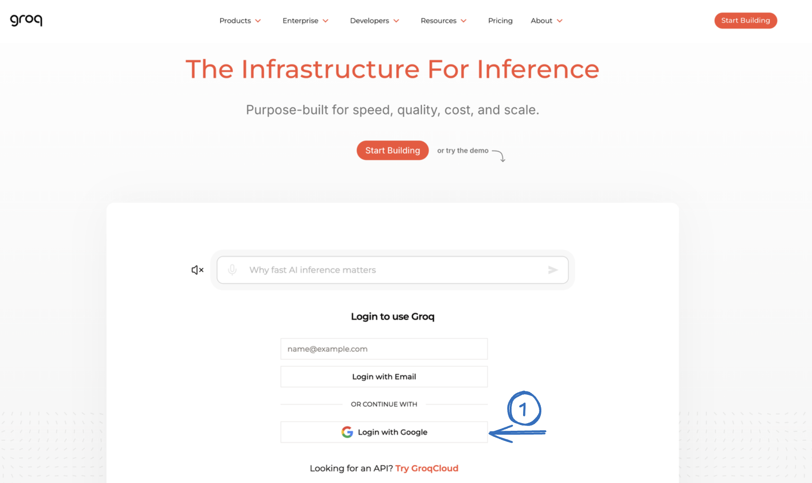
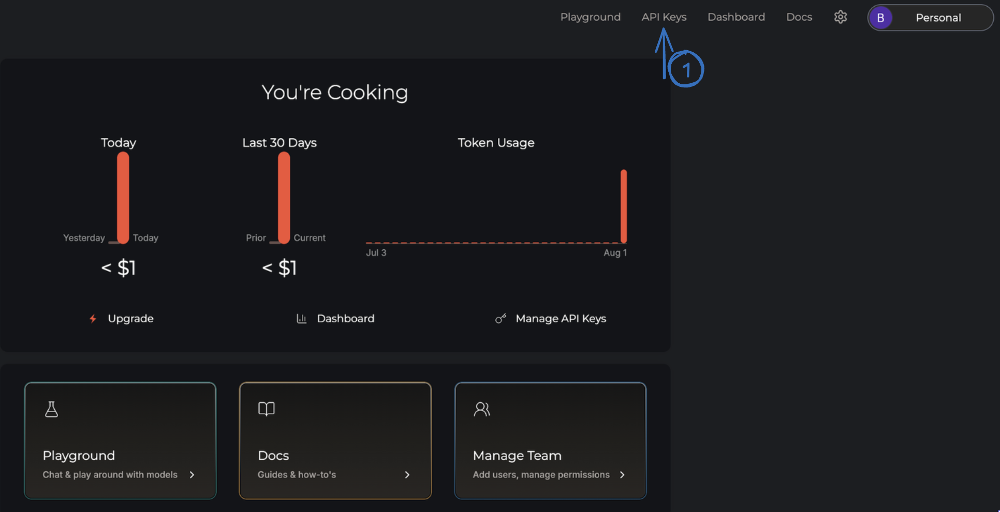
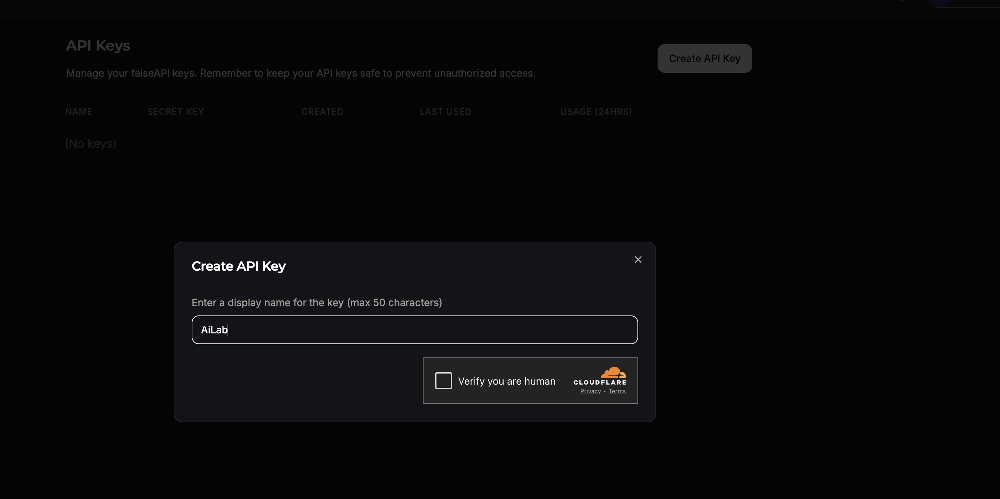
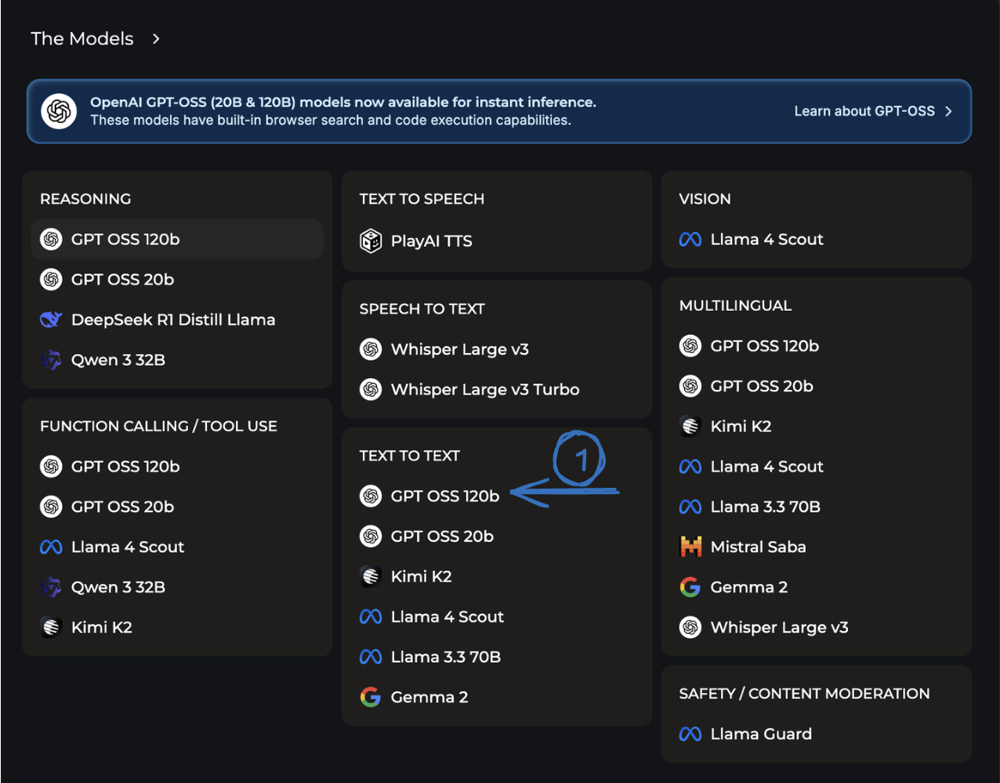
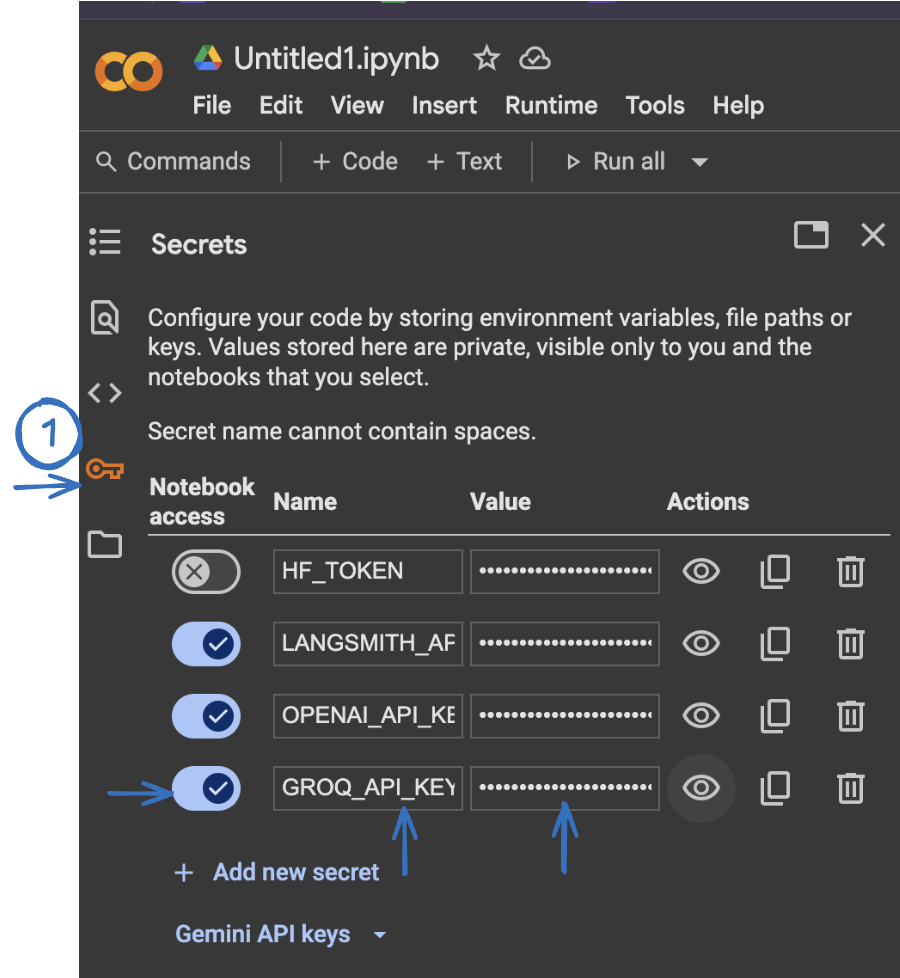

# Groq and Open Source Models

???+ blank "Getting Started with Groq"

    ??? info "Introduction"

        In the earlier tasks, we used OpenAI for inferencing, which delivers high-quality results but comes with associated usage costs. To access OpenAI's APIs, you must purchase credits and add a payment method (typically a credit card) to your account.

        In this module, we introduce you to <a href="https://console.groq.com/docs/overview" target="_blank">Groq</a>, a high-performance platform designed for **LPU-based inferencing**. LPUs (Language Processing Units) are custom-built accelerators optimized for running large language models (LLMs) at lightning speed with minimal latency.

        Groq offers blazing-fast inference with hosted open models like **GPT-OSS, Gemma, Mistral** and more — and it can serve as a **cost-effective, credit-free alternative** to traditional APIs when testing. We'll demo how to create a simple translation app using Groq to translate text from English to Spanish.

        This module is intended to show that **multiple inference platforms exist**, each with its own advantages and model ecosystem.

???+ blank "Groq — LAB"

    !!! warning "Session Timeout"
        When using Google Colab, if your notebook is **idle for too long**, the session will **time out**, requiring you to **re-run all the cells from the start**.

    !!! note
        Log in to the lab environment by opening a **new notebook** in Google Colab. Ensure you're connected to a runtime using a **CPU** — it is sufficient for this task.

    ---

    **Step 1 — Create a Groq Account & API Key**

    * Create a Groq account by browsing to <a href="https://groq.com" target="_blank">groq.com</a>. Use your personal Gmail account to sign up or click on Start Building.

    

    * Click on **Start Building**, then navigate to the **API Keys** section on the new page and create a key.

    

    

    !!! tip "Save to Key Vault"
        Once your Groq API key is created, open the **`$ keys`** panel (bottom-left) and paste it under **Groq API Key**. You can also add it directly to Google Colab Secrets in the next step either way works.

    * You can view the full list of models supported by Groq <a href="https://console.groq.com/docs/models" target="_blank">here</a>.

    * We will be using the **GPT-OSS-20B** model for this task. However, feel free to browse the Groq model page and select any other supported model if you'd like to experiment.

    

    ---

    **Step 2 — Configure API Keys in Colab**

    * In Google Colab, open the **Secrets** tab on the left. Click **Add new secret**, enter **GROQ_API_KEY** as the name, and paste your API key in the Value field. Make sure to toggle it on.

    

    ---

    **Step 3 — Install Dependencies**

    ```py linenums="1"
    !pip install langchain langchain_groq langchain_core langchain_openai
    ```

    ---

    **Step 4 — Set Up API Keys & LangSmith Tracing**

    Pull in the API keys from Colab Secrets and enable LangSmith tracing:

    ```py linenums="1"
    import os
    from google.colab import userdata
    os.environ['OPENAI_API_KEY']   = userdata.get('OPENAI_API_KEY')
    os.environ['LANGSMITH_API_KEY'] = userdata.get('LANGSMITH_API_KEY')
    os.environ['GROQ_API_KEY'] = userdata.get('GROQ_API_KEY')

    # Set LangSmith tracing config
    os.environ['LANGSMITH_TRACING'] = "true"
    os.environ['LANGSMITH_ENDPOINT'] = "https://api.smith.langchain.com"
    os.environ['LANGSMITH_PROJECT']  = "AibyDesign"
    ```

    !!! note
        OpenAI recently released two open-weight reasoning models (**GPT-OSS-20B** and **GPT-OSS-120B**) under the Apache 2.0 license — the first open models from OpenAI since GPT-2 in 2019. The 20B model achieves comparable performance to OpenAI's o3-mini on common benchmarks and can run on edge devices with just 16 GB of memory. Both models support **128K context windows**. More info: <a href="https://openai.com/index/introducing-gpt-oss/" target="_blank">OpenAI announcement</a> | <a href="https://openrouter.ai/openai/gpt-oss-20b" target="_blank">OpenRouter</a>

    ---

    **Step 5 — Initialize the Model**

    We'll use Groq's inferencing engine to access the **openai/gpt-oss-20b** model — fast and cost-efficient responses via Groq's LPU hardware:

    ```py linenums="1"
    from langchain_openai import ChatOpenAI
    from langchain_groq import ChatGroq
    model=ChatGroq(model="openai/gpt-oss-20b")
    model
    ```

    ---

    **Step 6 — Simple Chat Interaction**

    Create a simple translation using LangChain's SystemMessage and HumanMessage:

    ```py linenums="1"
    from langchain_core.messages import HumanMessage,SystemMessage

    messages=[
        SystemMessage(content="Translate the following from English to Spanish"),
        HumanMessage(content="Hello How are you?")
    ]

    result=model.invoke(messages)
    result
    ```

    ---

    **Step 7 — Parse the Output**

    Use `StrOutputParser` to extract the clean text from the model's response:

    ```py linenums="1"
    from langchain_core.output_parsers import StrOutputParser
    parser=StrOutputParser()
    parser.invoke(result)
    ```

    ---

    **Step 8 — Chain with LCEL**

    Use **LCEL (LangChain Expression Language)** to chain the model and parser into a single pipeline:

    ```py linenums="1"
    ### Using LCEL- chain the components
    chain=model|parser
    chain.invoke(messages)
    ```

    ---

    **Step 9 — Dynamic Prompt Templates**

    Define a reusable prompt template with placeholders for language and text:

    ```py linenums="1"
    ### Prompt Templates
    from langchain_core.prompts import ChatPromptTemplate

    generic_template="Translate the following into {language}:"

    prompt=ChatPromptTemplate.from_messages(
        [("system",generic_template),("user","{text}")]
    )
    result=prompt.invoke({"language":"Spanish","text":"Hello"})
    result.to_messages()
    ```

    ---

    **Step 10 — Full Pipeline**

    Chain everything together — prompt + model + parser:

    ```py linenums="1"
    ##Chaining together components with LCEL
    chain=prompt|model|parser
    chain.invoke({"language":"Spanish","text":"Hello"})
    ```

    ---

    **What We Did in This Module — and Why It Matters**

    Throughout this lab, we've been using **OpenAI** as our inference provider GPT-4o for generation, OpenAI embeddings for vectorization. It works brilliantly, but it comes at a cost: API credits, a credit card on file, and a dependency on a single vendor.

    In this module, we proved that **none of that is required**. We took the exact same LangChain patterns messages, chains, output parsers, prompt templates and swapped OpenAI for **Groq running an open-source model (GPT-OSS-20B)**. The code barely changed. The framework didn't change at all. And the results were fast, functional, and free(for testing).

    **Why does this matter?**

    * **No vendor lock-in** the LangChain abstraction means you can switch between OpenAI, Groq, Ollama, Hugging Face, or any other provider by changing one line of code
    * **Open-source models are real** GPT-OSS-20B runs on 16GB of memory and performs comparably to o3-mini on common benchmarks. These aren't toy models anymore
    * **Groq's LPU hardware** delivers inference speeds that rival or beat GPU-based solutions which matters when you're building real-time applications
    * **Cost** for prototyping, testing, and many production use cases, you can now build AI applications without spending anything on inference

    **How does this compare to what we've done before?**

    | | Earlier Modules (OpenAI) | This Module (Groq + Open Source) |
    |---|---|---|
    | **Model** | GPT-4o (proprietary) | GPT-OSS-20B (open-source, Apache 2.0) |
    | **Inference** | OpenAI API servers | Groq LPU hardware |
    | **Cost** | Pay per token | Free tier available |
    | **Framework** | LangChain | LangChain (identical) |
    | **Code changes** | — | Changed one line (`ChatGroq` instead of `ChatOpenAI`) |

    The point isn't that one is better than the other it's that you now know **both paths**. Use OpenAI when you need the latest capabilities. Use Groq and open-source models when you need speed, cost savings, or don't want vendor lock-in. The LangChain patterns you've learned work with all of them.

    <p align="right"> 👉 This concludes the task. Click the next **Module** on the left to continue. </p>
