# Tokenization

???+ blank "Tokenization"

    ??? info "Introduction"

        === "1. Background"

            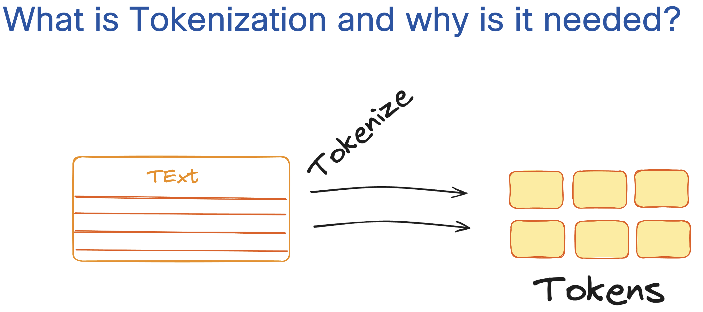

            * Language models have a limit on how much text they can handle at once, known as their context window. While these limits are expanding, research shows that LLM's often perform better when provided with less, but more relevant, information. However, selecting the most relevant information is straightforward for humans but challenging for computers. 

            A common approach to manage large amounts of data is to break it down into smaller, more manageable parts; this is a process often referred to as Tokenization or Chunking. Tokenization is a key step in this process, where raw text is divided into smaller units, called tokens, which can then be processed by a neural network.

        === "2. Types of Tokenization"

            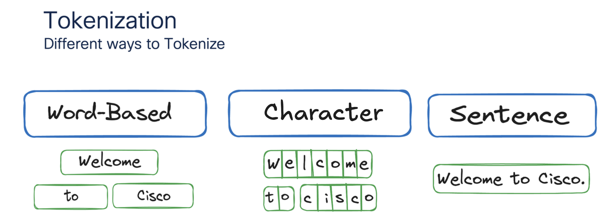

            In order to do this you need to pick a chunking/Tokenization strategy. Just to name a few:

            * Word-Based: A simple and straightforward method that most of us would propose is to use word-based tokens, splitting the text by spaces.

            * Character based tokenization: Individual words are considered as tokens . Lot of computing resources needed as now e.g for a 3 word serentence where you might need 3 tokens now 15 – 20 tokens needed 

            * Sentence Based: We need a .(fullstop) for it to work 

            <span class="colour" style="color:red"> Note: We've all heard of GPT and OpenAI. They utilize a tokenization method called Byte Pair Encoding (BPE), which is a middle ground between word-based and character-based tokenization. In BPE, words are broken down into smaller character sequences that the model encountered during training, allowing it to make informed predictions. </span>

            !!! Note

                <a href="https://huggingface.co/learn/nlp-course/en/chapter6/5" target="_blank">More Info for Byte-Pair Encoding tokenization</a>
            

        === "3. Why do we need Tokenization or Text Splitting?"

            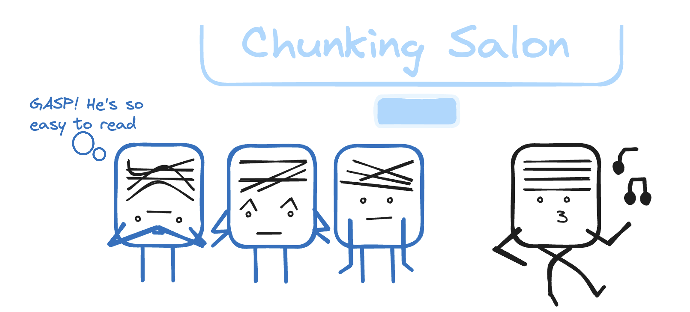

            Historically, applications perform better when they are provided with your own data. However, you can't feed unlimited data to your LLMs due to two key limitations:

            * Context window limit: LLMs have a finite context window for processing data.

            * Signal-to-noise ratio (SNR): LLMs perform better when the SNR is high, meaning the information provided is useful, relevant, and clear. Clear, unambiguous instructions help the model deliver more accurate and detailed results, while ambiguous or complex inputs can lead to less accurate or incomplete outputs.

            As noted, chunking or splitting refers to breaking your data into smaller, manageable pieces.

            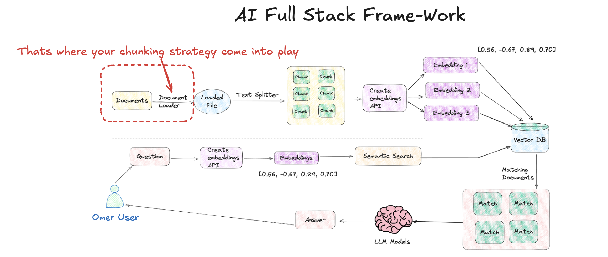
            

???+ blank "Tokenization LAB"

    ??? info "Log into the Lab Environment"

        === "1. Lab Steps"

            !!! warning "Session Timeout"
                When using Google Colab, if your notebook is **idle for too long**, the session will **time out**, requiring you to **re-run all the cells from the start**.

            * Open  <a href="https://colab.research.google.com/" target="_blank">Google Colab</a> and create a new notebook. Click on "File" > "New notebook". 
            
            !!! note
                Please refer to the [following section](Task1.md) to create Google Colab account.

            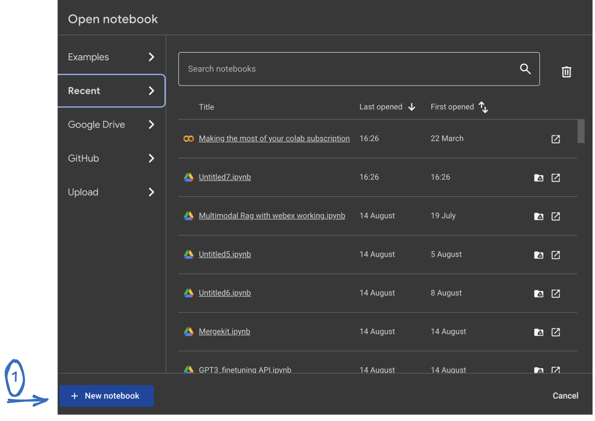

            * Make sure you are connected to a runtime. For this task, you can use the CPU as the runtime environment.

            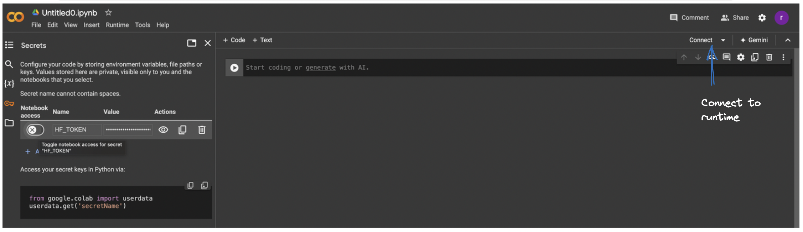

            <span class="colour" style="color:red">Reminder: </span>Whenever you want to copy the code in Google Colab and run it, be sure to click on + Code to add a new code cell.

            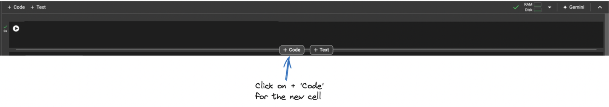

            <span class="colour" style="color:red">Reminder: </span>Click the play button to the left of the code, or use the keyboard shortcut "Command/Ctrl+Enter" while the cell is selected.

            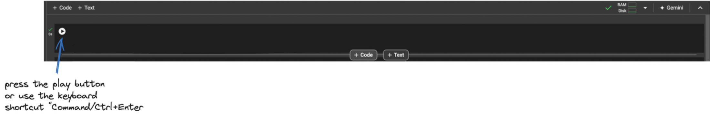


            === "1. Manual testing for Chunking/Tokenization"

            <span class="colour" style="color:green">We will create Chunks of 35 characters, so first 35 characters as chunk 1 ,next 35 characters chunk2 and so on </span>

            ```py linenums="1"
            # Manual Splitting
            text = """Cisco hosts multiple events, including Cisco Live and WebexOne, which bring together industry professionals for in-person and virtual experiences. These events focus on AI collaboration, customer experience, and the latest innovations.
            They feature a variety of activities such as insightful breakout sessions, technical training courses, hands-on labs, inspiring keynotes, epic entertainment, a solutions showcase and expo, customer awards, meet-the-experts sessions, 1:1 executive meetings, a partner program, and more!"""

            # Create a list that will hold your chunks
            chunks = []

            chunk_size = 35 

            # Run through the a range with the length of your text and iterate every chunk_size you want
            for i in range(0, len(text), chunk_size):
                chunk = text[i:i + chunk_size]
                chunks.append(chunk)

            print(chunks)
            ```

            !!! note
                The image below is provided to highlight the code and help you understand how chunking works. Not an actual output from print(chunks) command.

            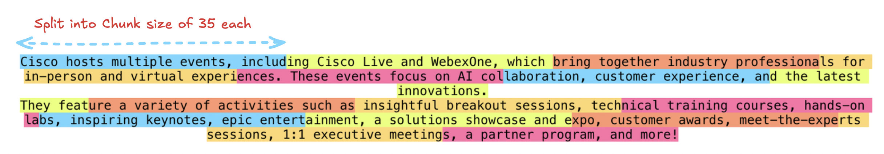

            !!! note
                
                Please note that the image above is not generated directly from our code. It has been included as a visual aid to help you better understand the concept of tokenization and chunking.  The text contained a total of 522 characters, divided into 15 chunks. Problem with the above chunking technique is that it got split at 'includ'. How do we know when to chunk? Before we look into that. Lets look into Langchain Splitter.

            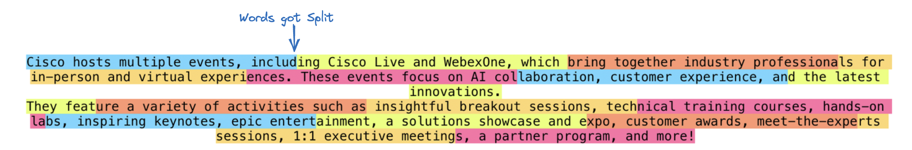

            === "2. LangChain Text Splitter using overlap"

            !!! note
        
                To proceed with this Task(Task3), use the same Colab notebook. Simply add a new code cell by clicking the '+ Code' button and paste the code below.

            * Let's retrieve the langchain library from the Python Package. In the example below, we'll configure the chunk_overlap parameter, which ensures that our chunks are blended together. Meaning the end of chunk 1 will overlap with the beginning of chunk 2. Please copy the below command in Colab and press **run** to execute each cell individually.

            ```py linenums="1"
            !pip install langchain langchain-text-splitters
            ```

            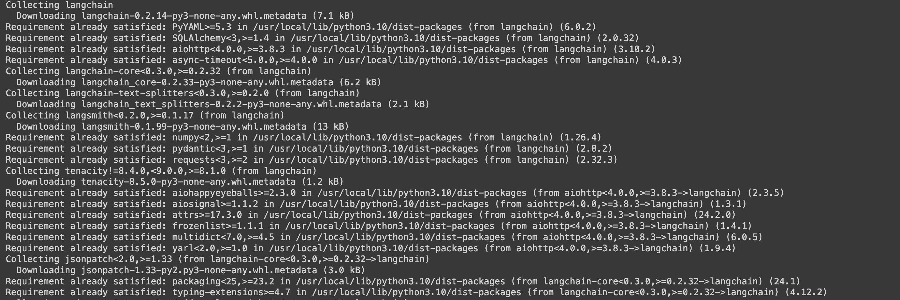


            ``` py linenums="1"
            text = """Cisco hosts multiple events, including Cisco Live and WebexOne, which bring together industry professionals for in-person and virtual experiences. These events focus on AI collaboration, customer experience, and the latest innovations. They feature a variety of activities such as insightful breakout sessions, technical training courses, hands-on labs, inspiring keynotes, epic entertainment, a solutions showcase and expo, customer awards, meet-the-experts sessions, 1:1 executive meetings, a partner program, and more!"""
            ```

            ``` py linenums="1"
    
            from langchain_text_splitters import CharacterTextSplitter

            text_splitter = CharacterTextSplitter(chunk_size=35, chunk_overlap=3, separator='', strip_whitespace=False) # seprate means you split by character

            a = text_splitter.create_documents([text])

            a

            ```
            !!! note
                Seprators are characters sequence you wanna split on. The image below is provided to highlight the code and help you understand how chunking works.

            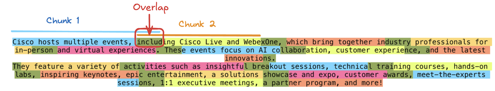

            In the above cell, the LangChain text splitter divides a long piece of text into smaller chunks of 35 characters each. Instead of splitting by words or sentences, it splits character by character because the separator is set to an empty string.

            A key feature here is the use of a `chunk_overlap` of 3 characters. This means that the end of one chunk is repeated at the beginning of the next chunk. This overlap helps preserve continuity between chunks, so important context is not lost when the text is broken apart. Without overlap, information at the boundaries of chunks could be cut off, which can reduce understanding when these chunks are later processed by language models.

            Overall, this approach ensures that the text is split into manageable pieces while still maintaining enough shared context between them for better downstream performance.

            === "3. Recursive Character Text Splitting"

            In the previous example, we used Character Splitting, where the text was divided based on a fixed number of characters. Specifically, the text was split into chunks of 35 characters each, regardless of whether a word or sentence was cut in the middle.

            However, with **Recursive Text Splitting (RTS)**, the process is more flexible. Instead of cutting the text at an exact character position every time, RTS tries to split the text using its natural structure first, which helps create chunks that are easier to read and more meaningful.

            **How RTS Works**

            Rather than blindly splitting at a fixed character count, RTS looks for the best places to break the text by checking a series of separators in order. It typically starts with larger logical boundaries, such as:

            * `\n\n` — double newlines for paragraph breaks
            * `\n` — single newlines for line breaks
            * ` ` — spaces to keep whole words together
            * `""` — individual characters if no other separator works

            This process is called **recursive splitting** because the splitter keeps trying smaller separators until the text fits within the desired chunk size.

            !!! info "Important Clarification"
                Although RTS uses the structure of the text, it can still take a `chunk_size` parameter. In the example below, `chunk_size=35` does **not** mean the text is blindly cut every 35 characters. Instead, it means that **35 characters is the maximum target size** for each chunk. The splitter will try to keep each chunk within that limit while splitting at the most natural boundary possible.

            !!! note
                To proceed, use the same Colab notebook you created earlier. Simply add a new code cell by clicking the '+ Code' button and paste the code below.

            ``` py linenums="1"
            text = """Cisco hosts multiple events, including Cisco Live and WebexOne, which bring together industry professionals for in-person and virtual experiences. These events focus on AI collaboration, customer experience, and the latest innovations. They feature a variety of activities such as insightful breakout sessions, technical training courses, hands-on labs, inspiring keynotes, epic entertainment, a solutions showcase and expo, customer awards, meet-the-experts sessions, 1:1 executive meetings, a partner program, and more!"""
            ```

            ```py linenums="1"
            from langchain_text_splitters import RecursiveCharacterTextSplitter
            text_splitter = RecursiveCharacterTextSplitter(chunk_size = 35, chunk_overlap = 0)
            # how many chunks we have
            print(len(text_splitter.create_documents([text]))

            text_splitter.create_documents([text])
            ```

            **Why This Approach is Useful**

            In the above example, the splitter avoids breaking words in the middle by using spaces as one of the separators. This helps keep related words together and makes each chunk more natural and easier for a language model to understand. As a result, the chunks are not only limited in size, but they also preserve more context than simple character-based splitting.

            !!! tip "Key Takeaway"
                * **CharacterTextSplitter** cuts text based on a fixed number of characters.
                * **RecursiveCharacterTextSplitter** also uses a size limit, but it tries to split the text at meaningful boundaries first.
                * This makes the chunks more **logical, readable, and context-aware**.

            !!! note "Recommendation"
                If you are new to AI and text chunking, **Recursive Text Splitting (RTS)** is often a better starting point because it usually produces cleaner and more useful chunks than basic character splitting.
            

            === "4. Document Level Splitting"

            So far, we've been working with splitting regular text. But what if we have markdown files or PDF or Python documentation? There's a better way to handle those cases, and that's where specialized document splitting comes into play.

            === "5. PDF with Table"

                PDFs often contain structured content such as tables, headings, paragraphs, lists, and images. This makes them more complex than plain text files, and simple character-based splitting methods may not work effectively.Before performing any chunking, it is important to first extract and identify the different elements within the document. This ensures that structured data especially tables are preserved and handled correctly. 
                
                We'll accomplish this using the <a href="https://unstructured.io/" target="_blank">Unstructured library</a>, which is specifically designed for handling such tasks. If you have a large collection of PDFs, <a href="https://unstructured.io/" target="_blank">Unstructured</a> is an excellent tool to manage them efficiently.

                !!! note
                    There are multiple libraries available for handling PDF extraction, but in this lab guide, we will use the <a href="https://unstructured.io/" target="_blank">Unstructured</a> library.

                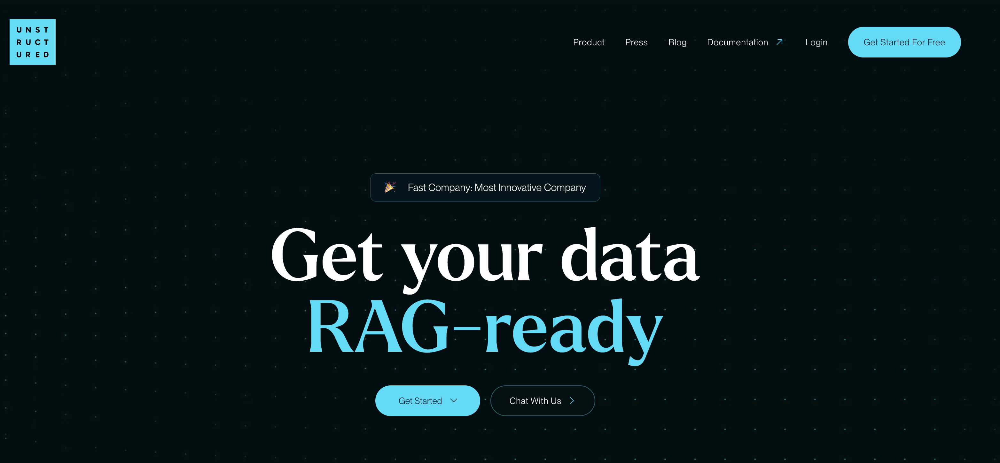

                !!! note
                
                    Please remember to let each cell finish executing before moving on to the next one.

                * Install relevant libraries including <a href="https://unstructured.io/" target="_blank">Unstructured</a>


                ```py linenums="1"
                !pip install scikit-learn langchain_community unstructured[all-docs] unstructured pdfminer pdfminer.six pdf2image pillow_heif opencv-python unstructured_inference pytesseract unstructured_pytesseract python-dotenv openai
                ```

                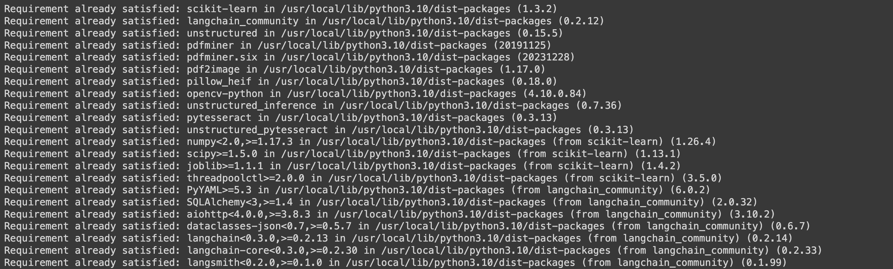

                !!! note
                    You will be asked to restart your notebook. Click on Restart Session.

                ```py linenums="1"
                !apt-get install -y poppler-utils && apt-get install -y tesseract-ocr
                ```

                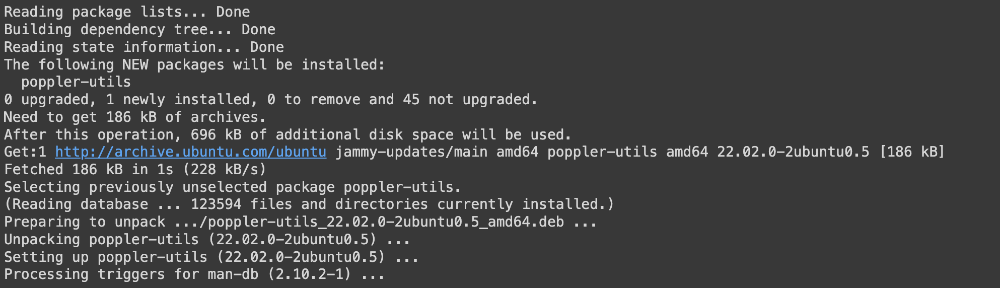

                * We will upgrade nltk to version 3.9.1

                ```py linenums="1"
                !pip install --upgrade nltk
                ```
                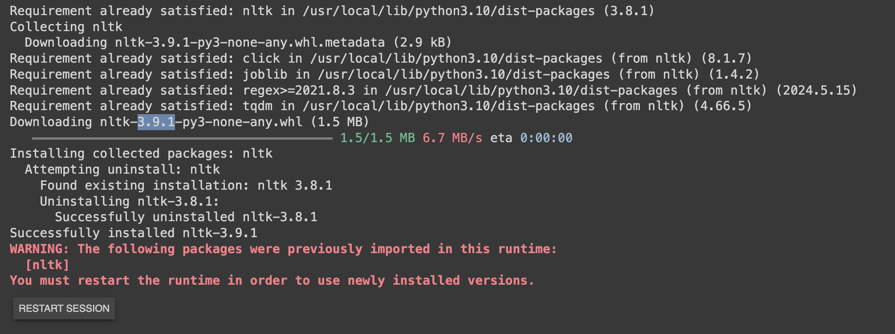

                * Let's load our PDF files into Google Colab. For this example, we can use the Cisco Financial Results. Please [Download the file here](./assets/static/CiscoReport.pdf){:target="_blank" download="CiscoReport.pdf"} as we will be using in the next step. You can open the pdf to go through the file. 

                * In Google Colab, click on the Folder tab. Right click and select New Folder to create a folder named "data."

                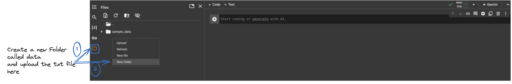

                * On your newly created 'data' folder, click [...] then select Upload.

                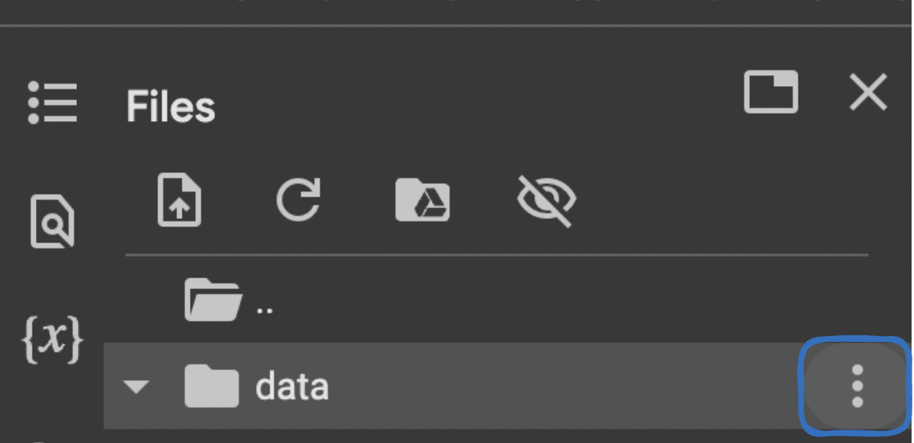

                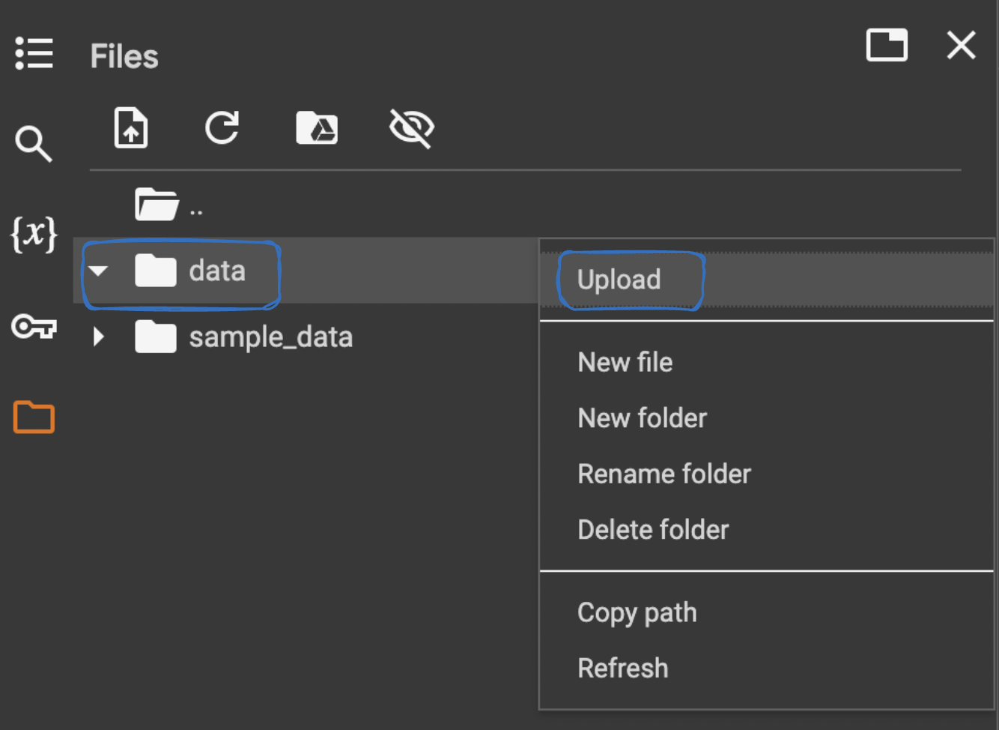

                * Choose your CiscoReport.pdf file and click Open

                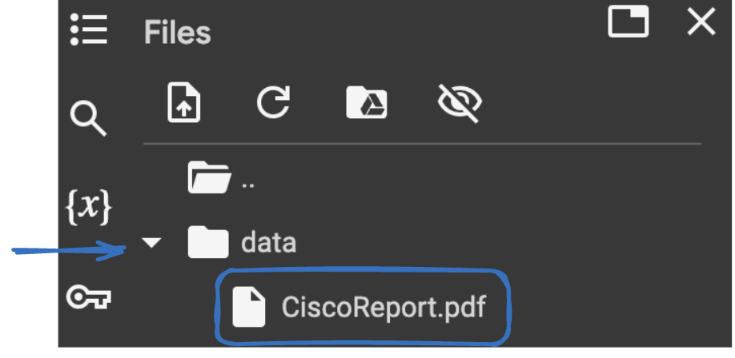

                * We'll use the following code from the Unstructured library to demonstrate how tables can be extracted

                !!! note
                    <Your-File-Path> In the below code filename, is the relative path where your PDF is uploaded. To get the correct file path, click on the 'data' folder, select your PDF file, click on [...] and choose Copy Path. Example: filename = "/content/data/CiscoReport.pdf"

                ```py linenums="1"

                import os
                from unstructured.partition.pdf import partition_pdf
                from unstructured.staging.base import elements_to_json

                # Let's load up our PDF and then partition it.
                filename = "<Your-File-Path>"# Use relative path since the file is in the same directory.
                # Extracts the elements from the PDF
                elements = partition_pdf(
                    filename=filename,
                    extract_images_in_pdf=True,
                    strategy="hi_res",
                    infer_table_structure=True,
                    hi_res_model_name="yolox"
                )
                # Let's look at our elements
                elements
                ```

                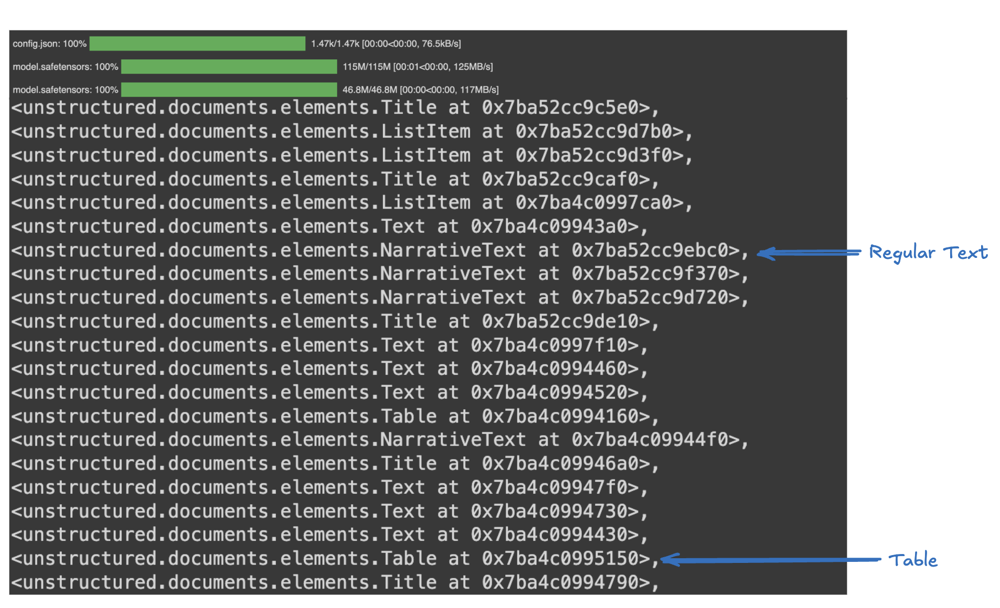

                * The elements output contains many different extracted components from the PDF, such as titles, paragraphs, list items, images, and tables. Since the exact position of a table can vary from one PDF to another, it is better to search the extracted elements programmatically rather than assuming the table will always appear at a fixed index. So lets run the below script:

                ```py linenums="1"
                from collections import Counter

                # Show how many elements of each type were extracted
                element_types = [type(el).__name__ for el in elements]
                print(Counter(element_types))

                # Find all table elements and print their index
                table_indexes = []

                for i, el in enumerate(elements):
                    if type(el).__name__ == "Table":
                        table_indexes.append(i)
                        print(f"Table found at index: {i}")

                print("All table indexes:", table_indexes)
                ```

                We can now see where the first "table" field is defined. Example elements[45]

                ```py linenums="1"
                elements[45].metadata.text_as_html
                ```

                !!! note
                    If you're working with PDFs in AI pipelines, combining Unstructured (for extraction) with LangChain (for chunking and retrieval) is a powerful approach.

                <span class="colour" style="color:green">OUTPUT - Example</span>

                !!! note
                    You can copy the below HTML snippet or use the actual HTML output you received from your element.

                ```html
                '<table><thead><tr><th>Revenue</th><th>$8.51 - $8.53 Billion</th><th>$34.5 - $34.7 Billion</th></tr></thead><tbody><tr><td>Y/Y Growth</td><td>~10%</td><td>~10%</td></tr><tr><td>FX Impact)</td><td>no impact</td><td>no impact</td></tr><tr><td>GAAP Operating Margin</td><td></td><td>~11.4%</td></tr><tr><td>Non-GAAP Operating Margin’)</td><td></td><td>~28.0%</td></tr><tr><td>GAAP Earnings per Share?)</td><td>$0.79 - $0.80</td><td>$2.67 - $2.69</td></tr><tr><td>Non-GAAP Earnings per Share()</td><td>$1.89 - $1.90</td><td>$7.41 - $7.43</td></tr><tr><td>Operating Cash Flow Growth (Y/Y)°)</td><td></td><td>16% - 17%</td></tr><tr><td>Current Remaining Performance Obligation Growth (Y/Y)</td><td>~10%</td><td></td></tr></tbody></table>'
                ```

                * Tables are straightforward for humans to read, but they aren't as easy for language models to interpret. Language models are typically trained on HTML tables, so when you pass HTML-formatted tables to an LLM, it will better understand the structure and content. You can paste the HTML into an <a href="https://codebeautify.org/htmlviewer" target="_blank">HTML viewer</a> to see how it looks.

                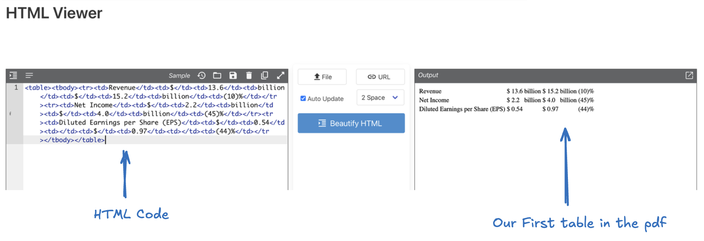

                !!! note
                    That's how you handle tables within a PDF. Please note that the image above may appear slightly different.
                


                === "6a. Multi-Modal (Text + Images)"

                What if a PDF or other document contains images? How can you extract them? We'll use the Unstructured library again to handle this.

                !!! note
        
                    To proceed, use the same Colab notebook you created earlier. Simply add a new code cell by clicking the '+ Code' button and paste the code below.

                === "6b. Multi-Modal (Extract Images from PDF)"

                    * Install relevant libraries 

                    ```py linenums="1"
                    from typing import Any
                    from pydantic import BaseModel
                    from unstructured.partition.pdf import partition_pdf  
                    ```

                    ```py linenums="1"

                    # Make sure to use the correct PATH where you saved the downloaded file in the previous step.
                    filepath = "/content/data/CiscoReport.pdf"
                    # Get elements
                    raw_pdf_elements = partition_pdf(
                        filename=filepath,

                        # Using pdf format to find embedded image blocks
                        extract_images_in_pdf=True,

                        # Use layout model (YOLOX) to get bounding boxes (for tables) and find titles
                        infer_table_structure=True,

                        # Specifies the strategy to be used for chunking the text. In our case, it will chunk the text based on titles found in the document.
                        chunking_strategy="by_title",
                        
                        # Sets a hard limit on the number of characters allowed in each chunk. 
                        max_characters=4000,
                        # This function will attempt to create a new chunk after every 3,800 characters, allowing some flexibility while chunking.
                        new_after_n_chars=3800,
                        # If a chunk has fewer than 2,000 characters, the function will 
                        # attempt to combine it with neighboring text blocks to create a larger, more meaningful chunk.
                        combine_text_under_n_chars=2000
                    )
                    ```

                    !!! note
                        After extracting images from the PDF, the files are saved locally in the figures folder. To analyze one of these images with a multimodal model, we need to send the image in a format the model can understand.
                        Since the image is stored locally in the Colab environment and does not have a public URL, a convenient approach is to convert it to base64 and include it in the request as a data URL. This allows the model to process the image directly.
                        A vision-capable model such as gpt-4o (or similar image-enabled models) can then generate a description or summary of the extracted image. This is especially useful when working with documents that contain both text and visuals.
                        Also if you get a warning it's just an informational message from the unstructured library letting you know that you haven't explicitly specified a language for text processing, so it's defaulting to English.
                        If you want to remove the warning and be explicit, you can pass the languages parameter like this: languages=["eng"] after the combine_text_under_n_chars=2000.

                    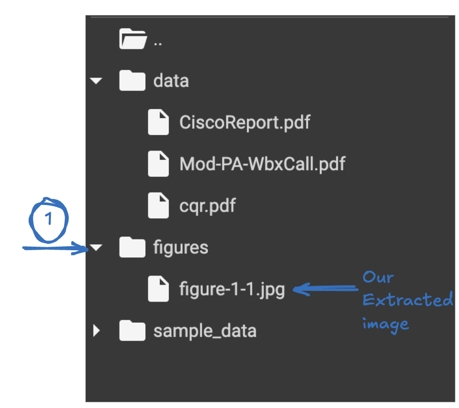

                    * You can view the image by double clicking it 

                    !!! note
                         After extracting images from a PDF or any other source, you can use the below method to send them to a multimodal model like GPT-4o to understand and generate insights about the images. This approach allows you to combine textual and visual data for a richer understanding of the content.

                    **Set OpenAI Token — MultiModal**

                    !!! note
                        The OpenAI API keys have already been **pre-generated and provided** to you in your `.txt` file. You can skip the steps below and go straight to adding the key in Colab Secrets.

                    ??? info "Optional — Create Your Own OpenAI API Key (click to expand)"

                        If you'd like to use your own key instead of the one provided, follow these steps:

                        * Browse to the <a href="https://platform.openai.com/api-keys" target="_blank">OpenAI API Keys page</a>
                        * Click **Create new secret key** — the key is automatically generated
                        * Save the API Key securely — you'll need it in the next steps
                        * Use default settings when creating the key

                        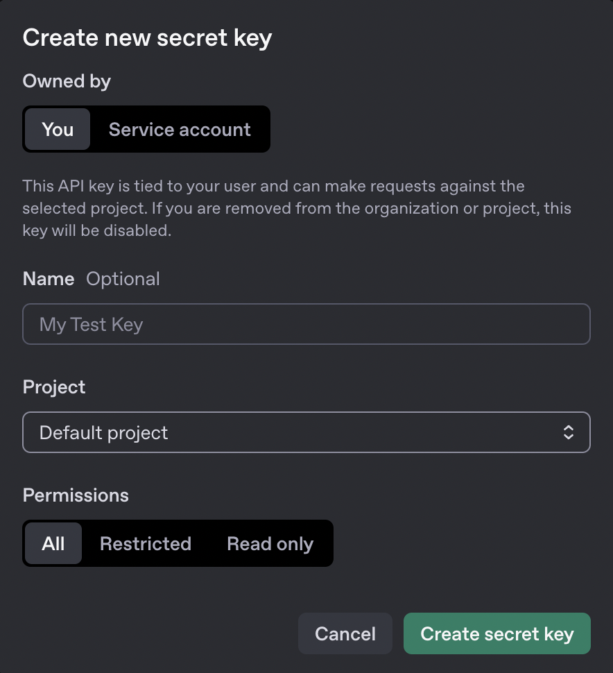

                        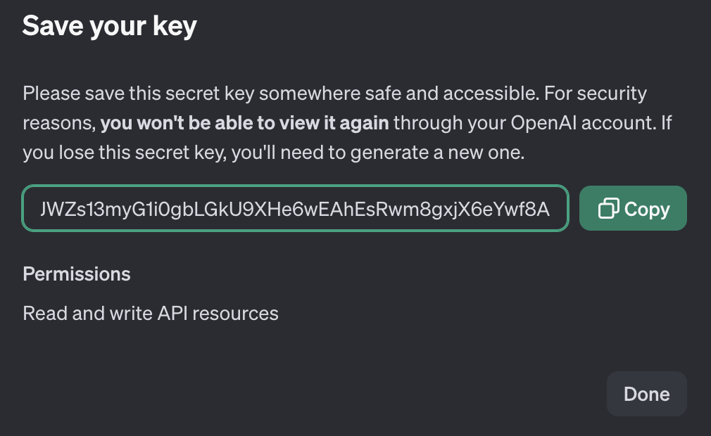

                    * Within your existing Google Colab notebook navigate to the new “Secrets” section in the sidebar.

                    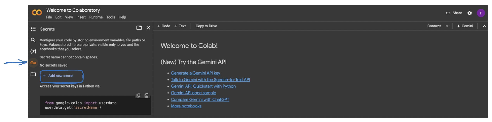

                    * Click on “Add a new secret.” Enter the name example: OPENAI_API_KEY and value of the secret(the API key sent to the tmedemouserX account or the .txt file you have downloaded). Note: The name is permanent once set. 

                    * The list of secrets is global across all your notebooks.

                    * Use the “Notebook access” toggle to grant or revoke access to a secret for each notebook.

                    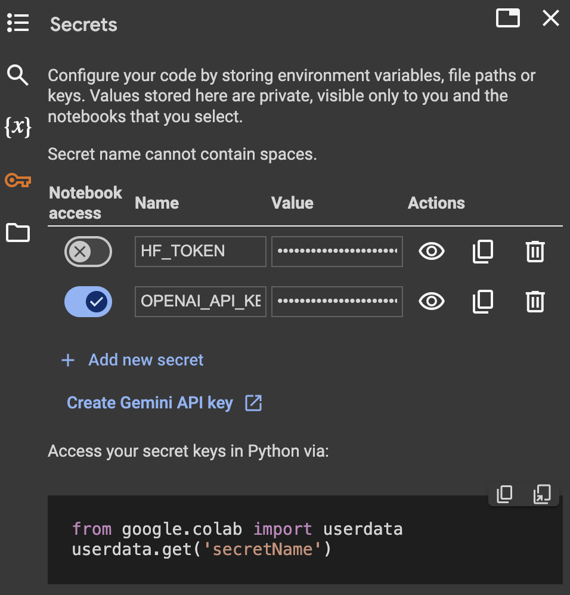

                    !!! important
                        Since ChatOpenAI has been deprecated in LangChain, we will use the langchain-openai package instead. Run the following command to update:

                    ```py linenums="1"
                    !pip install -U langchain-openai
                    ```

                    !!! important 
                        Let's import and load the envoirnment variables in the same notebook

                    ```py linenums="1"
                    from langchain_openai import ChatOpenAI
                    # from langchain.chat_models import ChatOpenAI
                    # from langchain.schema.messages import HumanMessage
                    from langchain_core.messages import HumanMessage
                    import os
                    from dotenv import load_dotenv
                    from PIL import Image
                    import base64
                    import io
                    # load_dotenv()
                    ```

                    !!! important 
                        Incorporating Secrets into your Code.  We'll use this later in the lab. Since GPT-5 was recently released, feel free to switch from GPT-4o to GPT-5.

                    ```py linenums="1"
                    import os
                    from google.colab import userdata
                    os.environ['OPENAI_API_KEY'] = userdata.get('OPENAI_API_KEY')
                    llm = ChatOpenAI(model="gpt-4o")
                    ```

                    !!! important
                        Function to Convert Image to Base64:

                    ```py linenums="1"
                    # Function to convert image to base64
                    def image_to_base64(image_path):
                        with Image.open(image_path) as image:
                            buffered = io.BytesIO()
                            image.save(buffered, format=image.format)
                            img_str = base64.b64encode(buffered.getvalue())
                            return img_str.decode('utf-8')

                    image_str = image_to_base64("/content/figures/figure-1-1.jpg")
                    ```

                    !!! note
                        This is the image that was extracted from our data and saved in the **Figures** folder.

                    * Lets see our  base64-encoded image

                    ```py linenums="1" 
                    print(image_str)
                    ```
                    <span class="colour" style="color:orange">Output: Our base64-encoded string </span>

                    ```
                    /9j/4AAQSkZJRgABAQAAAQABAAD/2wBDAAgGBgcGBQgHBwcJCQgKDBQNDAsLDBkSEw8UHRofHh0aHBwgJC4nICIsIxwcKDcpLDAxNDQ0Hyc5PTgyPC4zNDL/2wBDAQkJCQwLDBgNDRgyIRwhMjIyMjIyMjIyMjIyMjIyMjIyMjIyMjIyMjIyMjIyMjIyMjIyMjIyMjIyMjIyMjIyMjL/wAARCAB1AOkDASIAAhEBAxEB/8QAHwAAAQUBAQEBAQEAAAAAAAAAAAECAwQFBgcICQoL/8QAtRAAAgEDAwIEAwUFBAQAAAF9AQIDAAQRBRIhMUEGE1FhByJxFDKBkaEII0KxwRVS0fAkM2JyggkKFhcYGRolJicoKSo0NTY3ODk6Q0RFRkdISUpTVFVWV1hZWmNkZWZnaGlqc3R1dnd4eXqDhIWGh4iJipKTlJWWl5iZmqKjpKWmp6ipqrKztLW2t7i5usLDxMXGx8jJytLT1NXW19jZ2uHi4+Tl5ufo6erx8vP09fb3+Pn6/8QAHwEAAwEBAQEBAQEBAQAAAAAAAAECAwQFBgcICQoL/8QAtREAAgECBAQDBAcFBAQAAQJ3AAECAxEEBSExBhJBUQdhcRMiMoEIFEKRobHBCSMzUvAVYnLRChYkNOEl8RcYGRomJygpKjU2Nzg5OkNERUZHSElKU1RVVldYWVpjZGVmZ2hpanN0dXZ3eHl6goOEhYaHiImKkpOUlZaXmJmaoqOkpaanqKmqsrO0tba3uLm6wsPExcbHyMnK0tPU1dbX2Nna4uPk5ebn6Onq8vP09fb3+Pn6/9oADAMBAAIRAxEAPwD3+iiigAoopKAFopKWgCKVtkTP6DNeT3Gs39xeG6+0yK2cqFbAUegFeq3P/HtL/un+VeNjpXqZbCMuZtHzmfVZx5Ixdtz1fQrx9R0a3uZBh2BDY7kHGf0rUrD8Jf8AItWn/Av/AEI1t9K86qkqkku57mGk5UYSe7SHUUZpKg3FooooAKKKKACiiigAooooAY5wpPpXk13rN7dXxuftDoQ3yBWICjsMV6vL/q2+leMn7x+tenlkIycm0fO59UnFQUXbc9U8PXsmpaLBcSgeYcq2O5Bxn9K1RzWB4M/5FuD/AH3/APQjW/0rgrJRqSS7ntYSTlQhKW7SHUUlLWZ0BRRRQAUUUUAFFJuHrS0ANP8AKue8SeIG0VY44Yw88oJG77qgd66GuC8e/wDIQtf+uZ/nXThKcalZRlsefmdadHDSnB2ZpeHPFEuqXJtLmNBLtLI6cA47YrrK8y8Hf8jFF/uN/KvSx2p42lGnVtHYzynEVK+H5qju07DLn/j1l/3T/KvGe1ey3P8Ax6y/7h/lXjXauzK9pfI83iD4qfz/AEPT/CX/ACLVr/wL/wBCNblYfhL/AJFq1/4F/wChGtyvOr/xZerPdwn8CHojnvEmvto0MaQxq88udu48KB3PrVPw74ol1S6+y3UaLKVLIyZAOOxFZ3jz/j/tP+ubfzrN8Jf8jHb/AEb/ANBNd8cPTeF52tTxKuOrRzD2Sfu3Sseo0UUV5Z9IFFN3D1p1ACVgeI/EA0WJEjj8yeUEqD0AHc1v1wXj3/j+tP8Acb+YrowlONSqoy2ODMq86GHlOG5c0DxXNf3y2l4iB5M7HjBAzjOCK7HFeU+Gf+Rjs/8AfP8A6Ca9VrTHUo06iUVbQwyjEVK9Fuo7tMST/Vt9K8XP3j9a9ok/1bfSvFz94/WurK95fI8/iD/l38/0PS/Bv/Itwf77/wDoRrf71geDf+Rbg/33/wDQjW/Xn4j+LL1PcwX+7w9EYXiLXf7FtUZEDzSkhFPTjqTWX4f8Vz6hfrZ3scYaTOx4wQMjnBBJqDx/9+x/7af+y1heGv8AkY7L/fP/AKCa7qWGpywrm1rqeLicdWhj1Ti/dulb1PVRS0lLXln0gUUhIoyPWgLnj02p3txctcPcy+YW3ZViMfT0r07Qrt73RrWeXmRl+Y+pBxmvJq9T8L/8i5Z/7p/ma9jMqcYwjZHy2R1ZyrTUne6v+JsmuB8e/wDIQtf+uZ/nXfGuA8e/8hC1/wCuR/nXHgP46PUzn/dJfL8yj4O/5GKL/cb+VemV5n4O/wCRii/3G/lXplXmX8b5GWQ/7s/Vkdz/AMesv+4f5V4z2r2a5/49Zf8AcP8AKvGe1b5XtL5HFxB8VP5/oen+Ev8AkWrX/gX/AKEa3Kw/CX/ItWv/AAL/ANCNbledW/iy9We/hP4EPRHA+Pf+Qhaf9c2/nWb4S/5GO3+jfyNaXj3/AJCFp/1zb+dZ3hL/AJGOD6N/KvXp/wC5/JnzFf8A5GnzR6fUcz+XE74ztUnFSVDdf8esv+4f5V4i3PrJu0WeS3GqXt1cNcyXMokY5+VyNv09BXpfh+6kvtDtZ5WzIykMfUgkZ/SvKB0FeoeE/wDkXLT6N/6Ea9fMIRVKNl1PmclqzliJqTvdfqbhrg/H3/H9Z/8AXNv5iu8NcH4+/wCP6z/65t/MVxYH+Oj1c4/3SXyMbwz/AMjHZ/75/wDQTXqgryvwx/yMdl/vn/0E16pW2Z/xV6HNkP8AAl6/ohJP9W30rxc/eP1r2iT/AFbfSvFz94/Wtcr3l8jm4g/5d/P9D0vwb/yLcH++/wD6Ea3+9YHg3/kW4P8Aff8A9CNb/evOxH8WXqz3MF/u8PRHD+P/AL1h/wBtP/ZawfDX/Ix2X++f5Gt7x/8AesP+2n/stYXhn/kY7P8A3z/6Ca9bD/7m/RnzOM/5GS9V+h6qKbI21GPoM06mS/6t/wDdNeItz66WkTyO61W9u7t7h7iQOxyArkBfYVL/AG/rH/P9J+f/ANas7tS19PGlTcVdI/PZ163O2pP7zuZ/AkL3fmR3TJATkxBckewP/wBauqtLWOztY7eFdsca7VHtU4o6187Ur1KiSm72Pu6OEo0JOVONmxO9Y2uaDDrcS73Mc0edjjnGexFbVFZwnKEuaL1NatKFWDhNXTOe0LwxDo8jTtKZZyCobGAB7CuhFFLTqVJVJc0ndio0KdGHJTVkQ3P/AB6y/wC4f5V4x2r2l1DoVPQjFeez+CdQS6KwPE0BJw7HG0e4/wAK9DL60KfMpux4udYWrW5HTje1zqfCX/ItWv8AwL/0I1t9ao6XYrp2nQ2ifMI1wT6nqT+dXh1rz6slKba7nsYeDhSjGW6SMjXNCh1mBVdzHKmdjgZxn1HcVW0PwvHpErTvL585G0Nt2hR7CuhPTrQOnWqVaoociehMsJRlV9q4+93FprDIII4NOorM6TjbnwLDLeGWG5MUDHJi2ZI9gc11NnaRWNpHbwLtjjXCirFFaTrVKiSk72OajhKNGTlCNmwrH1rQ4NahVZCUlTOx17Z9R3FbFFTGTg+aO5rUpwqxcJq6ZzWh+E4tKuPtEk3nSjIQ7doX3x610tFFFSpKo+aTuyaNCnQjyU1ZDJP9W30rxg/eP1r2dxlT7159deCtQW8K27RPAzEh2bBUe4/wrvy6tCm5c7sePnWFq1lB043tc6Twb/yLcH+8/wD6Ea3+tUNIsF0zTYbVTu2DlvUnk/rV+uGrJSqSkurPWwsHCjGEt0kZetaLBrNqIpSUdDlJF6qf6is7RPCkelXP2qSczTDIQhdoXPtzzXTGk7VSrVFDkT0FPCUZ1VVlH3l1FoIyMUtFZHScdeeB4J70yw3LRRMctHtzj6GrH/CDaZ6z/wDfyunpa6FiqqSXMcH9m4a7fItRaKKK5zvCiimk4+lAAeKBzWTdeJNJtWKSXiFgcFUy3P4VWXxjo7HBuHX3Mbf4VoqFRq6izmljKEXZzV/U3/wpe1UbHU7PUVY2s6S7cbtp5GfUVezxUNNOzN4yjNc0XdCDpR0HSsy51/TbOd4JrpElT7ykHjjNS2Wq2WolxaTrKUxuwDxmm4TSvbQhV6TlyKSv2uaFFJmkLAVJqB4oHNY9z4n0m1Yo92rMDgiMFsflUCeMNHc4Nw6+7Rt/hWioVWrqLOaWLoRdnNX9Tf8Awpe1U7LULXUEaS1nSVAcEr2NXBUNNOzN4yUleLugpD9KM1Tu9RtLEA3NxHHnpubBP0FCTbsglJRV5OxcPFA571gt4w0dGx9oZvcRtj+VTW3ibSbp1jju1DscBXBXJ/GrdColdxZhHGUJOymr+ptUUUZrM6RKafwqO4uIrWJpZ5FRF5LMcAVjy+LdHjbH2ksf9lGI/lVxpzl8KuY1MRSp/HJL1NwH3FOrCh8V6PMcC7CH/popUfmRitmKZJkDxsGUjIZTkGiVOUfiVh069Op8Ek/QloooqDUKKKKACiikoAjlkWKJpHIVVGST2Fea674kudUneOGRorQHCqDguPU/4V1PjS7aDRfLQkGZwhx6ck/yrzkDJAA9sV6uX0ItOpL5HzOd42amqEHbuA5IA6ngVO1ldom5rWdV9TGQP5V6NoOg2+mWqM0atcsoLueSD6D0Fbe1ewGaqpmajK0Y3RFDIXKClUnZs4rwCfmvv+2f/s1dxjiq8VtDDI8kcSI743MoALY6Z/OrB6V5tar7Wo59z38Jh3h6Kpt3seV+Kf8AkZLv6r/6CK2vAP8Ar7//AHU/9mrF8U/8jHd/Vf8A0EVteAP9fff7qf1r1q/+5/JHzOE/5Gfzf6ncYwRXB+M9XmN7/Z8MjJEigybTgsT2Ptiu9PNeZ+LrZ4PEEsjAhJlVlPY4GD/KuDARjKt7x7GdVJww/udXqY1vbT3UwigiaSQ9FUc1pHwtrQTd9ib6B1z/ADqrpOpSaVfC5jRXOCrK3cHGfp0rtrLxpp9wQlwr27ercr+Yr08TVxFN/u43R4WAw+ErRtVm1Ib4MsrmytLmO5heJjLkBhjIwK6roKiilSVA8bqyMMgqcgipGOFJ9K8SrNzm5PqfW4elGjSUIu6RzPifxEdNjFtakfaZBknrsHr9a8+mmluZWlmkeSRurMck1PqN219qNxctn945I9h2H5VseFNDh1SeSe5y0EJA2f3m9/b/ABr2qUIYWjzy36nyeIq1swxPs4PTp29TCitp7jPkwSSY67EJ/lU9lG8WrWiSoyN56cMMH7wr1qOCOFAkcaqo6BRgCmyW0E2PMiR9pyNyg4Ncssyvdcuh6MMh5bNT1XkSqOB9Kzta1aLSLFp3wzH5Y0/vN6VpV5z41vHm1gWxb93AgwP9o8k/yrjwtH21VRex6eYYl4bDua32Rjahqd3qc5lupi/ov8K/QVWSN5W2xozt1woyav6Hpn9rapHbsSIgN0hHXaP/AK+K9QtbK3soFht4URF7Afzr1cRi4Ya0II+cweX1MdepOVl33bPH3R42KujKw7MMGr+l61e6VMrQSEx5+aJvun/CvTNQ0u11G3MVxErA9D3H0PavLdRs20/UJ7VjkxtgHGMjqD+Rp0MTDFJwkhYvBVcvkqkJadz1TTdQh1GyjuYfusOh6qe4PvV3PWuD8C3pW5uLMn5WXzB7EcH+Y/Ku8ryMRS9lUcD6jA4n6xQjUe/UWiiisDsCiiigDkfHULHS4ZBnCy8/iDXBI2x1bGcEGvXNVsI9S06a0k4Djg+h7H868pvLOexupLeddsiH8CPUe1e1l1SMqbpvdHyeeUJQrqstn+Z61Y3Ud5ZxTwtlHUMKsivKNL1290jKwOrRE5McnI/D0rafx5cmPCWSB/UuSPyxXJUy+qpe7qj0aGdUHTTqaM72l9a5fwnrN5q0t2bllwmzYqjAGc5/lXUVx1KbpycJbnq0K8a9NVIbM8r8U/8AIyXf1X/0EVteAP8AX33+6n9axfFP/IyXf1X/ANBFbXgH/X3/APup/wCzV7Nf/c/kj5XCf8jP5v8AU7mqGqaXa6pb+TdJuAOVYHBU+xq+a5XUfFw07U57N7QuIyMMrdcgHpj3rx6MJzl+73R9PiqtGnD998L0Mu+8D3MQZrO4WVeoVxhvz6fyrmbm1ns5jDcRtG46q3+ea7T/AITy1x/x5TZ+q1y+t6s2sXonMQiVF2KucnHXk17WFliea1VaHy2Pp4FR5qEtexr+DNTmjvxYO26KQEqD/CwGeK79xmNh6ivOfBlnJPri3AU+XApLN2yRgD9T+VekY4rzseoqt7p7WTOcsL7/AHdvQ8YliaCZ4nBDoxUg+oOK7HwLdxolzaMwEjOJFz1YYwcfl+tU/F+iSWt2+oQqWgmOXx/A3+BrmoZpLeZJYXZJEOVZTyK9NqOKoaP/AIc8BSnl+MvJbfij2fIxQfWvPrbxzeRR7bi2imI/iB2H8etOj8Y6jeahbwokcEbyqpwNzYJHc/4V5TwNZbo+hjnOGaVm7vyO/rzLxdGyeIpiejqrD6Yx/SvTR92uZ8W6K+oWq3MC7poQcqBy6+g96MFVVOsnLZ6FZth5V8M1HdanM+ELuO11wLIQBKhjBPY5BH8q9KVjk14uMqe4IP5Guhs/GWoWsSxSqk6qMAtkN+YruxmDnVlzwPHyrM4YeDpVdujPRywC5NeVeIbtLzXbqaMgpuCqR3wAM1a1HxXqF/G0S7YI2GCEPzEfWsNEaR1RAWZjgKByT6VWCwkqLc57kZpmMMUlSpbXOm8DwM+syTAfKkJBPuSMfyNeh4rB8MaOdK0797g3ExDv7eg/Ct/Nebi6qqVXJbHv5Zh5UMPGMt9xaKKK5j0AooooAQ1maro1nqsWLiP5l+668Mv0NFFOLad0Z1YRnBqSuee6too0648tZ969BlMH+dZYTPGaKK+koTk6auz4PE04xqtJaHeeCrMW0dxJv3GTbxtxjGf8a63tRRXhYt3rSPsctSWFiebeJLPzNfu28zGSvGP9kVreCbfyJb3592VTtj1oor0Kzf1T5I8fCwj/AGhe3VnZHpXmvim1/wCJ7cyb/vbeMdPlAoorky92qndnivh16mCV561r6PoS6ncBXuCig8gLnP60UV6+InKNJtM+ZwNOM6qUlc9D0/TrbS7bybaMKg5Pqx9Sav8AaiivnZNt6n3kIRhBKKI5IkmjKOoZWHIIyDXF614StYkkuLaVogvJjI3D8OeP1oorbC1JRmrM4swo06lP3lc4502tjOa1NF08z6nbnzduyRW+7nODn1oor3qzapM+Qw8IuutOp6qPu0GiivmT75bHMa54Zs73fcoTBP3ZBw31FcFcW/2eVk37sHGcYoor2cBUk002fK5zRpwneKsTWen/AGudY/NCBj125x+td9onh2z01fNUGWfH+scdPoO1FFTj6ktFfQvJqFNy5mtToBS0UV5B9QFFFFAH/9k=
                    ```

                    !!! important
                        Initializing the Multimodal and sending the Image to GPT-4o for Analysis:

                    ```py linenums="1"
                    chat = ChatOpenAI(model="gpt-4o", max_tokens=1024)

                    msg = chat.invoke(
                        [
                            HumanMessage(
                                content=[
                                    {"type": "text", "text": "Please give a summary of the image provided. Be descriptive"},
                                    {"type": "image_url", "image_url": {
                                        "url": f"data:image/jpeg;base64,{image_str}"
                                        }
                                    },
                                ]
                            )
                        ]
                    )
                    ```

                    * Retrieving the Response:

                    ```py linenums="1"
                    msg.content
                    ```

                    !!! important
                        Output: The response from the model is stored in msg.content, which will contain the descriptive summary of the image.

                    The image is the logo of Cisco Systems, Inc., commonly known as Cisco. The logo features the company name "cisco" written in lowercase letters in a distinct, modern sans-serif font. Above the text, there is a series of vertical bars of varying heights, which is stylized to resemble the Golden Gate Bridge. The logo is rendered in a light blue color. The design is clean, professional, and easily recognizable, reflecting Cisco's identity as a major tech company specializing in networking hardware, telecommunications equipment, and other high-technology services and products.

                    !!! note
                        The description of your image may vary depending on the image retrieved.
                    
                    <p align="right"> 👉 This concludes the task. Click the <strong>"Embeddings and Vector Database"</strong> Task on the left. </p>
            