# Task 4: Embeddings and Vector Database

???+ blank "Embeddings"

    ??? info "Introduction"

        === "1. Introduction"

            * Vector databases are specialized databases designed to store content like PDFs, blogs, Word documents, images, audio files, and videos as embedding vectors. This enables semantic-based retrieval, meaning the database can understand the meaning and context of the stored data, allowing for more accurate and relevant search results beyond simple keyword matching.

            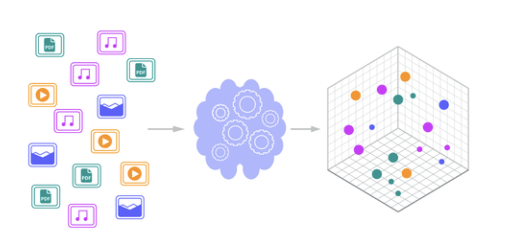

            * In the process of a large language model, embedding is generally the first step to convert discrete tokens (like words or subwords) into dense vector representations, which will allow the rest of the network to do the math necessary to predict the next word. Embeddings and vector databases are essential if you are building any kind of an AI product.

            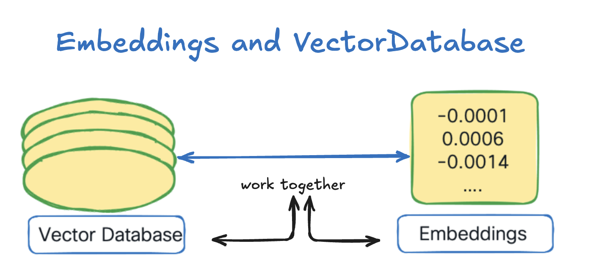

        === "2. What Are Embeddings?"

            Embeddings are basically data which are converted into an array of numbers called vectors that contain a pattern of relationships and can be used for similarity search. 

            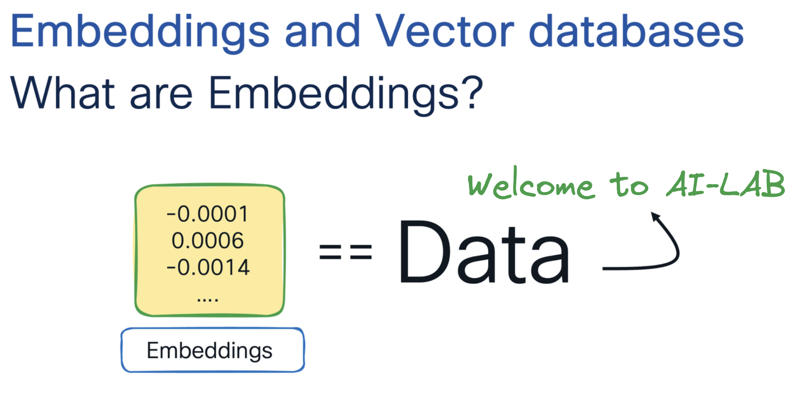


            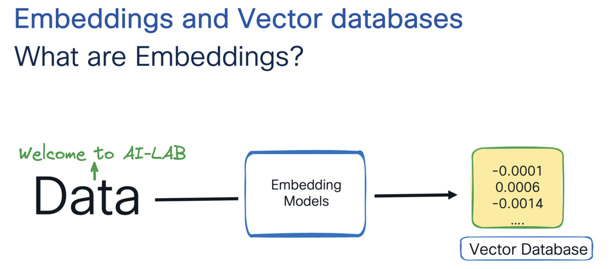

            Let's explain this concept using a 2D graph. In this graph, words like "Webex" and "collaboration" are often used in similar contexts, so their embeddings essentially vector representations are positioned close to each other (as shown in green in the below image ). These vectors are numerical arrays that computers can easily interpret.

            The advantage of using vectors is that we can find similar items by calculating the distances between their vectors, a process known as nearest neighbor search. However, simply storing these embeddings isn't enough. Performing queries across thousands of vectors can be incredibly slow. To overcome this, the vectors need to be indexed in the vector database. Indexing organizes the vectors in a way that speeds up the search process, allowing for quicker and more efficient retrieval of similar items.

            <span class="colour" style="color:red"> Note: In reality vectors can have hundred of dimensions </span>

            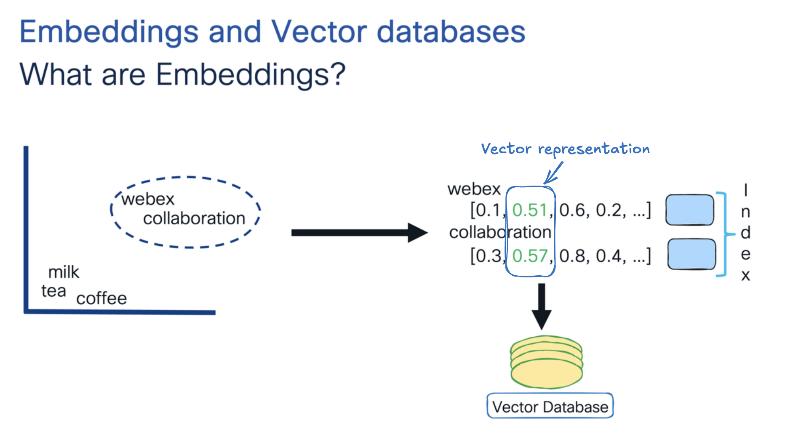

            Similarly, images are also broken into vectors, which are arrays of numbers that machines can process. Once these embeddings (both for words and images) are generated, they are stored in a specialized database known as a vector database.

            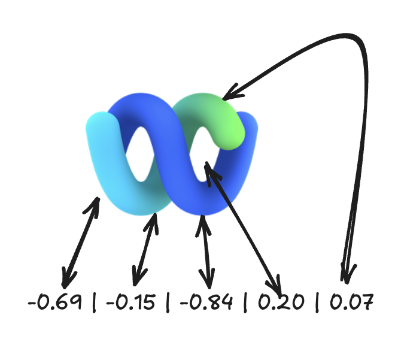

            There are numerous embedding models available, such as Google's Word2Vec, CLIP (Contrastive Language–Image Pretraining), and even those provided by OpenAI, which offer excellent capabilities for generating embeddings. However, the challenge is that these models don't include tools for storing and managing those embeddings. This is where vector databases become essential.

            !!! note
                In this lab session, we will be using OpenAI embeddings. More info can be found <a href="https://platform.openai.com/docs/guides/embeddings" target="_blank">here</a>
            
???+ blank "Vector Databases"

    ??? info "Introduction"

        === "1. Why Use Vector Databases?"
        
            Around 80% of the data we encounter is unstructured, including social media posts, images, and videos. This type of data doesn’t easily fit into traditional relational databases, which is where vector databases come into play.

            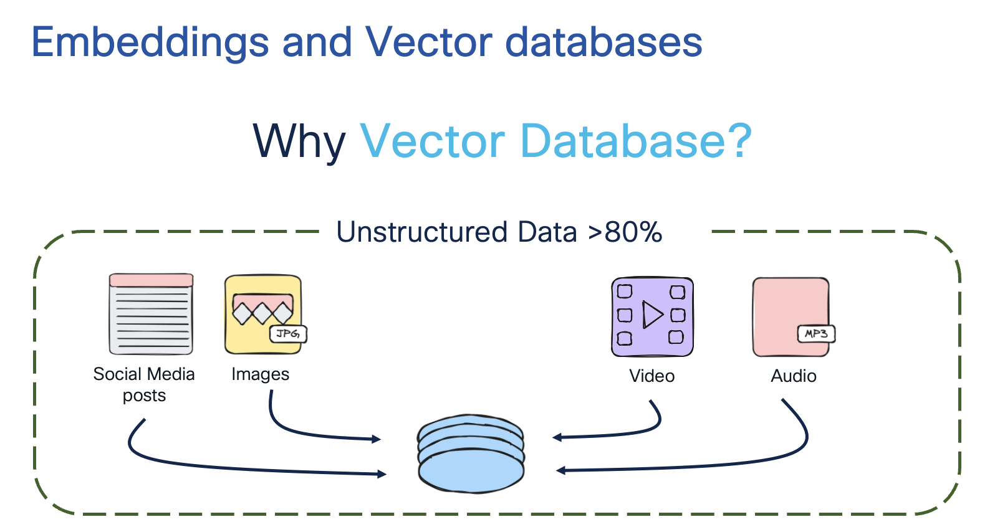

            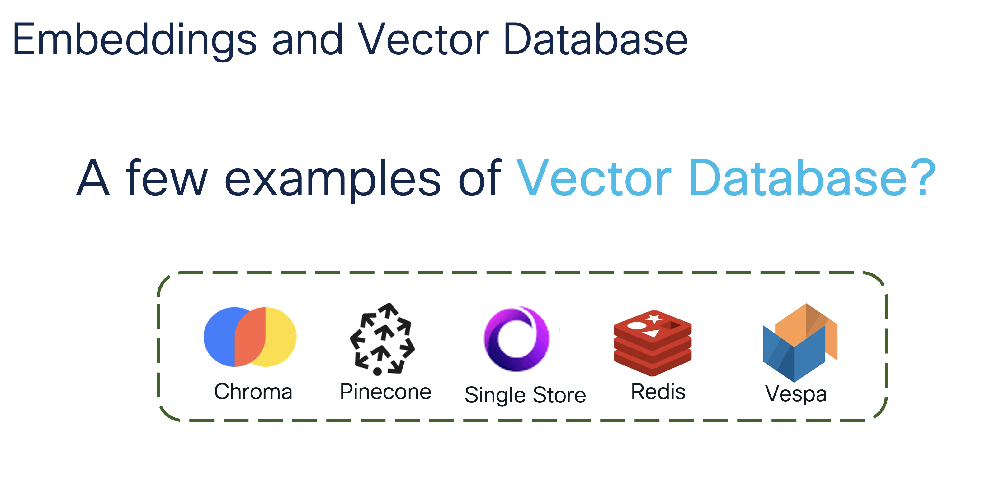
        
???+ blank "Understanding the workings of Embeddings and Vector Databases"

    ??? info "Introduction"

        === "1. Practical Example of Embedding Techniques"
        
            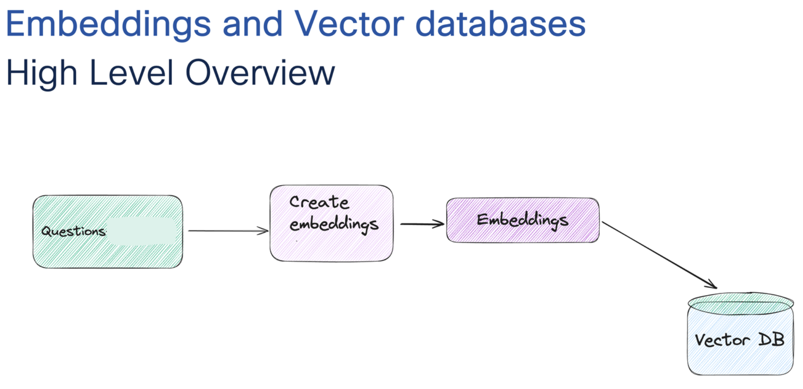

            The above image illustrates a high-level overview of how embeddings and vector databases will work together:

            * Questions/Input Data: The process begins with a set of questions or inputs that need to be understood or processed.

            * Create Embeddings: These questions or inputs are then converted into embeddings.

            * Embeddings: Once the embeddings are generated, they are stored temporarily and prepared for the next step. These embeddings are essentially numeric representations that contain the contextual information of the original input.

            * Vector Database (Vector DB): The generated embeddings are stored in a vector database(e.g Singlestore). This database is optimized for searching and retrieving embeddings quickly, enabling faster queries when comparing vectors to find similar items.

            !!! note
                There are many vector databases, such as Chroma, Faiss, Pinecone e.t.c. However, we will be using Chroma, and SingleStore for its ease of use and to help you better understand how embeddings are created.

            !!! important
                Please open a new <a href="https://colab.research.google.com/" target="_blank">Google Colab</a> notebook for this section. Click on **"File" > "New notebook"**.

            === "2. LAB"
                === "1. Set OpenAI Token"

                    !!! note
                        The OpenAI API keys have already been **pre-generated and provided** to you in your `.txt` file. You can skip the steps below and go straight to adding the key in Colab Secrets. We will use the OpenAI key to generate embeddings. More information about OpenAI embeddings can be found <a href="https://platform.openai.com/docs/api-reference/embeddings" target="_blank">here</a>.

                    ??? info "Optional — Create Your Own OpenAI API Key (click to expand)"

                        If you’d like to use your own key instead of the one provided, follow these steps:

                        * Browse to the <a href="https://platform.openai.com/api-keys" target="_blank">OpenAI API Keys page</a>
                        * Click **Create new secret key** — the key is automatically generated
                        * Save the API Key securely — you’ll need it in the next steps
                        * Use default settings when creating the key

                        

                    === "2. Text to Vectors — OpenAI Embeddings"

                        * Open Google Colab and create a new notebook(as mentioned). Click on "File" > "New notebook".

                        * Within your new Google Colab notebook navigate to the new “Secrets” section in the sidebar.

                        !!! note
                            If you have already set the OPENAI_API_KEY in the previous step, you can skip this step.                       

                        

                        * Click on “Add a new secret.” Enter the name example: OPENAI_API_KEY and value of the secret(the API key in your .txt file). Note: The name is permanent once set. 

                        * The list of secrets is global across all your notebooks.

                        * Use the “Notebook access” toggle to grant or revoke access to a secret for each notebook.

                        

                        * Once done lets start by installing all the necessary packages

                        ```py
                        !pip install python-dotenv langchain-openai chromadb langchain_community langchain_chroma
                        ```

                        * Import all the relevant libraries

                        ``` py linenums="1"
                        import os
                        from google.colab import userdata
                        os.environ['OPENAI_API_KEY'] = userdata.get('OPENAI_API_KEY')
                        ```

                        * We’ll initialize the OpenAI Embeddings model specifically text-embedding-3-large. This model will convert our text into vectors so we can do smart things like search, match, or retrieve context.

                        ```py linenums="1"
                        from langchain_openai import OpenAIEmbeddings
                        embeddings=OpenAIEmbeddings(model="text-embedding-3-large")
                        embeddings
                        ```

                        ```py linenums="1"
                        text="Welcome to the basics of GenAI created by Omer Ilyas."
                        query_result=embeddings.embed_query(text)
                        query_result   
                        ```     

                        !!! important
                            At this point, we’ve successfully used OpenAI’s text-embedding-3-large model to convert our input text into a numerical embedding.This embedding is just a list of floating-point numbers that represent the meaning of the sentence in a way that machines can understand. These vectors are what power many GenAI use cases, like searching through documents, matching similar content, or retrieving the most relevant context for a question.


                        🧠 Storing and Retrieving Embeddings with ChromaDB
                        
                        * Now, we’ll use ChromaDB to store the embeddings we just created and later retrieve information based on similarity.
                        
                        !!! note
                        
                            ChromaDB is an open-source vector database that lets us store text as high-dimensional vectors (embeddings) and run similarity searches over them. This is a key building block in many GenAI applications such as retrieval-augmented generation (RAG), semantic search, and intelligent assistants. 

                            One of the beauties of using ChromaDB is that it allows you to build and populate your vector database at runtime, no need to pre-create schemas, tables, or indexes like in traditional databases.
                        
                        * Before storing the data in Chroma, we wrap our input text inside a document object, because "Chroma.from_documents()" expects its input to be a list of document objects and not plain strings.

                        ```py linenums="1"
                        from langchain_core.documents import Document
                        docs = [Document(page_content=text)]
                        docs
                        ```

                        * Now that we’ve converted our text into a Document, the next step is to store it in a vector database using ChromaDB.

                        !!! note 
                            Langchain have released a new library for chroma you can also use from langchain_chroma import Chroma

                        ```py linenums="1"
                        from langchain_community.vectorstores import Chroma
                        db=Chroma.from_documents(docs,embeddings)
                        db
                        ```

                        !!! note
                            This is a key part of any GenAI or RAG workflow  we need a place to store text as vectors so we can later compare new user queries against it and retrieve relevant context.

                        * Now that our text is stored in ChromaDB as vectors, we can run similarity searches against it.

                        ```py linenums="1"
                        
                        ### Retrieve the results from query vectorstore db
                        query="who created the basics of GenAI? "
                        retrieved_results=db.similarity_search(query)
                        print(retrieved_results)
                        ```

                        !!! important

                            At this stage, we’ve built a simple yet powerful vector-based retrieval system using OpenAI embeddings (which incur cost) and ChromaDB. We converted plain text into high-dimensional vectors, stored them, and queried them semantically. Instead of relying on exact keyword matches, the system understands the meaning of the query and retrieves the most relevant content.
                            However, it’s important to note that this system performs retrieval, not question answering. It returns the most relevant document, and an additional language model would be needed to generate a direct answer (in the later section).
                            With just a few lines of code, we’ve created a foundational building block for modern GenAI systems, the ability to store and retrieve knowledge based on context and meaning.

                        === "3. Text to Vectors — Hugging Face Embeddings"

                            So far, we’ve used OpenAI embeddings, which are powerful but they come with API costs. The good news? There are many excellent open source alternatives that allow you to generate embeddings at no cost, such as Hugging Face.

                            !!! note 
                                If you've already downloaded the .txt file provided for this lab, it contains your Hugging Face API key.If you're unsure how to retrieve or use it, please refer to the Pre-requisites section at the start of this lab.
                        
                            * While on the same Google Colab notebook, navigate to the new “Secrets” section in the sidebar by clicking the "key icon”

                            

                            * Click on “Add a new secret”. Enter the name example: HF_TOKEN and value of the secret under (Huggingface API Key). Note: The name is permanent once set. 

                            * The list of secrets is global across all your notebooks.

                            * Use the “Notebook access” toggle to grant or revoke access to a secret for each notebook.

                            

                            * We will start by installing python packages

                            ```py linenums="1"
                            !pip install huggingface_hub langchain_huggingface sentence_transformers
                            
                            ```

                            * Lets import the required modules

                            ```py linenums="1"
                            import os
                            from google.colab import userdata
                            os.environ["HF_TOKEN"] = userdata.get('HF_TOKEN')
                            ```

                            * lets use emebddings from Huggingface.  More info on Huggingface embeddings can be found <a href="https://docs.langchain.com/oss/python/integrations/text_embedding/index#all-embedding-models" target="_blank">here</a>.

                            ```py linenums="1"
                            from langchain_huggingface import HuggingFaceEmbeddings
                            embeddings=HuggingFaceEmbeddings(model_name="all-MiniLM-L6-v2")
                            ```

                            * Lets convert our text into embeddings

                            ```py linenums="1"
                            text="Welcome to the basics of GenAI created by Omer Ilyas."
                            query_result=embeddings.embed_query(text)
                            query_result
                            ```

                            !!! note
                                In this session, we explored how open source embeddings can be used to convert data into numerical representations specifically, floating-point vectors that machines can process effectively. Earlier, we looked at how OpenAI’s models generate embeddings, providing a straightforward way to represent text data.
                                Then, we shifted focus to Hugging Face’s approach, where we used the all-MiniLM-L6-v2 model to create embeddings. This demo a powerful, open-source alternative that is both efficient and accessible. By converting our data into these embeddings, we enable various downstream tasks like similarity search, clustering, and classification. Overall, this hands on experience highlights how embeddings serve as a foundational step in many modern NLP workflows, allowing us to transform raw data into a format that models can understand and utilize effectively.

                            === "4. Text to Vectors — via Postman"

                                In this section, we manually generate embeddings in Postman and store them in SingleStore. This helps illustrate what an embedding looks like and how vector data can be saved and compared inside a database. We will insert the original text together with its embedding, then run a similarity search by comparing a query embedding against the stored vectors.
                                If you haven't installed Postman on your machine yet, you can download it from the following <a href="https://www.postman.com/downloads/" target="_blank">link</a>

                                !!! note
                                    If you are using the provided machines, Postman will already be pre-installed.

                                We will use embedding APIs to create an embedding vector that represents our input text. More information about OPENAI embeddings can be found at the following <a href="https://platform.openai.com/docs/api-reference/embeddings" target="_blank">link.</a> One important updat for a current lab, we are using text-embedding-ada-002 but you can change it to text-embedding-3-small unless your environment specifically requires the older model. OpenAI’s current docs point to the newer embedding models.

                                The POST request we will be using:

                                ``` https
                                https://api.openai.com/v1/embeddings
                                ```
                                * Open Postman, create a new request by pressing +. Select POST as your request and enter the request url  

                                

                                * Click on the Headers tab and enter the Following creds

                                ```JSON
                                Authorization: Bearer <Replace <your OpenAI API key here> with the actual API key you saved earlier in the .txt file.>
                                Content-Type : application/json
                                ```

                                !!! note
                                    Ensure there is a space between "Bearer" and your OpenAI API key.

                                

                                In this lab, we will be using the [text-embedding-ada-002 model or text-embedding-3-small](https://platform.openai.com/docs/guides/embeddings/embedding-models), but feel free to use any other embedding model of your choice.

                                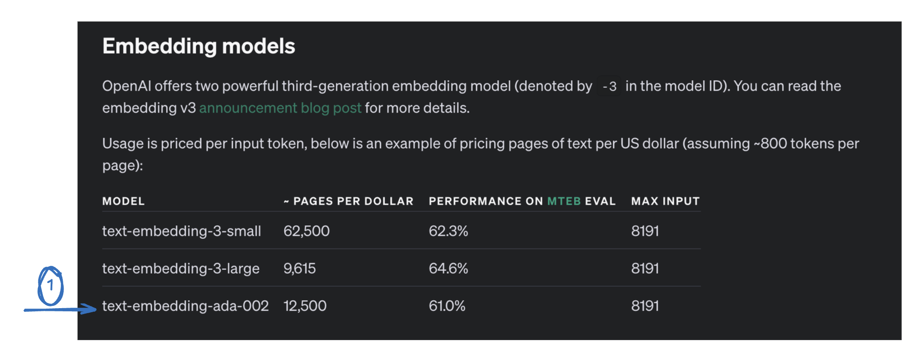

                                !!! note
                                    In the input field below, you can also enter your own text if you prefer.

                                * In Postman, click on the "Body" tab, select **RAW** and enter the following information, and then press **Send**.

                                ``` json
                                {
                                    "input": "WebexOne is an annual in-person and virtual event that takes place over four days. It’s an event focused on AI collaboration and customer experience, and it features a range of activities such as insightful breakout sessions, technical training courses, hands-on labs, inspiring keynotes, epic entertainment, a solutions showcase and expo, customer awards, meet the experts, 1:1 executive meetings, a partner program, and more!",
                                    "model": "text-embedding-3-small"
                                }
                                ```

                                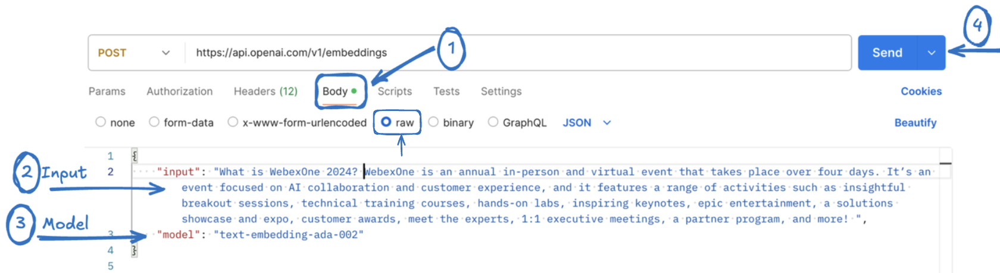

                                * You will receive a 200 OK message, confirming success. You'll notice that our text has been converted into embeddings (vectors/floating point numbers). In the upcoming steps, we will learn how to manually save this information in a vector database.

                                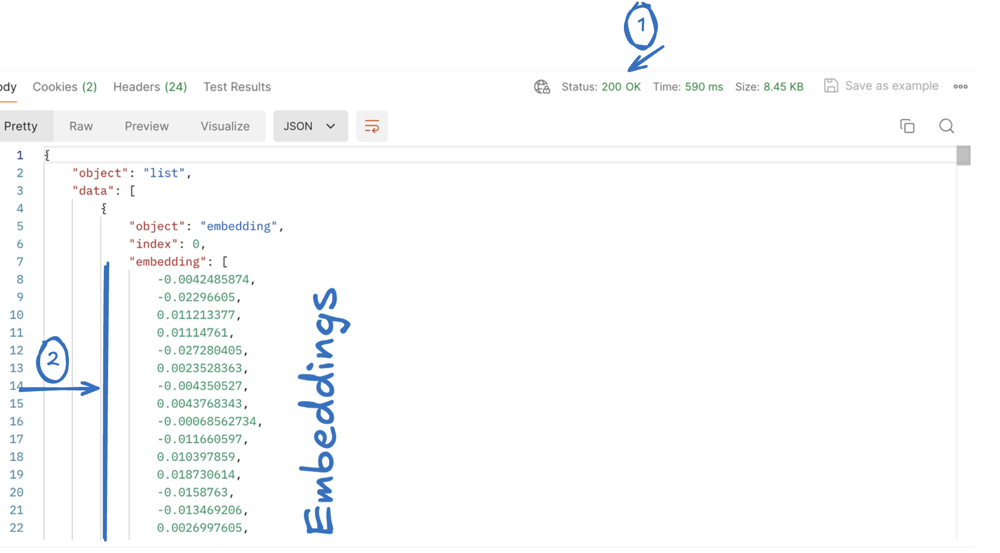

                                !!! note
                                    Text embedding models convert text into numerical data (embeddings) that represent the meaning of the text.
                                

                                === "5. Inserting Values in Vector Database"
                                    
                                    We have a variety of databases available. In the upcoming step, let's demonstrate how to use <a href="https://www.singlestore.com/built-in-vector-database/" target="_blank">SingleStore</a> as a vector database and save our embeddings there.

                                    !!! note
                                        This MANUAL step is simply to illustrate how embeddings are stored in vector databases.
                                        
                                        We will create a Free account on <a href="https://www.singlestore.com/built-in-vector-database/" target="_blank">SingleStore</a> since it provides some credits to set up a trial account.</span>

                                    !!! important
                                        If you encounter an error while inserting data, try deleting the table and running the insert again.

                                    

                                    * I’m choosing to create an account using Google, but feel free to use any other method that works for you. Please use your personal google account.

                                    

                                    * Select Continue

                                    

                                    

                                    !!! note
                                        Enter the verification code that you received at your chosen email address.

                                    

                                    

                                    

                                    

                                    

                                    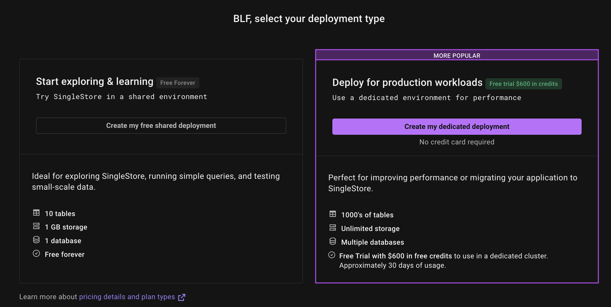

                                    * Keep default settings. Click on Create WorkSpace.  

                                    

                                    !!! note
                                        Workspace creation can take up to 5 minutes.                                   
                                    
                                    * Click Deployments and click on Create Workspace

                                    

                                    * Give your workspace a name, keep all other settings at their default, and click "Next."

                                    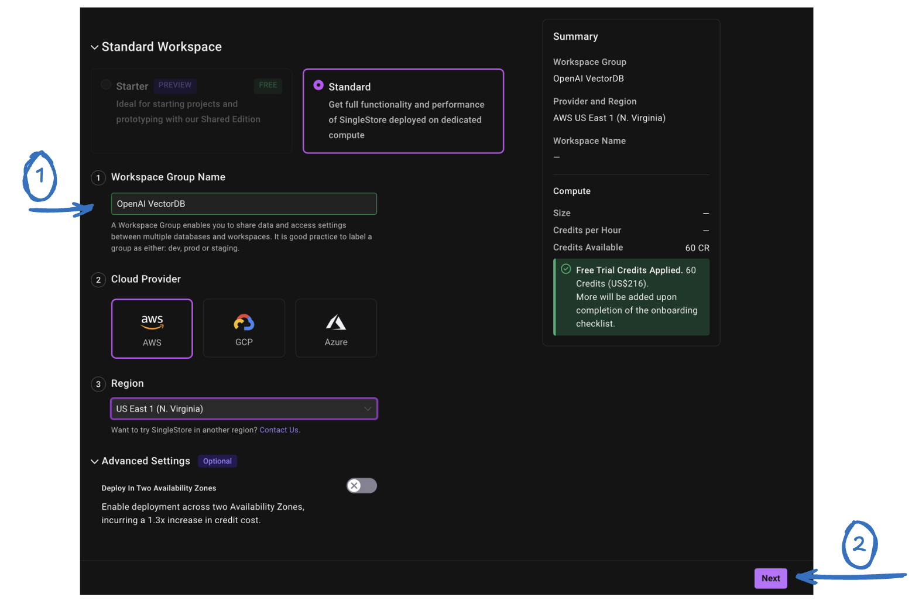

                                    * Then, leave everything as is and click on "Create Workspace."

                                    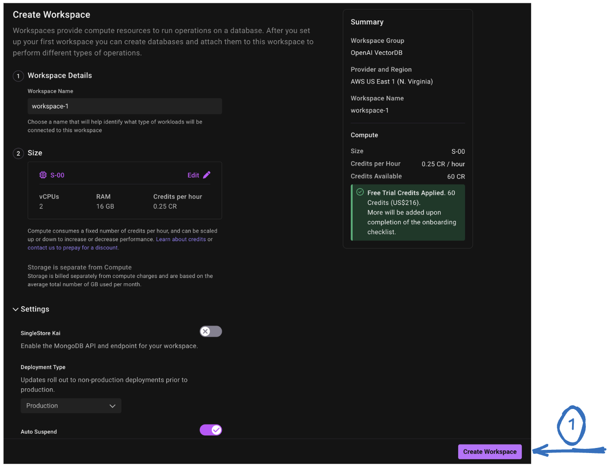

                                    !!! note
                                        Workspace creation may take up to 5 minutes. Please wait until the process is complete before proceeding.

                                    * Now we can create a database in the workspace we created earlier.  

                                    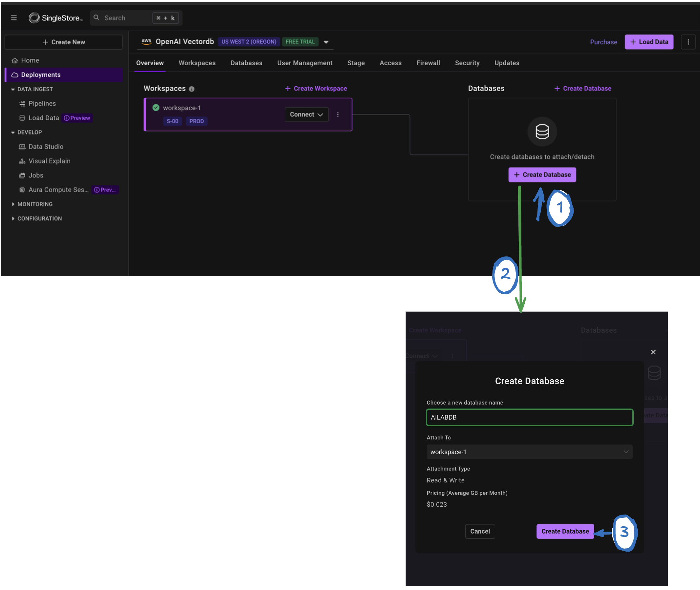
                                    


                                    

                                    * Click on Database tab and click on the database name you created earlier.

                                    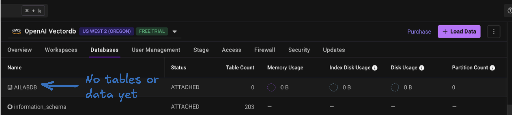

                                    * Navigate to Query Editor. Click Open SQL Editor

                                    

                                    *  Be sure to select your workspace and database that you have created earlier.

                                    

                                    * Run this SQL command to create a table called myvectortable  - Press Run

                                    !!! note
                                        You can also name the table as you prefer. 
                                        Please note: If your lab remains inactive for 20 minutes, the SingleStore database will automatically pause. To resume, go back to the homepage, click 'Resume,' and your workspace will be ready again within a few minutes."

                                    ```sql
                                    create table if not exists myvectortable (
                                    text TEXT,
                                    vector BLOB
                                    );
                                    ```
                                    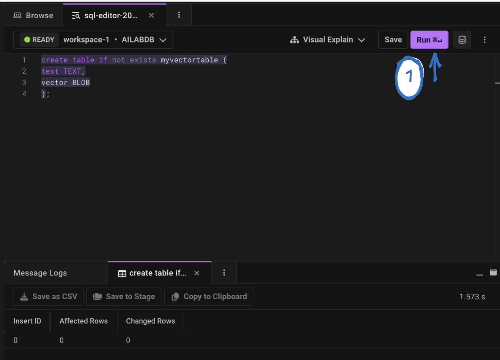

                                    * You can navigate to the Schema Explorer VIEW on the right, and verify that the table has been created.

                                    

                                    !!! important
                                        OR

                                    * Navigate to the Deployments tab, click on Databases, select your database, and verify that the table has been created.

                                    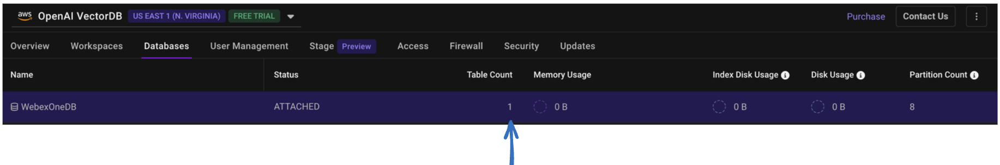

                                    !!! note
                                        The table name we created earlier may differ from the one shown in the image above. In our case, we named the table myvectortable.

                                    * Let's copy the embeddings we generated earlier using Postman so that we can insert them into our database.

                                    * To proceed, copy the input text (from the input field only) and all the values from the 'embedding' field (in reponse), including the square brackets [ ], as shown in the image. These will be used for insertion into our database.

                                    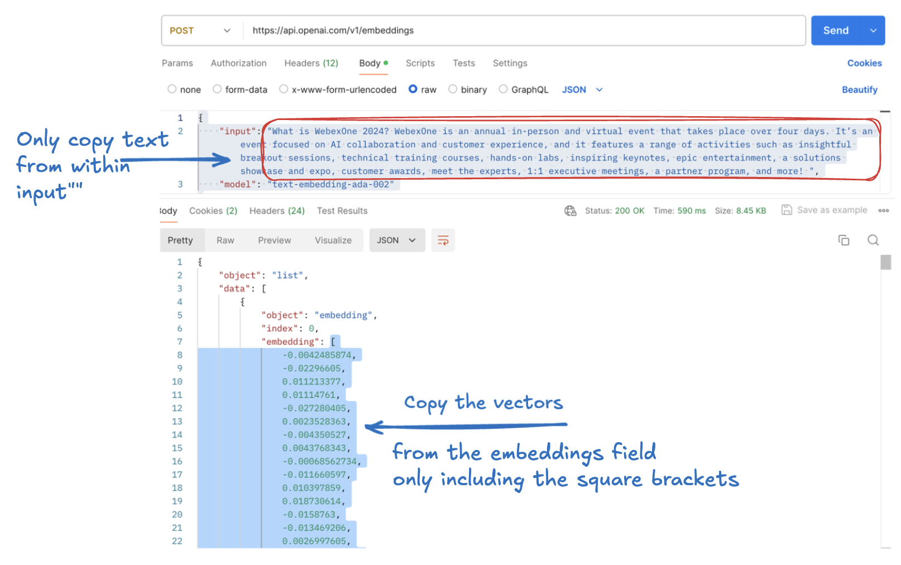

                                    * Let's head back to our Query Editor --> SQL editor and insert the values into our database using the below SQL command. Once done press "Run"

                                    !!! important
                                        You can reuse the same SQL editor block, remove the previous command, and run the following one.

                                    ```sql
                                    insert into myvectortable (text ,vector) values ("your_input_text", JSON_ARRAY_PACK("your_embeddings"))
                                    ```

                                    !!! note
                                    
                                        If you used the same input text from the lab guide in Postman to create the embedding, you can simply copy the instructions below into your SQL editor and press Run.
                                        
                                        However, if you modified the query in Postman, please ensure the following:

                                        - <b style="color: red;">Replace "your_input_text" with the input values from Postman.</b>
                                        - <b style="color: red;">Replace "your_embeddings" with the embeddings you copied earlier, including the square brackets [ ].</b>

                                    ``` sql
                                    insert into myvectortable (text ,vector) values ("WebexOne is an annual in-person and virtual event that takes place over four days. It’s an event focused on AI collaboration and customer experience, and it features a range of activities such as insightful breakout sessions, technical training courses, hands-on labs, inspiring keynotes, epic entertainment, a solutions showcase and expo, customer awards, meet the experts, 1:1 executive meetings, a partner program, and more!", JSON_ARRAY_PACK("[
                                    -0.009520035,
                                    -0.02111717,
                                    0.020877503,
                                    0.005828525,
                                    -0.031742327,
                                    0.00950672,
                                    -0.002098735,
                                    0.00007250289,
                                    0.008335024,
                                    -0.021623129,
                                    0.0029508779,
                                    0.029265786,
                                    -0.007935582,
                                    -0.00887427,
                                    -0.0066939825,
                                    -0.0020271684,
                                    0.014659522,
                                    -0.023021176,
                                    -0.00077267067,
                                    -0.042793557,
                                    -0.008940844,
                                    0.00091954885,
                                    -0.018454222,
                                    0.004986368,
                                    -0.028679937,
                                    0.00033869356,
                                    -0.008508115,
                                    -0.014686152,
                                    0.02109054,
                                    -0.004007735,
                                    0.0020770985,
                                    -0.015378518,
                                    -0.007902294,
                                    0.0027594788,
                                    0.015698072,
                                    0.010818222,
                                    -0.0063045267,
                                    -0.0071500125,
                                    0.009173852,
                                    0.000045587363,
                                    0.022235606,
                                    0.032940652,
                                    -0.009200482,
                                    0.014047044,
                                    -0.025178162,
                                    0.013634288,
                                    -0.02351382,
                                    -0.021782905,
                                    0.008441541,
                                    0.011317524,
                                    0.004723402,
                                    0.008188562,
                                    -0.014113618,
                                    0.0059583434,
                                    -0.006281226,
                                    -0.008761095,
                                    -0.021330204,
                                    0.01203652,
                                    0.019719122,
                                    -0.014845929,
                                    -0.015032335,
                                    0.003004137,
                                    -0.030410852,
                                    0.019133274,
                                    -0.025897158,
                                    -0.0160842,
                                    -0.029052751,
                                    0.028919604,
                                    0.011111146,
                                    -0.019865584,
                                    0.022981232,
                                    0.007869008,
                                    -0.004889836,
                                    -0.011237636,
                                    -0.00031726516,
                                    -0.0042640436,
                                    -0.02907938,
                                    0.00080013234,
                                    0.017788485,
                                    0.009014075,
                                    0.0016518593,
                                    -0.015578239,
                                    -0.014086989,
                                    -0.013980471,
                                    0.0006565828,
                                    0.0137940645,
                                    -0.0011850114,
                                    -0.0053791525,
                                    0.0012249555,
                                    -0.006061533,
                                    0.0054157684,
                                    -0.0076959166,
                                    -0.0031938718,
                                    0.01264234,
                                    -0.01985227,
                                    0.01777517,
                                    0.006640724,
                                    0.015232056,
                                    -0.008434884,
                                    -0.02860005,
                                    0.0018241185,
                                    0.006617423,
                                    -0.020624524,
                                    -0.017961577,
                                    -0.027747907,
                                    0.015218741,
                                    -0.0054557123,
                                    -0.005925057,
                                    0.021303575,
                                    0.031316254,
                                    -0.02455237,
                                    0.0075228247,
                                    0.012562452,
                                    -0.02955871,
                                    -0.031369515,
                                    -0.03810677,
                                    0.0034152293,
                                    -0.008574689,
                                    -0.0067139547,
                                    -0.011510588,
                                    0.020451432,
                                    0.008574689,
                                    0.009746386,
                                    -0.021197056,
                                    0.015218741,
                                    0.008255135,
                                    -0.02427276,
                                    -0.031289626,
                                    0.0415686,
                                    -0.014979076,
                                    0.043459293,
                                    -0.014872558,
                                    0.026949022,
                                    -0.008048757,
                                    -0.023646967,
                                    0.0097597,
                                    -0.019412883,
                                    -0.00047558566,
                                    -0.00627124,
                                    -0.0043206313,
                                    0.015764646,
                                    0.013427909,
                                    -0.0029325702,
                                    -0.00309734,
                                    -0.016696677,
                                    0.020438118,
                                    0.027481612,
                                    -0.014726096,
                                    0.029398933,
                                    0.003491789,
                                    0.0036249363,
                                    0.009540007,
                                    -0.0023051135,
                                    0.020105248,
                                    0.020944078,
                                    0.010032652,
                                    0.0065375348,
                                    0.040769715,
                                    -0.019559344,
                                    0.0108115645,
                                    -0.01982564,
                                    0.016909713,
                                    -0.0011575497,
                                    -0.00614475,
                                    0.008315052,
                                    0.026456377,
                                    0.020944078,
                                    0.013281448,
                                    0.0077558327,
                                    -0.00801547,
                                    0.0067705424,
                                    0.0018557411,
                                    -0.03459168,
                                    0.0146062635,
                                    0.009952764,
                                    0.0009545,
                                    0.009500063,
                                    -0.004367233,
                                    -0.03749429,
                                    -0.0059350426,
                                    0.013414595,
                                    -0.018361019,
                                    0.006674011,
                                    -0.024911867,
                                    -0.022408698,
                                    -0.02634986,
                                    0.008814354,
                                    -0.008488143,
                                    0.014393228,
                                    0.0050030113,
                                    0.0063711004,
                                    0.018241186,
                                    -0.0021303575,
                                    0.0021436722,
                                    -0.64635044,
                                    -0.01380738,
                                    0.013534428,
                                    -0.03762744,
                                    0.020984022,
                                    0.0041408823,
                                    0.025590919,
                                    -0.017708596,
                                    -0.020637838,
                                    0.032408062,
                                    0.0018690558,
                                    -0.002098735,
                                    -0.013254818,
                                    -0.028706567,
                                    0.0056654196,
                                    -0.024605628,
                                    -0.0030474097,
                                    -0.019266421,
                                    -0.014992391,
                                    0.0050995434,
                                    -0.012176325,
                                    0.01428671,
                                    -0.028919604,
                                    -0.0035750063,
                                    -0.021410093,
                                    -0.018068094,
                                    -0.00033328444,
                                    -0.0058218674,
                                    -0.024312705,
                                    -0.010638473,
                                    -0.012049834,
                                    0.012003233,
                                    0.016430382,
                                    -0.009200482,
                                    0.039278466,
                                    0.0006366107,
                                    -0.019719122,
                                    0.025071645,
                                    0.014206821,
                                    0.033153687,
                                    -0.015698072,
                                    0.026190082,
                                    -0.0004108844,
                                    0.003315369,
                                    0.0068837176,
                                    -0.01555161,
                                    -0.014872558,
                                    0.016976286,
                                    0.003393593,
                                    -0.02702891,
                                    -0.0046801292,
                                    -0.013740806,
                                    -0.01625729,
                                    0.0016194045,
                                    0.0014105297,
                                    0.0117103085,
                                    0.0094534615,
                                    -0.0022518544,
                                    -0.016923027,
                                    0.0036016356,
                                    -0.0141535625,
                                    0.011703651,
                                    -0.01957266,
                                    -0.022528531,
                                    -0.011930002,
                                    0.01797489,
                                    0.0037314543,
                                    0.02151661,
                                    0.009167194,
                                    0.0027145415,
                                    0.029825006,
                                    0.048279226,
                                    -0.0046035694,
                                    -0.006773871,
                                    0.0275615,
                                    0.02682919,
                                    0.00094534614,
                                    0.0027378423,
                                    -0.02362034,
                                    -0.00018536607,
                                    0.00915388,
                                    -0.012429304,
                                    -0.017895004,
                                    -0.006291212,
                                    0.014459802,
                                    -0.016323864,
                                    -0.03661552,
                                    -0.015165483,
                                    0.01317493,
                                    -0.019199846,
                                    0.03256784,
                                    0.00013949265,
                                    0.00015832052,
                                    -0.029851634,
                                    -0.011603791,
                                    0.015871163,
                                    0.010944712,
                                    0.04002409,
                                    0.0003923686,
                                    -0.017362414,
                                    -0.010405465,
                                    -0.02477872,
                                    0.028413642,
                                    0.019066699,
                                    0.012875348,
                                    0.02227555,
                                    -0.025138218,
                                    -0.0018807062,
                                    0.04471088,
                                    -0.019599289,
                                    -0.011903373,
                                    -0.01302181,
                                    -0.01181017,
                                    0.0029175912,
                                    -0.017562134,
                                    -0.022248922,
                                    -0.01726921,
                                    0.0033969216,
                                    -0.0046668146,
                                    -0.023673598,
                                    0.029052751,
                                    -0.028014202,
                                    0.0020338257,
                                    -0.0015428448,
                                    0.016683362,
                                    -0.0068437736,
                                    -0.0029958151,
                                    -0.018827034,
                                    -0.0075561116,
                                    -0.018906923,
                                    -0.016643418,
                                    -0.018853664,
                                    0.016883083,
                                    0.008055414,
                                    0.02007862,
                                    -0.018347705,
                                    -0.011470644,
                                    -0.007216586,
                                    0.0005546419,
                                    -0.00950672,
                                    -0.025710752,
                                    -0.0016551879,
                                    0.019133274,
                                    -0.01585785,
                                    -0.021529926,
                                    -0.021170428,
                                    -0.021716332,
                                    0.012049834,
                                    -0.006297869,
                                    0.014739411,
                                    -0.0071034105,
                                    -0.007655972,
                                    0.0041375537,
                                    0.03259447,
                                    0.033686277,
                                    0.010412122,
                                    -0.0025664151,
                                    -0.036935072,
                                    -0.036855184,
                                    -0.032328174,
                                    -0.000081552746,
                                    0.004986368,
                                    0.0026046948,
                                    0.0035716775,
                                    0.003628265,
                                    0.00313562,
                                    0.016457012,
                                    0.020091934,
                                    -0.005828525,
                                    -0.023327414,
                                    -0.0057186782,
                                    -0.0017642023,
                                    -0.014579634,
                                    0.023473877,
                                    -0.019213162,
                                    -0.00061663863,
                                    -0.011823484,
                                    0.022941288,
                                    0.008022128,
                                    -0.012216269,
                                    -0.007782462,
                                    0.014180192,
                                    -0.022621734,
                                    -0.016736621,
                                    -0.0146062635,
                                    0.019412883,
                                    0.030863553,
                                    0.00011161492,
                                    -0.012629026,
                                    0.006817144,
                                    0.001992217,
                                    0.010591871,
                                    -0.0064476603,
                                    0.01603094,
                                    -0.011836799,
                                    0.030890184,
                                    -0.022794826,
                                    0.007629343,
                                    0.01507228,
                                    0.017402358,
                                    0.037227996,
                                    0.0009952764,
                                    0.02230218,
                                    0.019892214,
                                    0.014925817,
                                    -0.008055414,
                                    -0.0017941605,
                                    -0.03709485,
                                    0.034138978,
                                    0.026509635,
                                    0.02179622,
                                    -0.016843138,
                                    0.000267751,
                                    -0.006710626,
                                    0.013321391,
                                    0.008508115,
                                    -0.009952764,
                                    0.018414278,
                                    -0.033313464,
                                    0.022195661,
                                    0.004037693,
                                    -0.03901217,
                                    0.022488587,
                                    -0.021077225,
                                    -0.035683487,
                                    0.018920237,
                                    0.013128328,
                                    0.037760586,
                                    0.003608293,
                                    -0.023833374,
                                    0.0016784887,
                                    0.023660284,
                                    0.027202003,
                                    0.016230661,
                                    -0.008667892,
                                    0.0037181396,
                                    0.0103588635,
                                    -0.029745117,
                                    0.04159523,
                                    0.004899822,
                                    0.001105123,
                                    0.024818664,
                                    0.01977238,
                                    0.0029825005,
                                    0.031795587,
                                    -0.016643418,
                                    0.018893609,
                                    -0.0025680794,
                                    -0.003393593,
                                    0.0029542067,
                                    -0.021077225,
                                    0.005505643,
                                    -0.008068729,
                                    -0.00852143,
                                    -0.016190717,
                                    0.007329761,
                                    -0.014419857,
                                    0.005292607,
                                    0.015378518,
                                    0.022129089,
                                    -0.0020970707,
                                    -0.005702035,
                                    0.019692492,
                                    -0.00094784267,
                                    -0.011643735,
                                    -0.0067072976,
                                    0.0039744484,
                                    -0.010585214,
                                    0.0063910726,
                                    -0.013467854,
                                    0.030277707,
                                    -0.014712782,
                                    0.007542797,
                                    -0.008121988,
                                    0.013900583,
                                    0.0099061625,
                                    -0.0015029006,
                                    -0.0011858435,
                                    -0.01597768,
                                    0.04260715,
                                    -0.024938498,
                                    -0.023141008,
                                    -0.011923345,
                                    0.021476667,
                                    0.0026030305,
                                    -0.014473116,
                                    -0.0128886625,
                                    -0.0012882005,
                                    0.010744991,
                                    0.028493531,
                                    -0.0011891722,
                                    0.0063777575,
                                    -0.030410852,
                                    -0.012941922,
                                    -0.0026795904,
                                    0.00009595971,
                                    0.02551103,
                                    -0.0043139737,
                                    -0.0019489443,
                                    -0.01934631,
                                    0.013288105,
                                    -0.0074429363,
                                    0.00862129,
                                    -0.039464872,
                                    0.03349987,
                                    -0.014579634,
                                    -0.025471088,
                                    -0.011870085,
                                    -0.004923123,
                                    -0.01140407,
                                    0.0024648902,
                                    0.006597451,
                                    -0.013001838,
                                    -0.024392594,
                                    0.005805224,
                                    -0.001651027,
                                    -0.0012457598,
                                    -0.006394401,
                                    0.018893609,
                                    -0.00007042246,
                                    0.0037048247,
                                    -0.042500634,
                                    -0.022408698,
                                    0.003383607,
                                    0.10215064,
                                    0.009606581,
                                    -0.0010618501,
                                    0.01403373,
                                    0.00073563907,
                                    0.0033419982,
                                    -0.04899822,
                                    -0.02958534,
                                    0.017815115,
                                    -0.013095041,
                                    -0.01805478,
                                    0.0046534995,
                                    0.008028785,
                                    0.0034951176,
                                    -0.0071167257,
                                    0.010638473,
                                    0.0033436627,
                                    -0.010511983,
                                    0.022435328,
                                    0.015631499,
                                    0.007090096,
                                    -0.01625729,
                                    -0.005452384,
                                    0.0048432346,
                                    0.015990997,
                                    -0.006510905,
                                    0.013534428,
                                    0.026389804,
                                    -0.0020970707,
                                    -0.040876236,
                                    0.005325894,
                                    0.019759066,
                                    0.0150589645,
                                    0.005312579,
                                    -0.012369388,
                                    0.033446614,
                                    -0.004387205,
                                    0.043885365,
                                    0.018321075,
                                    -0.01701623,
                                    -0.028626679,
                                    0.021356834,
                                    0.015951052,
                                    -0.021250317,
                                    -0.015258686,
                                    -0.022888029,
                                    0.009380231,
                                    0.030117929,
                                    0.0032854106,
                                    -0.028892973,
                                    0.0011617106,
                                    0.032248285,
                                    -0.014379913,
                                    -0.04207456,
                                    -0.022382068,
                                    0.013714177,
                                    -0.0065242196,
                                    -0.016377123,
                                    0.008414912,
                                    -0.038772505,
                                    -0.016124142,
                                    -0.028307125,
                                    -0.0048865075,
                                    0.010152485,
                                    -0.022994546,
                                    -0.010791592,
                                    -0.009839589,
                                    -0.007775805,
                                    -0.00045935833,
                                    0.008667892,
                                    -0.017215952,
                                    0.0029508779,
                                    -0.031156478,
                                    0.012708914,
                                    0.030384224,
                                    0.009972736,
                                    0.0037614123,
                                    -0.009852903,
                                    -0.02531131,
                                    0.022368753,
                                    0.0013938863,
                                    0.01631055,
                                    -0.02156987,
                                    0.00004046431,
                                    -0.0021985956,
                                    0.014206821,
                                    -0.0015470057,
                                    -0.0035051038,
                                    -0.00031060778,
                                    0.0046768,
                                    0.0066207517,
                                    -0.0385861,
                                    0.03906543,
                                    0.008794382,
                                    0.013328049,
                                    0.008168589,
                                    0.008341681,
                                    0.012182982,
                                    -0.011204349,
                                    -0.005369167,
                                    -0.0028460245,
                                    -0.026682727,
                                    -0.023686912,
                                    0.0055522444,
                                    0.011750253,
                                    -0.000096531825,
                                    0.012009891,
                                    0.016403753,
                                    -0.014912503,
                                    -0.004427149,
                                    -0.0039311755,
                                    -0.014313339,
                                    0.020797616,
                                    -0.014566319,
                                    -0.0123494165,
                                    -0.0015212084,
                                    0.006154736,
                                    0.010864823,
                                    -0.0020071962,
                                    0.002210246,
                                    0.024618944,
                                    -0.042979963,
                                    0.0037713984,
                                    -0.0012715572,
                                    -0.011870085,
                                    0.0051328302,
                                    0.0030540673,
                                    -0.010045967,
                                    -0.009646525,
                                    0.0015844534,
                                    -0.008980788,
                                    -0.02561755,
                                    0.01453969,
                                    0.0034019146,
                                    -0.023354044,
                                    -0.01375412,
                                    0.002278484,
                                    0.03110322,
                                    -0.0075827413,
                                    -0.023420617,
                                    -0.022488587,
                                    -0.011677022,
                                    0.017948262,
                                    -0.0075161676,
                                    0.0066773393,
                                    -0.025803955,
                                    -0.011071201,
                                    0.00826845,
                                    -0.017402358,
                                    0.0110778585,
                                    -0.0060448893,
                                    0.025803955,
                                    -0.00407098,
                                    -0.007056809,
                                    -0.0023400646,
                                    -0.026895763,
                                    -0.03717474,
                                    0.0013572708,
                                    0.0160842,
                                    0.021809535,
                                    0.017815115,
                                    0.003608293,
                                    0.020544635,
                                    0.009393545,
                                    -0.0052959356,
                                    -0.0024615615,
                                    -0.010398808,
                                    0.0038745876,
                                    -0.0012457598,
                                    0.023220897,
                                    -0.011317524,
                                    0.009067334,
                                    0.024632258,
                                    -0.0108115645,
                                    -0.0017958247,
                                    0.030357594,
                                    -0.009120593,
                                    -0.045270097,
                                    -0.010272318,
                                    -0.018827034,
                                    0.011723624,
                                    0.004257386,
                                    0.01175691,
                                    0.0045702825,
                                    -0.01529863,
                                    0.012569109,
                                    0.031023331,
                                    0.034884606,
                                    0.012735544,
                                    0.020890819,
                                    0.0010144163,
                                    0.0030940115,
                                    0.03259447,
                                    0.009380231,
                                    -0.00063244987,
                                    -0.004710087,
                                    -0.008754438,
                                    -0.041249048,
                                    -0.00016216931,
                                    0.040743086,
                                    0.013993786,
                                    0.019652547,
                                    0.0022551832,
                                    0.01054527,
                                    -0.0101791145,
                                    0.021383462,
                                    -0.01678988,
                                    -0.00915388,
                                    0.011204349,
                                    -0.025018387,
                                    0.020757671,
                                    -0.00021636444,
                                    0.004566954,
                                    -0.0077292034,
                                    0.004513695,
                                    -0.012569109,
                                    -0.00262966,
                                    0.032780875,
                                    -0.012609053,
                                    -0.018187927,
                                    0.00015083098,
                                    -0.0004289841,
                                    0.03818666,
                                    0.0050629275,
                                    0.029345674,
                                    0.036509,
                                    0.013860638,
                                    0.014925817,
                                    -0.0052193757,
                                    -0.009593266,
                                    0.005805224,
                                    0.011577161,
                                    0.030224446,
                                    -0.016204031,
                                    -0.011037915,
                                    0.005469027,
                                    0.0030590603,
                                    -0.02005199,
                                    -0.036988333,
                                    0.012742201,
                                    0.0103522055,
                                    0.015804589,
                                    -0.026762616,
                                    -0.016616788,
                                    -0.0050629275,
                                    0.033979204,
                                    -0.010012681,
                                    0.00080013234,
                                    0.0013464525,
                                    -0.030836925,
                                    0.0074961954,
                                    -0.009520035,
                                    -0.028813085,
                                    0.012828747,
                                    0.008414912,
                                    -0.0020770985,
                                    0.009020733,
                                    0.008048757,
                                    0.00241496,
                                    -0.004606898,
                                    -0.012469249,
                                    0.015964366,
                                    -0.0061680507,
                                    0.019479455,
                                    -0.00007099458,
                                    -0.005881784,
                                    0.0034252154,
                                    -0.012415989,
                                    0.01597768,
                                    0.022528531,
                                    -0.018267816,
                                    -0.024286075,
                                    -0.012189639,
                                    0.0055089714,
                                    -0.007775805,
                                    -0.009673155,
                                    -0.010591871,
                                    -0.017309155,
                                    -0.008128645,
                                    -0.0009020732,
                                    0.0024016453,
                                    0.0108115645,
                                    0.029185897,
                                    -0.014672837,
                                    0.016190717,
                                    -0.01957266,
                                    0.020265026,
                                    0.0033120401,
                                    0.00007052648,
                                    -0.025364568,
                                    -0.005325894,
                                    -0.0123427585,
                                    -0.01378075,
                                    0.03509764,
                                    0.018680573,
                                    0.00687706,
                                    -0.0010776613,
                                    -0.016177403,
                                    0.006587465,
                                    -0.0078024343,
                                    -0.0022901343,
                                    0.009380231,
                                    -0.025191477,
                                    -0.0019372938,
                                    -0.014965761,
                                    0.00080720574,
                                    0.033872683,
                                    0.0046568285,
                                    -0.038426325,
                                    0.0069702636,
                                    0.0050129974,
                                    0.0091805095,
                                    0.0038579442,
                                    0.013660917,
                                    0.032754246,
                                    0.004397191,
                                    -0.020717727,
                                    0.012049834,
                                    -0.011603791,
                                    0.0062679113,
                                    -0.0039411616,
                                    -0.004819934,
                                    0.029878264,
                                    -0.03507101,
                                    0.019253105,
                                    0.00019608026,
                                    0.040902864,
                                    0.009493406,
                                    -0.029265786,
                                    -0.0061813653,
                                    -0.007163327,
                                    -0.010418779,
                                    0.0015053971,
                                    -0.00024028934,
                                    -0.017562134,
                                    -0.017215952,
                                    -0.025644178,
                                    0.026669413,
                                    -0.010818222,
                                    -0.007296474,
                                    0.009773015,
                                    0.008341681,
                                    0.015764646,
                                    -0.0006207995,
                                    -0.011004628,
                                    -0.008847641,
                                    -0.032381434,
                                    -0.019878898,
                                    -0.04417829,
                                    0.0073497333,
                                    -0.009393545,
                                    0.04463099,
                                    0.0075161676,
                                    -0.024752092,
                                    -0.017615393,
                                    -0.028759826,
                                    -0.041834895,
                                    0.009193824,
                                    -0.0030757035,
                                    0.014686152,
                                    -0.0007431286,
                                    0.001952273,
                                    0.016883083,
                                    0.031476032,
                                    0.003403579,
                                    0.017801799,
                                    -0.023700228,
                                    0.03765407,
                                    0.00010188892,
                                    -0.016869769,
                                    0.0031938718,
                                    -0.016350493,
                                    -0.018227872,
                                    0.015431777,
                                    0.029345674,
                                    -0.009100621,
                                    -0.009007418,
                                    0.016243976,
                                    -0.01191003,
                                    -0.008374968,
                                    0.0128886625,
                                    0.0068570883,
                                    0.006051547,
                                    0.011936659,
                                    0.019266421,
                                    -0.043432664,
                                    0.018866979,
                                    0.025524346,
                                    -0.014872558,
                                    -0.022288864,
                                    0.008721151,
                                    0.0049530813,
                                    0.021023966,
                                    0.0045103664,
                                    0.018241186,
                                    -0.010758305,
                                    0.012569109,
                                    -0.019705806,
                                    0.00852143,
                                    -0.014100304,
                                    -0.0016385445,
                                    0.018733831,
                                    0.013953841,
                                    0.0070102075,
                                    -0.03517753,
                                    0.012655655,
                                    -0.023979837,
                                    -0.01092474,
                                    0.030437483,
                                    -0.029958151,
                                    -0.018667258,
                                    -0.022035886,
                                    0.003183886,
                                    -0.012176325,
                                    -0.0045602964,
                                    -0.007875665,
                                    0.014499745,
                                    -0.025258051,
                                    0.007649315,
                                    0.01923979,
                                    -0.04108927,
                                    -0.01051864,
                                    -0.015205426,
                                    0.013847324,
                                    0.0035417194,
                                    0.0030956757,
                                    -0.0067905146,
                                    -0.021583185,
                                    -0.017442303,
                                    0.02958534,
                                    -0.018613998,
                                    -0.01067176,
                                    -0.012635683,
                                    0.03805351,
                                    0.0070967535,
                                    0.033233576,
                                    0.20057316,
                                    0.004523681,
                                    -0.033899315,
                                    0.010452067,
                                    -0.017428987,
                                    0.0018740488,
                                    0.025364568,
                                    0.015272,
                                    0.015471721,
                                    0.007948897,
                                    -0.01752219,
                                    0.00072065997,
                                    -0.024419222,
                                    -0.007782462,
                                    0.017988207,
                                    -0.007709231,
                                    -0.027960941,
                                    -0.010338891,
                                    -0.011104489,
                                    0.01732247,
                                    0.017162692,
                                    -0.0017409015,
                                    0.015445092,
                                    -0.01954603,
                                    0.01754882,
                                    -0.012735544,
                                    -0.0062179808,
                                    -0.0031905433,
                                    0.0132481605,
                                    0.0119832605,
                                    -0.002230218,
                                    0.01954603,
                                    -0.006870403,
                                    0.020411488,
                                    -0.0063178414,
                                    -0.025151534,
                                    0.008434884,
                                    -0.012629026,
                                    0.023953207,
                                    0.024232816,
                                    -0.005282621,
                                    -0.0007943071,
                                    0.024459166,
                                    -0.008694521,
                                    0.004310645,
                                    0.009733071,
                                    -0.0021536583,
                                    -0.021423407,
                                    -0.00487985,
                                    0.0071699843,
                                    -0.04859878,
                                    0.017562134,
                                    0.017934946,
                                    0.032141767,
                                    0.00093369576,
                                    0.0043905335,
                                    0.019905528,
                                    0.021157112,
                                    -0.009460119,
                                    0.004660157,
                                    -0.008454856,
                                    0.01603094,
                                    -0.017735226,
                                    -0.014992391,
                                    -0.0012740536,
                                    -0.004270701,
                                    0.005532272,
                                    -0.0057220072,
                                    0.008714493,
                                    0.0146994665,
                                    0.017255895,
                                    -0.007722546,
                                    -0.017721912,
                                    0.0029958151,
                                    -0.018933551,
                                    -0.024339335,
                                    0.026443062,
                                    0.02961197,
                                    0.026988966,
                                    0.030410852,
                                    0.02505833,
                                    0.0010293954,
                                    -0.016204031,
                                    0.0027727934,
                                    -0.0066107656,
                                    -0.012096436,
                                    0.03155592,
                                    -0.023367358,
                                    -0.01585785,
                                    0.0008804368,
                                    -0.0031439418,
                                    0.006281226,
                                    -0.0038213287,
                                    -0.032408062,
                                    0.02860005,
                                    0.005905085,
                                    0.0073497333,
                                    0.015285315,
                                    -0.009480091,
                                    -0.008461514,
                                    -0.027934313,
                                    0.0634314,
                                    0.0020537977,
                                    0.0033586416,
                                    -0.005186089,
                                    -0.007229901,
                                    0.0042474004,
                                    0.010791592,
                                    0.0111710625,
                                    -0.0029874935,
                                    0.007902294,
                                    -0.010458724,
                                    0.015245371,
                                    -0.00026837512,
                                    -0.013601001,
                                    -0.0072432156,
                                    -0.004693444,
                                    -0.010944712,
                                    0.0093602585,
                                    -0.016377123,
                                    0.0020071962,
                                    -0.03847958,
                                    0.0009511713,
                                    0.009227111,
                                    -0.019000126,
                                    -0.047187418,
                                    0.0012274521,
                                    0.0054923277,
                                    -0.023260841,
                                    -0.02235544,
                                    0.022262236,
                                    0.011204349,
                                    0.0071566696,
                                    -0.037680697,
                                    -0.0064410027,
                                    -0.040796347,
                                    0.02804083,
                                    -0.009826274,
                                    -0.021263631,
                                    -0.0021802878,
                                    -0.02449911,
                                    -0.0062446105,
                                    -0.0128021175,
                                    0.00006849807,
                                    0.0050862287,
                                    -0.0056321328,
                                    0.031742327,
                                    0.010405465,
                                    -0.009932792,
                                    -0.01403373,
                                    -0.015724702,
                                    0.006394401,
                                    -0.017708596,
                                    -0.009826274,
                                    0.054909963,
                                    -0.013847324,
                                    -0.0137008615,
                                    -0.012602396,
                                    -0.0022252249,
                                    0.0059916303,
                                    -0.026669413,
                                    -0.047054272,
                                    0.0075760838,
                                    -0.013387965,
                                    -0.02654958,
                                    0.010259002,
                                    -0.16872431,
                                    -0.0036149505,
                                    0.019066699,
                                    0.0045935833,
                                    0.015564924,
                                    0.001120102,
                                    0.027960941,
                                    -0.00018182934,
                                    0.0017991535,
                                    0.008448199,
                                    0.008661235,
                                    -0.018347705,
                                    -0.010092569,
                                    0.0061281063,
                                    0.0109846555,
                                    0.010778277,
                                    0.020291654,
                                    0.0037913707,
                                    0.015338574,
                                    0.00046393528,
                                    0.016323864,
                                    0.0030440812,
                                    0.010918082,
                                    -0.01909333,
                                    0.011224321,
                                    -0.006324499,
                                    -0.016829824,
                                    -0.0006852927,
                                    0.00788898,
                                    -0.018946867,
                                    0.0061247777,
                                    -0.017002916,
                                    0.0390388,
                                    0.015804589,
                                    0.00203549,
                                    -0.0032205014,
                                    -0.020850874,
                                    -0.0009994373,
                                    -0.0107183615,
                                    0.01785506,
                                    0.005775266,
                                    -0.014859243,
                                    -0.001772524,
                                    -0.006470961,
                                    -0.025484402,
                                    0.0016268941,
                                    0.009992708,
                                    0.0006715619,
                                    0.0051428163,
                                    -0.008854298,
                                    0.028094089,
                                    -0.022967916,
                                    -0.00007619565,
                                    -0.014752726,
                                    0.035390563,
                                    0.027481612,
                                    0.01785506,
                                    -0.007110068,
                                    -0.0008821011,
                                    -0.01979901,
                                    -0.0013472846,
                                    -0.016337179,
                                    -0.0005604671,
                                    -0.039677907,
                                    -0.0039478187,
                                    0.008075386,
                                    -0.004700101,
                                    0.012202954,
                                    -0.026136823,
                                    0.019812325,
                                    0.01732247,
                                    0.0066240802,
                                    -0.0004776661,
                                    -0.015684757,
                                    0.015445092,
                                    0.0011525567,
                                    -0.00687706,
                                    0.021237,
                                    0.025777325,
                                    0.003648237,
                                    0.005009669,
                                    0.02761476,
                                    0.01904007,
                                    0.023247527,
                                    -0.018121354,
                                    -0.0155116655,
                                    -0.0051062005,
                                    0.00788898,
                                    0.026789246,
                                    -0.007050152,
                                    0.015085594,
                                    -0.026416432,
                                    -0.012109751,
                                    0.005921728,
                                    0.016297234,
                                    0.031981993,
                                    -0.011989919,
                                    0.0040743086,
                                    0.034671567,
                                    -0.0199721,
                                    -0.0026080236,
                                    0.04218108,
                                    0.009513377,
                                    -0.012056492,
                                    0.010112541,
                                    0.007596056,
                                    0.01704286,
                                    0.026869133,
                                    0.018214557,
                                    -0.011863428,
                                    -0.018161297,
                                    0.0069502913,
                                    0.03163581,
                                    0.01659016,
                                    0.02081093,
                                    0.021916052,
                                    0.03057063,
                                    -0.00052801246,
                                    0.008561375,
                                    0.022901343,
                                    0.042367484,
                                    0.00614475,
                                    -0.036881816,
                                    0.008787724,
                                    -0.035150897,
                                    -0.0077292034,
                                    -0.09213796,
                                    -0.034138978,
                                    -0.0032005294,
                                    0.028786456,
                                    0.0030856896,
                                    0.0067272694,
                                    -0.017415673,
                                    0.03349987,
                                    -0.0064410027,
                                    0.032914024,
                                    0.018800404,
                                    -0.015618184,
                                    -0.018174613,
                                    0.0007747511,
                                    0.02362034,
                                    -0.023793431,
                                    -0.005828525,
                                    0.0016135793,
                                    0.0068837176,
                                    0.014579634,
                                    -0.009087306,
                                    -0.034005832,
                                    0.012356074,
                                    -0.0061380924,
                                    -0.010751648,
                                    -0.02632323,
                                    -0.015458407,
                                    0.012928607,
                                    0.009073991,
                                    -0.0057486366,
                                    -0.0053292224,
                                    -0.023460561,
                                    0.024339335,
                                    -0.030703777,
                                    0.0275615,
                                    0.010844851,
                                    -0.013161615,
                                    -0.011790197,
                                    -0.019492771,
                                    -0.030517371,
                                    0.001977238,
                                    0.012089779,
                                    0.025045015,
                                    -0.024871923,
                                    -0.016749935,
                                    -0.004463765,
                                    0.018893609,
                                    -0.0027162058,
                                    -0.008840984,
                                    -0.023247527,
                                    -0.026656099,
                                    -0.013587686,
                                    -0.042820185,
                                    -0.023726856,
                                    0.007722546,
                                    0.028892973,
                                    -0.008175246,
                                    -0.01782843,
                                    -0.023899948,
                                    -0.014859243,
                                    -0.0085480595,
                                    -0.032754246,
                                    -0.01350114,
                                    0.026682727,
                                    -0.007742518,
                                    0.017841743,
                                    -0.0028110733,
                                    0.0068970323,
                                    0.000075779564,
                                    -0.021889424,
                                    -0.01979901,
                                    -0.0055921883,
                                    0.0019639232,
                                    0.022235606,
                                    -0.015951052,
                                    -0.023913262,
                                    -0.0060016164,
                                    -0.004586926,
                                    0.013208216,
                                    0.0064210305,
                                    -0.034911234,
                                    -0.01712275,
                                    -0.013927212,
                                    -0.014805985,
                                    0.005272635,
                                    0.007216586,
                                    0.015964366,
                                    -0.014086989,
                                    -0.011730281,
                                    -0.036003042,
                                    0.009613238,
                                    0.011996576,
                                    0.010012681,
                                    -0.013714177,
                                    -0.020225082,
                                    -0.017215952,
                                    0.0023583723,
                                    -0.02103728,
                                    -0.009859561,
                                    0.020065304,
                                    -0.0036515659,
                                    -0.0019472799,
                                    -0.081858985,
                                    0.02531131,
                                    -0.004217442,
                                    0.007229901,
                                    0.03304717,
                                    0.00036012195,
                                    0.040450163,
                                    -0.0015503344,
                                    -0.012808775,
                                    0.021916052,
                                    -0.028360384,
                                    0.023793431,
                                    0.0013764107,
                                    -0.0058085527,
                                    -0.0031389487,
                                    0.0094534615,
                                    0.046255387,
                                    -0.0118900575,
                                    -0.004167512,
                                    -0.00402105,
                                    0.010658445,
                                    0.010099226,
                                    0.010851508,
                                    0.0023550435,
                                    -0.008894242,
                                    -0.010472039,
                                    -0.023500506,
                                    0.00018110119,
                                    -0.010565242,
                                    -0.016177403,
                                    0.03571012,
                                    -0.019372938,
                                    -0.0005176103,
                                    0.047746636,
                                    -0.013061754,
                                    -0.0023933235,
                                    0.0025064987,
                                    0.04050342,
                                    -0.0030906827,
                                    0.023873318,
                                    -0.01577796,
                                    -0.017628709,
                                    0.02109054,
                                    -0.010525297,
                                    -0.03208851,
                                    0.004440464,
                                    0.012415989,
                                    0.018294444,
                                    -0.0009961085,
                                    0.000105113584,
                                    -0.0051328302,
                                    0.00031248017,
                                    -0.013913898,
                                    -0.0024132957,
                                    -0.0014987398,
                                    0.008894242,
                                    0.01507228,
                                    -0.021143798,
                                    0.03911869,
                                    0.020291654,
                                    0.030544,
                                    0.019466141,
                                    -0.004090952,
                                    0.023833374,
                                    0.000087273926,
                                    -0.011550532,
                                    -0.0038213287,
                                    -0.0026396462,
                                    -0.010578556,
                                    0.0037780558,
                                    -0.005052942,
                                    -0.0070767812,
                                    -0.0022618405,
                                    0.023260841,
                                    0.005818539,
                                    -0.014499745,
                                    0.02480535,
                                    0.010418779,
                                    -0.022874713,
                                    0.01782843,
                                    0.014060359,
                                    -0.027295206,
                                    0.00038238254,
                                    0.023380673,
                                    0.009034047,
                                    0.013714177,
                                    -0.02354045,
                                    -0.011543875,
                                    -0.018680573,
                                    -0.00015603204,
                                    -0.0072498727,
                                    0.016736621,
                                    -0.022701623,
                                    0.011683679,
                                    0.00076726155,
                                    0.01805478,
                                    0.0011891722,
                                    -0.007829064,
                                    -0.003954476,
                                    0.022541845,
                                    0.016803194,
                                    0.006637395,
                                    0.0048232623,
                                    -0.017735226,
                                    -0.039438244,
                                    0.00991282,
                                    -0.008568032,
                                    0.015378518,
                                    -0.004407177,
                                    0.002649632,
                                    0.005878455,
                                    0.011816827,
                                    -0.011570504,
                                    0.0029825005,
                                    -0.003588321,
                                    0.020158507,
                                    0.019878898,
                                    0.0056454474,
                                    -0.028227236,
                                    0.05906416,
                                    -0.0030074655,
                                    -0.0021952668,
                                    0.0028277168,
                                    -0.031476032,
                                    0.04015724,
                                    -0.002945885,
                                    0.002366694,
                                    -0.031369515,
                                    -0.015085594,
                                    -0.0037713984,
                                    0.00044229883,
                                    -0.024978442,
                                    -0.0046768,
                                    -0.007502853,
                                    -0.019865584,
                                    0.0029741789,
                                    -0.011017943,
                                    0.023607023,
                                    0.00042191063,
                                    0.05746639,
                                    0.024512425,
                                    -0.007176642,
                                    0.021636443,
                                    -0.009966078,
                                    0.008980788,
                                    0.00988619,
                                    0.0075694267,
                                    -0.0008159436,
                                    -0.028733196,
                                    0.022848085,
                                    0.0043505896,
                                    -0.011823484,
                                    -0.018347705,
                                    -0.022448642,
                                    -0.0030324308,
                                    -0.0025780655,
                                    -0.010891452,
                                    -0.012143037,
                                    0.0029342347,
                                    0.02857342,
                                    -0.013427909,
                                    0.040743086,
                                    0.0032937324,
                                    -0.01585785,
                                    0.014126933,
                                    0.007616028,
                                    0.00091122714,
                                    -0.026762616,
                                    -0.008401597,
                                    -0.010019338,
                                    -0.0017325798,
                                    -0.030863553,
                                    -0.008301737,
                                    -0.012901978,
                                    -0.026456377,
                                    0.01785506,
                                    -0.013647603,
                                    0.014805985,
                                    0.015205426,
                                    0.014646208,
                                    0.003525076,
                                    -0.01264234,
                                    -0.012249555,
                                    0.015471721,
                                    0.015245371,
                                    -0.03302054,
                                    -0.010278975,
                                    -0.027987571
                                    ]"))
                                    ```

                                    * After running the above command, you will see that our table now contains both the input text and the corresponding embeddings. Click on Sample Data

                                    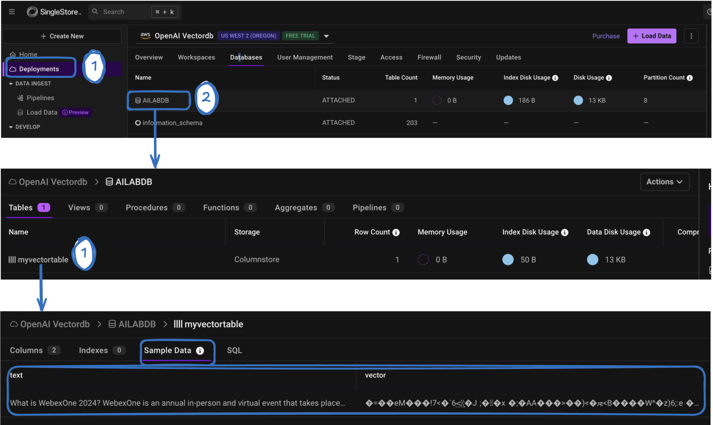

                                    * Let's now explore on how to retrive values from Vector Database


                                    === "6. Retrieving Values from the Vector Database"

                                        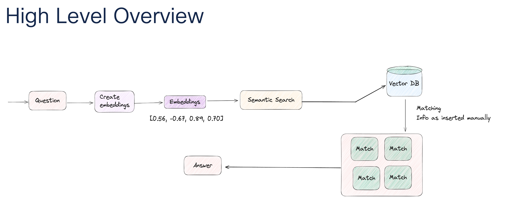

                                        * Searching the vector database is quite simple. Example: we want to find information related to WebexOne. To do this, we'll create embeddings for our query, "Is WebexOne an annual event?" and then search the vector database to find matches against the existing embeddings.

                                        ```py linenums="1"
                                        Is WebexOne an annual event?
                                        ```

                                        * Let's open Postman and create an embedding for our question now. Be sure to click on "Send."

                                        !!! note
                                            Make sure you use the same embedding techniques that we used earlier.

                                        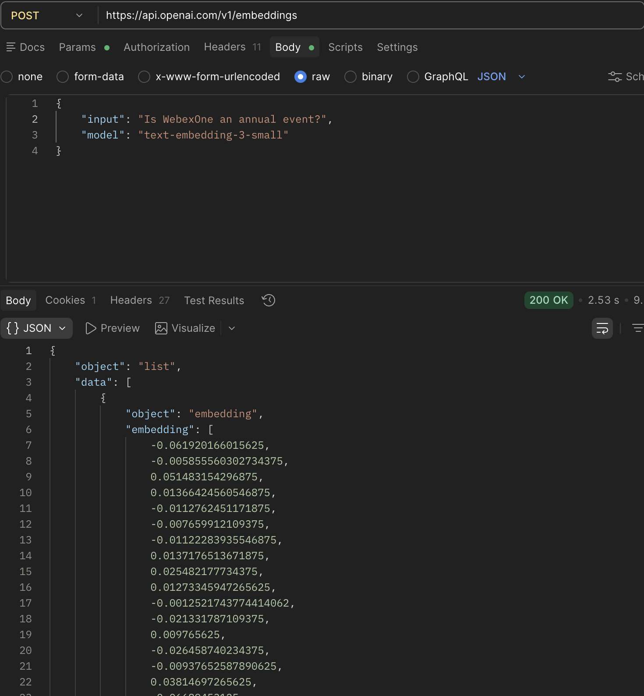

                                        * Let's head over to the Query editor and run a query for our search.

                                        

                                        !!! note
                                            You can reuse the same SQL editor block, remove the previous command, and run the following one.

                                        ``` sql
                                        select text,dot_product(vector,JSON_ARRAY_PACK("your_embeddings")) as score
                                        from myvectortable
                                        order by score desc
                                        limit 5;
                                        ```

                                        !!! note
                                            If you used the same input text from the lab guide in Postman to create the embedding for our question , you can simply copy the instructions below into your SQL editor and press Run.
                                            However, if you modified the query in Postman, please ensure the following:

                                            - <b style="color: red;">Replace "your_embeddings" with the embeddings you copied earlier, including the square brackets [ ].</b>

                                            <span class="colour" style="color:red">Note: You can copy the below code in SQL Editor </span>

                                        ```sql
                                        select text,dot_product(vector,JSON_ARRAY_PACK("[
                                                        -0.0015992327,
                                                        -0.021217406,
                                                        0.023561109,
                                                        -0.007348198,
                                                        -0.022857998,
                                                        0.00591785,
                                                        -0.026084036,
                                                        -0.010339866,
                                                        0.0052009528,
                                                        -0.009471317,
                                                        0.024016062,
                                                        0.020155845,
                                                        0.0155235855,
                                                        0.016833302,
                                                        -0.016268056,
                                                        -0.0006845853,
                                                        0.018032726,
                                                        -0.010718995,
                                                        0.00800995,
                                                        -0.026318405,
                                                        -0.0020266138,
                                                        -0.005607654,
                                                        -0.012642209,
                                                        0.0004174721,
                                                        -0.0139312465,
                                                        0.011725408,
                                                        -0.0008482998,
                                                        -0.011863273,
                                                        0.007830725,
                                                        0.010084816,
                                                        0.020266138,
                                                        -0.0033018638,
                                                        -0.0067071263,
                                                        0.0096919015,
                                                        -0.0028589729,
                                                        -0.008106455,
                                                        -0.0074722767,
                                                        -0.008127134,
                                                        0.017081458,
                                                        0.0004269503,
                                                        0.027407538,
                                                        0.033335727,
                                                        -0.008409758,
                                                        0.0017698404,
                                                        -0.036148172,
                                                        0.015220283,
                                                        0.012552598,
                                                        -0.01840496,
                                                        0.003656866,
                                                        0.008844032,
                                                        -0.0008293434,
                                                        0.0011752981,
                                                        -0.017660491,
                                                        -0.0013691706,
                                                        -0.016612718,
                                                        -0.01468261,
                                                        -0.008134028,
                                                        0.0076859673,
                                                        0.005087214,
                                                        -0.011732302,
                                                        0.0061280937,
                                                        0.020776238,
                                                        -0.01613019,
                                                        0.013414253,
                                                        -0.023326738,
                                                        -0.005252652,
                                                        -0.007361985,
                                                        0.011235988,
                                                        -0.018225737,
                                                        -0.020900317,
                                                        0.029613376,
                                                        0.015082418,
                                                        -0.002476398,
                                                        -0.033583883,
                                                        -0.002221348,
                                                        -0.012525025,
                                                        -0.020555655,
                                                        -0.015303002,
                                                        0.016543785,
                                                        0.006338338,
                                                        0.011732302,
                                                        -0.0038671098,
                                                        -0.023188872,
                                                        -0.0050527477,
                                                        0.0022144546,
                                                        0.010091709,
                                                        0.022982076,
                                                        0.0064417366,
                                                        0.0003356148,
                                                        0.0052354187,
                                                        0.02505005,
                                                        0.004004975,
                                                        0.0025918598,
                                                        0.011711622,
                                                        -0.020500507,
                                                        0.0061315405,
                                                        -0.01209075,
                                                        0.008685487,
                                                        0.010236467,
                                                        -0.003146766,
                                                        0.0029572016,
                                                        -0.0020989927,
                                                        0.000089504465,
                                                        -0.016902234,
                                                        -0.029392792,
                                                        0.018501466,
                                                        0.008878498,
                                                        0.014213869,
                                                        0.0075205294,
                                                        0.015068632,
                                                        -0.027159382,
                                                        0.006593388,
                                                        -0.0022196246,
                                                        -0.0160199,
                                                        -0.028565602,
                                                        -0.03151591,
                                                        0.008561409,
                                                        -0.012552598,
                                                        -0.014027752,
                                                        -0.0060695014,
                                                        0.017963793,
                                                        0.0076997536,
                                                        0.030909305,
                                                        -0.027090449,
                                                        0.021961875,
                                                        -0.0008586397,
                                                        -0.043372292,
                                                        -0.008726847,
                                                        0.014751542,
                                                        -0.013786488,
                                                        0.020983035,
                                                        0.0024195286,
                                                        0.017701851,
                                                        -0.00077548996,
                                                        -0.023836838,
                                                        0.022085954,
                                                        -0.008630342,
                                                        0.0072654793,
                                                        -0.018597972,
                                                        -0.02473296,
                                                        0.016654078,
                                                        0.010332973,
                                                        -0.011945992,
                                                        0.011511718,
                                                        -0.001213211,
                                                        0.013979499,
                                                        0.028675895,
                                                        -0.0065037757,
                                                        0.014875621,
                                                        -0.013145416,
                                                        -0.013248815,
                                                        0.009891805,
                                                        0.013097163,
                                                        0.030799014,
                                                        0.009216268,
                                                        0.008099562,
                                                        -0.017770784,
                                                        0.02696637,
                                                        -0.010698315,
                                                        -0.009733261,
                                                        -0.023023436,
                                                        0.014999699,
                                                        0.01648864,
                                                        -0.00008191112,
                                                        -0.010153748,
                                                        0.031736497,
                                                        0.015964754,
                                                        -0.0077617927,
                                                        0.011842594,
                                                        -0.01051909,
                                                        -0.0061763464,
                                                        -0.021810224,
                                                        -0.02269256,
                                                        0.014517172,
                                                        0.022982076,
                                                        0.013538331,
                                                        -0.012966192,
                                                        -0.004049781,
                                                        -0.03490739,
                                                        -0.022899356,
                                                        -0.008375292,
                                                        -0.010091709,
                                                        -0.011470358,
                                                        -0.011594436,
                                                        -0.03057843,
                                                        -0.015440866,
                                                        -0.0045840074,
                                                        -0.011711622,
                                                        0.012669782,
                                                        0.000019144909,
                                                        0.015151351,
                                                        0.006103968,
                                                        0.0021420757,
                                                        0.009760833,
                                                        -0.65469277,
                                                        -0.012973085,
                                                        0.03490739,
                                                        -0.01797758,
                                                        0.033528738,
                                                        0.005318138,
                                                        0.03038542,
                                                        0.0019456181,
                                                        -0.055642266,
                                                        0.024278006,
                                                        -0.0007720433,
                                                        -0.003446622,
                                                        -0.012235508,
                                                        -0.011842594,
                                                        0.011863273,
                                                        -0.022747705,
                                                        -0.0072241197,
                                                        0.0020248904,
                                                        0.0066692135,
                                                        0.0064520766,
                                                        0.002653899,
                                                        0.016323201,
                                                        -0.025339564,
                                                        -0.0059592095,
                                                        0.0097953,
                                                        -0.0035172778,
                                                        0.021176046,
                                                        -0.043482583,
                                                        -0.013979499,
                                                        -0.01411047,
                                                        -0.0055938675,
                                                        0.012221722,
                                                        0.020748664,
                                                        -0.010629382,
                                                        0.03835401,
                                                        -0.012545704,
                                                        -0.0170401,
                                                        0.01617155,
                                                        0.0034552386,
                                                        0.023437029,
                                                        -0.019328656,
                                                        0.035238262,
                                                        0.0024729513,
                                                        0.015509799,
                                                        -0.009657435,
                                                        0.00412216,
                                                        -0.02005934,
                                                        0.01289726,
                                                        0.019149432,
                                                        -0.030909305,
                                                        -0.010470837,
                                                        0.0040980335,
                                                        -0.007348198,
                                                        0.0018439428,
                                                        0.0041807527,
                                                        0.013124737,
                                                        0.028014144,
                                                        0.003618953,
                                                        -0.03463166,
                                                        0.010243361,
                                                        -0.018432535,
                                                        0.02107954,
                                                        -0.013028231,
                                                        -0.01313163,
                                                        0.000810387,
                                                        -0.0037361383,
                                                        -0.019645745,
                                                        0.035707004,
                                                        0.0091335485,
                                                        0.003286354,
                                                        0.030688722,
                                                        0.021796437,
                                                        -0.018639332,
                                                        -0.006393484,
                                                        0.021961875,
                                                        0.02739375,
                                                        -0.0037602647,
                                                        -0.0026573455,
                                                        -0.031846788,
                                                        -0.007058682,
                                                        -0.008265,
                                                        -0.011118802,
                                                        -0.018432535,
                                                        -0.0007716125,
                                                        0.008616555,
                                                        -0.030661149,
                                                        -0.032756694,
                                                        -0.011732302,
                                                        0.016116405,
                                                        -0.00077075086,
                                                        0.007954803,
                                                        0.0075687817,
                                                        0.008678595,
                                                        -0.0059109568,
                                                        -0.004029101,
                                                        0.024788106,
                                                        -0.017205536,
                                                        0.025422284,
                                                        0.019880116,
                                                        -0.010491517,
                                                        -0.0010899942,
                                                        -0.00007620266,
                                                        0.03112989,
                                                        0.0067863986,
                                                        0.022444403,
                                                        0.019673318,
                                                        -0.034990106,
                                                        0.011477252,
                                                        0.04568842,
                                                        -0.006465863,
                                                        -0.000060585153,
                                                        -0.002693535,
                                                        0.0019662979,
                                                        0.0050596413,
                                                        -0.014269015,
                                                        -0.028014144,
                                                        0.008389078,
                                                        0.007410237,
                                                        -0.017660491,
                                                        -0.0012140726,
                                                        0.009753941,
                                                        -0.013062698,
                                                        -0.002631496,
                                                        -0.023698973,
                                                        0.013793381,
                                                        0.01880477,
                                                        -0.0102088945,
                                                        -0.013614157,
                                                        -0.010388119,
                                                        -0.0063417843,
                                                        -0.011808127,
                                                        -0.0018249863,
                                                        0.02158964,
                                                        0.008602768,
                                                        0.01715039,
                                                        -0.008699274,
                                                        -0.008120242,
                                                        -0.0100158835,
                                                        0.0004144563,
                                                        -0.015358147,
                                                        -0.0029192888,
                                                        0.007299945,
                                                        0.012724929,
                                                        -0.023795478,
                                                        -0.016240483,
                                                        -0.015096204,
                                                        -0.017122818,
                                                        0.011566863,
                                                        -0.010953365,
                                                        0.021699931,
                                                        -0.007789366,
                                                        0.0015906161,
                                                        0.0055559548,
                                                        0.015909607,
                                                        0.02579452,
                                                        0.014393093,
                                                        0.0048735235,
                                                        -0.030054543,
                                                        -0.038023133,
                                                        -0.0109188985,
                                                        0.016874662,
                                                        0.00009278952,
                                                        -0.0076446077,
                                                        0.0008995683,
                                                        0.016709223,
                                                        0.018198164,
                                                        -0.004659833,
                                                        -0.0021420757,
                                                        0.006045375,
                                                        -0.018556613,
                                                        -0.007837619,
                                                        -0.005518042,
                                                        0.0017302042,
                                                        0.031267755,
                                                        -0.004359977,
                                                        -0.0018663458,
                                                        -0.008003056,
                                                        0.021575853,
                                                        -0.00054456625,
                                                        -0.005983336,
                                                        0.008023736,
                                                        0.027876278,
                                                        -0.0153305745,
                                                        -0.008561409,
                                                        0.0027624676,
                                                        0.021134686,
                                                        0.021382842,
                                                        0.024664028,
                                                        -0.0091335485,
                                                        0.022458188,
                                                        0.009871125,
                                                        0.0047632316,
                                                        -0.01593718,
                                                        0.011594436,
                                                        -0.013834741,
                                                        0.0076928604,
                                                        -0.013276388,
                                                        0.011022297,
                                                        0.007768686,
                                                        0.030523285,
                                                        0.02590481,
                                                        -0.012525025,
                                                        0.015757956,
                                                        0.009340346,
                                                        -0.008651021,
                                                        -0.01699874,
                                                        -0.002260984,
                                                        -0.019893901,
                                                        0.02505005,
                                                        0.019149432,
                                                        0.0151789235,
                                                        -0.012911046,
                                                        0.01364173,
                                                        0.010663848,
                                                        0.0024246986,
                                                        -0.010174428,
                                                        -0.009147335,
                                                        0.00020970541,
                                                        -0.024622668,
                                                        0.011897739,
                                                        -0.011167055,
                                                        -0.032315526,
                                                        0.02811065,
                                                        -0.013490079,
                                                        -0.018363602,
                                                        0.012021817,
                                                        0.012476772,
                                                        0.03854702,
                                                        0.001856006,
                                                        -0.014282801,
                                                        -0.014462026,
                                                        0.01829467,
                                                        0.023891984,
                                                        0.018666904,
                                                        -0.004077354,
                                                        0.008492476,
                                                        0.00087458035,
                                                        -0.011222201,
                                                        0.02594617,
                                                        0.011677155,
                                                        0.021203618,
                                                        0.0066692135,
                                                        0.014172509,
                                                        0.02881376,
                                                        0.023285378,
                                                        -0.004177306,
                                                        0.014861834,
                                                        0.002958925,
                                                        -0.00087501114,
                                                        0.009188694,
                                                        -0.013772702,
                                                        0.0018542827,
                                                        -0.006048822,
                                                        -0.0051078936,
                                                        -0.0030278575,
                                                        0.008065095,
                                                        -0.014158723,
                                                        0.0050493013,
                                                        -0.000025405374,
                                                        0.012849007,
                                                        -0.0003416464,
                                                        0.010905112,
                                                        0.018887488,
                                                        -0.0032432713,
                                                        -0.004004975,
                                                        -0.013448719,
                                                        -0.010243361,
                                                        0.0020852063,
                                                        0.02460888,
                                                        -0.02919978,
                                                        0.017026313,
                                                        -0.024857039,
                                                        0.0020076574,
                                                        0.0018749624,
                                                        0.015082418,
                                                        -0.0065072225,
                                                        0.013014445,
                                                        -0.021658573,
                                                        -0.0114358915,
                                                        0.022237604,
                                                        -0.01621291,
                                                        -0.029392792,
                                                        -0.003524171,
                                                        0.0102295745,
                                                        -0.0018646225,
                                                        -0.03085416,
                                                        0.013214349,
                                                        -0.0035534673,
                                                        0.015868248,
                                                        0.027586762,
                                                        -0.0053560506,
                                                        0.010525984,
                                                        -0.039677512,
                                                        -0.0046736193,
                                                        -0.0030778334,
                                                        0.0013372893,
                                                        0.014530959,
                                                        -0.004029101,
                                                        -0.018901275,
                                                        -0.003801624,
                                                        0.010629382,
                                                        -0.01311095,
                                                        0.015234069,
                                                        -0.030799014,
                                                        0.03446622,
                                                        -0.0069139237,
                                                        -0.011373852,
                                                        -0.041607622,
                                                        -0.004728765,
                                                        -0.0016492086,
                                                        0.0098642325,
                                                        -0.013779595,
                                                        -0.014475812,
                                                        -0.015826888,
                                                        0.014710182,
                                                        0.0050630877,
                                                        -0.013241922,
                                                        0.00540775,
                                                        0.019301083,
                                                        -0.0027555742,
                                                        -0.008051309,
                                                        -0.024084995,
                                                        -0.039126053,
                                                        0.0028262301,
                                                        0.1015237,
                                                        0.0046805125,
                                                        0.003213975,
                                                        0.017715637,
                                                        -0.0018663458,
                                                        0.011897739,
                                                        -0.028951624,
                                                        -0.019797396,
                                                        0.014930766,
                                                        -0.03493496,
                                                        -0.022499548,
                                                        0.014806688,
                                                        -0.010581129,
                                                        0.01313163,
                                                        0.0004191954,
                                                        0.005580081,
                                                        -0.0043255105,
                                                        -0.016943594,
                                                        0.018749624,
                                                        0.003556914,
                                                        -0.02445723,
                                                        -0.009354132,
                                                        0.006782952,
                                                        0.02936522,
                                                        0.019190792,
                                                        -0.0030175175,
                                                        0.020073127,
                                                        -0.006813972,
                                                        0.0007673042,
                                                        -0.009726367,
                                                        0.0007173282,
                                                        0.01519271,
                                                        0.027490256,
                                                        0.019866329,
                                                        -0.0061418805,
                                                        0.026180541,
                                                        -0.004077354,
                                                        0.03465923,
                                                        0.02853803,
                                                        -0.019687105,
                                                        -0.015730383,
                                                        0.0010270934,
                                                        0.018597972,
                                                        -0.014530959,
                                                        -0.0008918134,
                                                        -0.019397588,
                                                        0.0033897527,
                                                        0.01782593,
                                                        0.013014445,
                                                        -0.008299466,
                                                        0.0055283816,
                                                        0.01648864,
                                                        0.0028451865,
                                                        -0.020183418,
                                                        -0.02862075,
                                                        -0.0105742365,
                                                        -0.013469399,
                                                        -0.01719175,
                                                        -0.006648534,
                                                        -0.042407237,
                                                        -0.024236646,
                                                        -0.02496733,
                                                        0.00025741957,
                                                        0.01134628,
                                                        -0.012862793,
                                                        0.0015932011,
                                                        -0.02881376,
                                                        -0.017922435,
                                                        -0.0028624195,
                                                        -0.009547143,
                                                        -0.012911046,
                                                        -0.014269015,
                                                        -0.053243417,
                                                        0.009960738,
                                                        0.028083077,
                                                        0.009119762,
                                                        0.009216268,
                                                        -0.0046839593,
                                                        -0.010588023,
                                                        0.010236467,
                                                        0.002248921,
                                                        -0.0030278575,
                                                        -0.0149859125,
                                                        -0.0038533234,
                                                        -0.017302042,
                                                        0.026097821,
                                                        0.008616555,
                                                        0.007465383,
                                                        -0.0059971223,
                                                        0.016805729,
                                                        0.0035534673,
                                                        -0.012428519,
                                                        0.039622366,
                                                        -0.022237604,
                                                        0.01644728,
                                                        -0.0038671098,
                                                        0.0059523163,
                                                        0.026690641,
                                                        -0.014820474,
                                                        0.0007565335,
                                                        0.01075346,
                                                        -0.019949049,
                                                        -0.0077548996,
                                                        0.014213869,
                                                        0.013800275,
                                                        0.02186537,
                                                        0.006941497,
                                                        0.016088832,
                                                        -0.014944553,
                                                        0.009409278,
                                                        0.004677066,
                                                        -0.011587543,
                                                        0.004925223,
                                                        -0.02107954,
                                                        0.013765808,
                                                        0.00064796495,
                                                        -0.0015837228,
                                                        0.02154828,
                                                        -0.010022777,
                                                        0.012545704,
                                                        0.01281454,
                                                        -0.040339265,
                                                        0.0007190515,
                                                        0.01155997,
                                                        -0.010057243,
                                                        0.0063245515,
                                                        -0.009126655,
                                                        -0.016502427,
                                                        -0.009533357,
                                                        -0.008954324,
                                                        -0.005125127,
                                                        -0.0048011444,
                                                        0.019494094,
                                                        -0.00669334,
                                                        -0.046818912,
                                                        -0.019645745,
                                                        -0.018694477,
                                                        0.016143978,
                                                        -0.01472397,
                                                        -0.008533836,
                                                        -0.025091408,
                                                        -0.026373552,
                                                        0.008058202,
                                                        0.004925223,
                                                        0.012035604,
                                                        -0.023423243,
                                                        -0.014875621,
                                                        -0.0068794577,
                                                        -0.0025280972,
                                                        -0.012711142,
                                                        -0.0039980817,
                                                        0.012428519,
                                                        0.0070931483,
                                                        -0.013138523,
                                                        0.0052905646,
                                                        -0.02936522,
                                                        -0.02743511,
                                                        -0.004656386,
                                                        0.018570399,
                                                        0.031350475,
                                                        0.02209974,
                                                        0.0058971704,
                                                        0.014213869,
                                                        0.019756038,
                                                        0.000076579636,
                                                        -0.010139962,
                                                        -0.021148473,
                                                        -0.0052836714,
                                                        0.004070461,
                                                        0.010863752,
                                                        -0.011863273,
                                                        0.005035515,
                                                        0.013882994,
                                                        0.0018525593,
                                                        -0.005697266,
                                                        0.019094286,
                                                        -0.021300124,
                                                        -0.045054242,
                                                        -0.01648864,
                                                        -0.02873104,
                                                        0.021479348,
                                                        -0.0001554211,
                                                        0.0007914306,
                                                        -0.018873703,
                                                        -0.031019598,
                                                        0.004659833,
                                                        0.0073826644,
                                                        0.026511416,
                                                        -0.0029296286,
                                                        0.005945423,
                                                        0.011208415,
                                                        0.019728465,
                                                        0.04753581,
                                                        0.0027417878,
                                                        0.013814061,
                                                        -0.009526463,
                                                        -0.032508537,
                                                        -0.014930766,
                                                        -0.0069001373,
                                                        0.025698014,
                                                        -0.00056266104,
                                                        0.015785528,
                                                        0.010870646,
                                                        0.032729123,
                                                        -0.0038808964,
                                                        0.026856078,
                                                        -0.01872205,
                                                        -0.012228615,
                                                        0.009967631,
                                                        -0.012745609,
                                                        0.012745609,
                                                        -0.02241683,
                                                        -0.013145416,
                                                        -0.0029882214,
                                                        0.01884613,
                                                        -0.00977462,
                                                        -0.0096505415,
                                                        0.020114485,
                                                        -0.0021593086,
                                                        -0.013276388,
                                                        -0.010691421,
                                                        -0.0118012335,
                                                        0.021920515,
                                                        0.0034845348,
                                                        0.008657915,
                                                        0.030771442,
                                                        0.001283005,
                                                        -0.0027555742,
                                                        -0.006400377,
                                                        0.0019370016,
                                                        -0.0010288167,
                                                        0.028000357,
                                                        0.025532575,
                                                        -0.0055352747,
                                                        -0.002659069,
                                                        0.017343402,
                                                        -0.0043358505,
                                                        -0.022568481,
                                                        -0.028979197,
                                                        0.0058351313,
                                                        0.01621291,
                                                        0.020665945,
                                                        -0.0059764427,
                                                        -0.017867288,
                                                        0.0072447993,
                                                        0.028014144,
                                                        -0.01079482,
                                                        -0.008402864,
                                                        -0.008395971,
                                                        -0.027683267,
                                                        0.019990407,
                                                        0.000630301,
                                                        -0.035238262,
                                                        0.009037043,
                                                        0.008451117,
                                                        -0.0013114397,
                                                        0.010388119,
                                                        -0.0068415445,
                                                        0.01570281,
                                                        -0.0020490168,
                                                        -0.01903914,
                                                        0.020459149,
                                                        0.0039188094,
                                                        0.013676196,
                                                        0.001568213,
                                                        0.007775579,
                                                        -0.013076484,
                                                        -0.017908648,
                                                        -0.006200473,
                                                        0.021562068,
                                                        -0.015757956,
                                                        -0.011470358,
                                                        0.027131809,
                                                        0.017329615,
                                                        0.0005975581,
                                                        -0.0028899924,
                                                        -0.009857339,
                                                        -0.008147814,
                                                        -0.0072654793,
                                                        0.00900947,
                                                        0.014489599,
                                                        0.014489599,
                                                        0.024043635,
                                                        -0.0011046424,
                                                        -0.0010736227,
                                                        -0.025684226,
                                                        0.021493135,
                                                        0.0010917175,
                                                        -0.011656475,
                                                        -0.01872205,
                                                        -0.016268056,
                                                        -0.013262602,
                                                        -0.0017586389,
                                                        0.045715995,
                                                        0.011752981,
                                                        0.0071000415,
                                                        0.008837139,
                                                        -0.0039429357,
                                                        -0.0142965885,
                                                        -0.008726847,
                                                        0.013655516,
                                                        0.00022403043,
                                                        -0.01002967,
                                                        0.012028711,
                                                        -0.009016363,
                                                        -0.012028711,
                                                        0.0333633,
                                                        0.012718035,
                                                        -0.030661149,
                                                        0.0052492055,
                                                        0.008271893,
                                                        0.015054845,
                                                        0.0062142597,
                                                        0.005090661,
                                                        0.015109991,
                                                        0.015109991,
                                                        -0.0030554305,
                                                        0.0020679731,
                                                        -0.005852364,
                                                        0.016405921,
                                                        -0.022347897,
                                                        0.01891506,
                                                        0.018143019,
                                                        -0.031571057,
                                                        0.030275127,
                                                        0.007020769,
                                                        0.014048431,
                                                        0.0004872662,
                                                        -0.026828505,
                                                        -0.0062590656,
                                                        -0.0036603126,
                                                        -0.001130492,
                                                        -0.0057282858,
                                                        -0.01746748,
                                                        -0.02936522,
                                                        -0.019880116,
                                                        -0.013276388,
                                                        0.025891025,
                                                        -0.021810224,
                                                        -0.013117843,
                                                        -0.0003304449,
                                                        0.0010951641,
                                                        -0.00018988733,
                                                        -0.0031536592,
                                                        -0.014227656,
                                                        -0.0028003803,
                                                        -0.024788106,
                                                        -0.029475512,
                                                        -0.034521367,
                                                        -0.016143978,
                                                        -0.014200083,
                                                        0.043344717,
                                                        0.0027797006,
                                                        -0.034438647,
                                                        -0.033859614,
                                                        -0.02292693,
                                                        -0.039236344,
                                                        0.022775277,
                                                        -0.0011149822,
                                                        0.0071896533,
                                                        0.020914102,
                                                        -0.010967151,
                                                        0.020459149,
                                                        0.029254928,
                                                        -0.0076308213,
                                                        0.00051010004,
                                                        -0.0022885571,
                                                        0.01287658,
                                                        -0.0044737156,
                                                        -0.014144937,
                                                        0.008003056,
                                                        0.002926182,
                                                        -0.031019598,
                                                        0.012849007,
                                                        0.034411073,
                                                        -0.0042083254,
                                                        0.006093628,
                                                        0.01026404,
                                                        -0.009443744,
                                                        -0.010395012,
                                                        -0.010477731,
                                                        -0.00514236,
                                                        0.002328193,
                                                        0.02936522,
                                                        -0.0018180931,
                                                        -0.037361383,
                                                        0.023933344,
                                                        0.016750583,
                                                        0.0035810403,
                                                        -0.01778457,
                                                        0.00008384985,
                                                        0.016006112,
                                                        0.007055235,
                                                        -0.008513156,
                                                        0.0010546664,
                                                        -0.007403344,
                                                        0.0025953064,
                                                        -0.013055804,
                                                        0.0023212999,
                                                        -0.0048666303,
                                                        0.010629382,
                                                        0.005914403,
                                                        0.003767158,
                                                        -0.018956421,
                                                        -0.013331534,
                                                        0.012966192,
                                                        -0.026070248,
                                                        -0.004222112,
                                                        0.019563027,
                                                        -0.021148473,
                                                        -0.022403043,
                                                        -0.01719175,
                                                        0.0060074623,
                                                        -0.01340736,
                                                        -0.004232452,
                                                        -0.020128272,
                                                        -0.00920248,
                                                        -0.027407538,
                                                        0.011194629,
                                                        0.010829287,
                                                        -0.04353773,
                                                        -0.015399507,
                                                        -0.014351734,
                                                        -0.0034569618,
                                                        0.0046632797,
                                                        0.0048011444,
                                                        -0.01436552,
                                                        -0.031543486,
                                                        -0.012159683,
                                                        0.027062876,
                                                        -0.029640948,
                                                        -0.023547322,
                                                        -0.009905592,
                                                        0.032398246,
                                                        0.01774321,
                                                        0.028014144,
                                                        0.23514234,
                                                        0.020514295,
                                                        -0.024664028,
                                                        0.01459989,
                                                        -0.02025235,
                                                        0.0042772577,
                                                        0.014393093,
                                                        0.0071345074,
                                                        -0.000021043243,
                                                        0.008347718,
                                                        -0.023188872,
                                                        -0.0058041112,
                                                        -0.011387639,
                                                        -0.006090181,
                                                        -0.002093823,
                                                        0.0013726172,
                                                        -0.031984653,
                                                        -0.0024677813,
                                                        -0.021203618,
                                                        0.019521667,
                                                        0.011766767,
                                                        -0.018060299,
                                                        0.015206496,
                                                        -0.004542648,
                                                        0.015785528,
                                                        -0.0027193849,
                                                        0.018349815,
                                                        0.0048287176,
                                                        -0.000082557366,
                                                        0.007596355,
                                                        -0.0031657224,
                                                        0.018597972,
                                                        0.0011796064,
                                                        0.011387639,
                                                        -0.0043186173,
                                                        -0.029282501,
                                                        -0.0035810403,
                                                        0.009616075,
                                                        0.023891984,
                                                        0.025546363,
                                                        0.0010339866,
                                                        -0.022623627,
                                                        0.011229094,
                                                        -0.00019893471,
                                                        0.002243751,
                                                        0.0105328765,
                                                        0.0030054543,
                                                        -0.033308156,
                                                        0.001135662,
                                                        -0.00020905916,
                                                        -0.04370317,
                                                        -0.003046814,
                                                        0.030275127,
                                                        0.026070248,
                                                        0.0046805125,
                                                        -0.024526162,
                                                        0.011298027,
                                                        0.0016242206,
                                                        -0.03388719,
                                                        -0.015592518,
                                                        -0.012242401,
                                                        0.023271592,
                                                        -0.009147335,
                                                        -0.00945753,
                                                        0.013738235,
                                                        -0.008437331,
                                                        0.001510482,
                                                        0.012545704,
                                                        0.0036361862,
                                                        -0.013648623,
                                                        0.0056317803,
                                                        0.010415692,
                                                        -0.023450816,
                                                        0.020762451,
                                                        -0.016309416,
                                                        -0.006993196,
                                                        0.024884611,
                                                        0.034962535,
                                                        0.02269256,
                                                        0.009719474,
                                                        0.003201912,
                                                        0.005562848,
                                                        -0.012249295,
                                                        -0.01053977,
                                                        -0.008850926,
                                                        -0.0069173705,
                                                        0.051010005,
                                                        -0.01927351,
                                                        -0.01207007,
                                                        -0.0053629437,
                                                        0.011125696,
                                                        0.022458188,
                                                        -0.014337948,
                                                        -0.01699874,
                                                        0.013069591,
                                                        -0.0051182336,
                                                        0.013559011,
                                                        0.024071207,
                                                        -0.011387639,
                                                        -0.0036086133,
                                                        -0.02991668,
                                                        0.07389557,
                                                        0.009257627,
                                                        0.008940537,
                                                        0.008588982,
                                                        0.0014157,
                                                        -0.01695738,
                                                        0.014007072,
                                                        0.02021099,
                                                        -0.0011968395,
                                                        0.009643649,
                                                        -0.0059316363,
                                                        0.016240483,
                                                        0.0013596924,
                                                        -0.012752501,
                                                        -0.01723311,
                                                        -0.017329615,
                                                        -0.014586104,
                                                        0.014434453,
                                                        0.0017388208,
                                                        0.0031054064,
                                                        -0.029751241,
                                                        -0.0061212005,
                                                        0.013359107,
                                                        -0.031074744,
                                                        -0.0402014,
                                                        0.011415212,
                                                        -0.00537673,
                                                        -0.019245937,
                                                        -0.04668105,
                                                        0.015496013,
                                                        0.010843073,
                                                        0.0017491607,
                                                        -0.048942033,
                                                        -0.0021489689,
                                                        -0.047976978,
                                                        0.0076790736,
                                                        -0.024857039,
                                                        -0.009388599,
                                                        -0.012242401,
                                                        -0.02320266,
                                                        -0.0041325,
                                                        0.0022902803,
                                                        -0.0009486827,
                                                        -0.014227656,
                                                        -0.021892942,
                                                        0.032756694,
                                                        -0.0003056723,
                                                        -0.010829287,
                                                        -0.0076308213,
                                                        -0.010319186,
                                                        -0.008037522,
                                                        -0.012428519,
                                                        0.00002535152,
                                                        0.04651561,
                                                        -0.023781693,
                                                        -0.013496972,
                                                        -0.019108072,
                                                        -0.012318227,
                                                        0.020872742,
                                                        -0.019052926,
                                                        -0.03595516,
                                                        0.02853803,
                                                        -0.015537372,
                                                        -0.043234427,
                                                        0.010698315,
                                                        -0.17812142,
                                                        -0.0057179458,
                                                        0.013097163,
                                                        0.0018956421,
                                                        0.018956421,
                                                        0.0018025833,
                                                        0.045633275,
                                                        0.0026521757,
                                                        -0.009402385,
                                                        0.0048287176,
                                                        0.015564945,
                                                        -0.011677155,
                                                        -0.019259723,
                                                        -0.006827758,
                                                        0.0093058795,
                                                        0.010650062,
                                                        0.0109395785,
                                                        0.009946951,
                                                        0.013317747,
                                                        0.0013743405,
                                                        0.023078581,
                                                        0.00033518398,
                                                        0.0096505415,
                                                        -0.020624585,
                                                        -0.011704728,
                                                        -0.006300425,
                                                        -0.024677813,
                                                        0.019811183,
                                                        0.0045909006,
                                                        -0.013869207,
                                                        -0.007603248,
                                                        -0.0004082093,
                                                        0.018501466,
                                                        0.013014445,
                                                        -0.0072172265,
                                                        -0.007651501,
                                                        -0.018970208,
                                                        0.007534316,
                                                        -0.016502427,
                                                        0.027421325,
                                                        -0.025298206,
                                                        -0.023285378,
                                                        -0.0002421252,
                                                        -0.008623448,
                                                        -0.009423065,
                                                        0.012476772,
                                                        0.017605346,
                                                        0.014530959,
                                                        0.006762272,
                                                        -0.009705688,
                                                        0.016860874,
                                                        -0.027903851,
                                                        0.020817596,
                                                        -0.015730383,
                                                        0.02881376,
                                                        0.029585803,
                                                        0.019769823,
                                                        0.011945992,
                                                        -0.003584487,
                                                        -0.0033311602,
                                                        -0.010656956,
                                                        -0.027338605,
                                                        0.00462192,
                                                        -0.028427739,
                                                        -0.02371276,
                                                        0.009216268,
                                                        -0.008058202,
                                                        0.008127134,
                                                        -0.018887488,
                                                        0.033942334,
                                                        0.008320145,
                                                        0.013827847,
                                                        0.008106455,
                                                        -0.014310375,
                                                        0.01801894,
                                                        0.01825331,
                                                        -0.015771743,
                                                        0.013841634,
                                                        0.02728346,
                                                        0.020983035,
                                                        0.0073206252,
                                                        0.046653476,
                                                        0.009471317,
                                                        0.023450816,
                                                        -0.00079832383,
                                                        0.009719474,
                                                        0.017812142,
                                                        -0.0025349904,
                                                        0.03328058,
                                                        0.0019180451,
                                                        0.0063176583,
                                                        -0.033032425,
                                                        0.018115446,
                                                        -0.01005035,
                                                        0.022030808,
                                                        0.023064794,
                                                        -0.021369057,
                                                        0.0146412505,
                                                        0.032811843,
                                                        -0.018708264,
                                                        -0.0046357065,
                                                        0.030909305,
                                                        0.012731821,
                                                        0.0070931483,
                                                        0.0121458955,
                                                        0.008044416,
                                                        -0.0019128752,
                                                        0.018473893,
                                                        0.019177005,
                                                        -0.011904633,
                                                        -0.031929508,
                                                        0.03212252,
                                                        0.027062876,
                                                        0.016378347,
                                                        0.030826587,
                                                        0.025132768,
                                                        0.018005153,
                                                        -0.008161601,
                                                        -0.012159683,
                                                        0.014186297,
                                                        0.030357847,
                                                        0.013200562,
                                                        -0.014655037,
                                                        -0.008651021,
                                                        -0.030164836,
                                                        0.00025548085,
                                                        -0.1021303,
                                                        -0.014186297,
                                                        0.0019645744,
                                                        0.015950967,
                                                        0.0010089986,
                                                        -0.0025263738,
                                                        0.0076239277,
                                                        0.021134686,
                                                        0.0060832878,
                                                        0.015813101,
                                                        0.020776238,
                                                        -0.010891326,
                                                        -0.013324641,
                                                        -0.00945753,
                                                        0.02543607,
                                                        -0.037664685,
                                                        0.0039705085,
                                                        -0.024057422,
                                                        0.00013958818,
                                                        0.02331295,
                                                        -0.017081458,
                                                        -0.038298864,
                                                        0.007541209,
                                                        -0.01880477,
                                                        -0.004852844,
                                                        -0.030688722,
                                                        -0.020872742,
                                                        0.017439907,
                                                        0.017894862,
                                                        -0.0054697893,
                                                        0.004149733,
                                                        -0.02811065,
                                                        0.011566863,
                                                        -0.017398547,
                                                        0.015454653,
                                                        -0.0066244076,
                                                        -0.031846788,
                                                        -0.004449589,
                                                        -0.016874662,
                                                        -0.0402014,
                                                        0.0035207244,
                                                        0.009995203,
                                                        0.039705086,
                                                        -0.033611458,
                                                        -0.0044909483,
                                                        -0.019287298,
                                                        0.013924353,
                                                        -0.000263882,
                                                        0.0069035836,
                                                        -0.015840674,
                                                        -0.01002967,
                                                        -0.015840674,
                                                        -0.023809265,
                                                        -0.023437029,
                                                        0.009298986,
                                                        0.009705688,
                                                        -0.015868248,
                                                        0.015275429,
                                                        -0.018597972,
                                                        -0.022210032,
                                                        -0.008023736,
                                                        -0.022210032,
                                                        -0.0058144513,
                                                        0.015165137,
                                                        0.017067673,
                                                        0.03215009,
                                                        0.02088653,
                                                        -0.000928003,
                                                        -0.0037706045,
                                                        -0.012001138,
                                                        -0.016254269,
                                                        0.005890277,
                                                        -0.010277827,
                                                        -0.0030106243,
                                                        -0.015882034,
                                                        -0.02677336,
                                                        0.009298986,
                                                        0.0074171307,
                                                        0.0047115325,
                                                        0.006228046,
                                                        -0.022582266,
                                                        -0.017577773,
                                                        -0.0113256,
                                                        -0.016502427,
                                                        0.007355091,
                                                        0.016226696,
                                                        0.0072447993,
                                                        0.002814167,
                                                        0.00032979864,
                                                        -0.017439907,
                                                        0.0109395785,
                                                        0.008368398,
                                                        0.021107113,
                                                        0.0030967898,
                                                        -0.029475512,
                                                        0.0015053122,
                                                        0.010002097,
                                                        -0.00012547859,
                                                        0.0007117274,
                                                        0.02150692,
                                                        -0.015385721,
                                                        0.0027521276,
                                                        -0.084759325,
                                                        0.026635494,
                                                        0.007306839,
                                                        -0.0034224957,
                                                        0.01364173,
                                                        0.005879937,
                                                        0.024084995,
                                                        -0.0033570097,
                                                        -0.011387639,
                                                        0.022982076,
                                                        -0.010236467,
                                                        0.036286037,
                                                        0.0011460019,
                                                        0.0044013364,
                                                        0.018005153,
                                                        0.0045667742,
                                                        0.050899714,
                                                        -0.015096204,
                                                        0.009705688,
                                                        0.013097163,
                                                        0.008747526,
                                                        0.020597013,
                                                        0.005628334,
                                                        0.0160199,
                                                        -0.02936522,
                                                        0.00019882701,
                                                        -0.018983994,
                                                        0.0011322154,
                                                        -0.009919378,
                                                        -0.017246896,
                                                        0.032177664,
                                                        -0.03261883,
                                                        0.0011658199,
                                                        0.011732302,
                                                        -0.018198164,
                                                        -0.017660491,
                                                        -0.01051909,
                                                        0.01593718,
                                                        0.00079401553,
                                                        0.0008181419,
                                                        -0.019190792,
                                                        -0.00640727,
                                                        0.012187256,
                                                        -0.0014337947,
                                                        -0.010601809,
                                                        0.004442696,
                                                        0.00023221616,
                                                        0.013710663,
                                                        0.0029606484,
                                                        0.0031243628,
                                                        -0.0035396807,
                                                        -0.0017750104,
                                                        -0.014861834,
                                                        0.008747526,
                                                        -0.003020964,
                                                        0.0125112375,
                                                        0.017522626,
                                                        -0.023850624,
                                                        0.024195287,
                                                        -0.008685487,
                                                        0.028675895,
                                                        0.031378046,
                                                        -0.005087214,
                                                        0.0019973174,
                                                        0.010436371,
                                                        0.0051044472,
                                                        -0.0017431291,
                                                        0.0075067426,
                                                        -0.019769823,
                                                        0.0021386289,
                                                        -0.011794341,
                                                        -0.0020300604,
                                                        0.019094286,
                                                        0.011229094,
                                                        0.0006126371,
                                                        -0.0066519803,
                                                        0.0013691706,
                                                        -0.018515253,
                                                        -0.015813101,
                                                        0.01829467,
                                                        0.012973085,
                                                        -0.052416228,
                                                        -0.021644786,
                                                        0.014213869,
                                                        0.0105328765,
                                                        0.012718035,
                                                        -0.010222681,
                                                        -0.0155235855,
                                                        -0.021107113,
                                                        -0.0036499726,
                                                        -0.010732781,
                                                        0.009023257,
                                                        -0.025022475,
                                                        0.017619131,
                                                        -0.0063142115,
                                                        0.01613019,
                                                        -0.00009365118,
                                                        -0.00053982716,
                                                        -0.022278965,
                                                        0.035817295,
                                                        0.037030507,
                                                        0.00092714134,
                                                        -0.004004975,
                                                        -0.011125696,
                                                        -0.03482467,
                                                        0.023740333,
                                                        -0.018818555,
                                                        0.013317747,
                                                        -0.0037774977,
                                                        -0.0071965465,
                                                        -0.016943594,
                                                        0.0062039196,
                                                        -0.0020369536,
                                                        0.015151351,
                                                        0.020693518,
                                                        0.0021937748,
                                                        0.0043909964,
                                                        -0.009367919,
                                                        -0.015027272,
                                                        0.04235209,
                                                        0.001510482,
                                                        -0.001360554,
                                                        -0.0012623253,
                                                        -0.02150692,
                                                        0.03686507,
                                                        -0.028841333,
                                                        0.002488461,
                                                        -0.022940716,
                                                        -0.00616256,
                                                        -0.003756818,
                                                        -0.008402864,
                                                        -0.02543607,
                                                        -0.008582089,
                                                        -0.024636455,
                                                        -0.015799316,
                                                        -0.015647665,
                                                        -0.014069111,
                                                        0.01797758,
                                                        -0.008837139,
                                                        0.06893244,
                                                        0.017012525,
                                                        -0.006565815,
                                                        0.024195287,
                                                        0.009285199,
                                                        0.010043456,
                                                        0.015633877,
                                                        0.015675237,
                                                        -0.006813972,
                                                        -0.026538989,
                                                        0.010298506,
                                                        0.0051182336,
                                                        -0.007837619,
                                                        -0.026373552,
                                                        -0.033197865,
                                                        0.0007449012,
                                                        0.004539201,
                                                        0.005187166,
                                                        -0.012490558,
                                                        0.012621529,
                                                        0.018818555,
                                                        -0.01566145,
                                                        0.02331295,
                                                        0.0064520766,
                                                        -0.005145807,
                                                        0.01668165,
                                                        0.0061315405,
                                                        -0.0046942993,
                                                        -0.025298206,
                                                        -0.023561109,
                                                        -0.011277347,
                                                        0.0028658663,
                                                        -0.023740333,
                                                        -0.014020858,
                                                        -0.012490558,
                                                        -0.016295629,
                                                        0.0026228793,
                                                        -0.020914102,
                                                        0.009236947,
                                                        -0.004504735,
                                                        -0.001440688,
                                                        0.0024419317,
                                                        -0.019177005,
                                                        -0.009333452,
                                                        0.02371276,
                                                        0.007348198,
                                                        -0.023519749,
                                                        0.0047632316,
                                                        -0.036093026
                                                    ]")) as score
                                        from myvectortable
                                        order by score desc
                                        limit 5;
                                        ```

                                        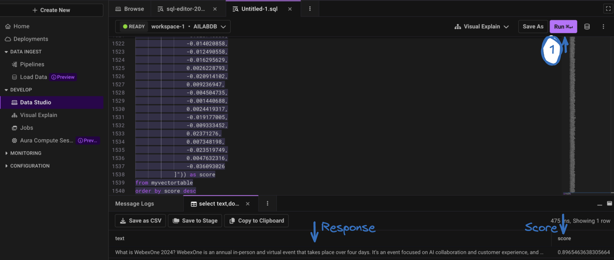

                                        !!! note
                                            You’ll be able to see the success of the vector database. Higher scores indicate better matches for the answer. In the Singlestore manual example, we store only one embedding to show the mechanics of insertion and retrieval. In a real application, you would store many chunks of text, each with its own embedding, so the system can return the most relevant matches.


                                        === "7. Testing with Pinecone"

                                            So far, we used **SingleStore** to demonstrate the core idea behind vector storage and similarity search. We manually generated embeddings, saved them in a database, and queried them using similarity scoring.

                                            Next, we will do the same concept using **Pinecone**, a purpose-built vector database. Instead of manually managing vectors in a SQL table, Pinecone is designed to **store, index, and search embeddings efficiently**.

                                            In this section, we will generate embeddings for our text, store them in Pinecone, and then query Pinecone with a new question to retrieve the most relevant matches. This is much closer to how vector search is typically implemented in **real-world AI and RAG applications**.

                                            We will create a Free account on PineCone since it provides some credits to set up a trial account.

                                            1. Go to <a href="https://login.pinecone.io/" target="_blank">Pinecone</a>

                                            

                                            2. Click on Sign Up and register using your personal Google account.
                              
                                            3. From the left-hand menu, click on API Keys. You can either use the default API key or create a new one.
                                            
                                            !!! note 
                                                Copy and save your API key in a secure location (e.g., Notepad or your lab guide’s $keys vault section)
                                            
                                            
                                            
                                            4. Navigate to Databases → Indexes. You will see indexes (vector tables) created from your script. We will return to this section later in the lab.

                                            
                                         
                                            5. Go back to your existing Google Colab notebook that you used earlier in this task. Ensure your notebook is still connected to runtime resources. Add a New Code Cell
                                            
                                            !!! note 
                                                Click the + Code button to create a new code cell where we will begin integrating Pinecone
                                            
                                            6. Let's install the Pinecone SDK

                                            ```py linenums="1"
                                            !pip install pinecone openai                                                
                                            ```

                                            7. Lets set up authentication by loading our OpenAI API key from Colab userdata, then initialize both the OpenAI and Pinecone clients for use in the lab.
                                            
                                            ```py linenums="1"
                                            from google.colab import userdata
                                            import os
                                            os.environ['OPENAI_API_KEY'] = userdata.get('OPENAI_API_KEY')
                                            from openai import OpenAI
                                            from pinecone import Pinecone, ServerlessSpec
                                            openai_client = OpenAI(api_key=os.environ['OPENAI_API_KEY'])
                                            pc = Pinecone(api_key="YOUR_API_KEY_FROM_Pinecone")
                                            ```

                                            !!! note
                                                Replace "YOUR_API_KEY_FROM_Pinecone" with your Pinecone key. We enter it manually here for simplicity, but this is not best practice in a production environment secure key management should be used instead.
                                            
                                            8. Lets create embeddings

                                            ```py linenums="1"
                                            text = "WebexOne and Cisco Live is an annual in-person and virtual event"
                                            response = openai_client.embeddings.create(
                                                model="text-embedding-3-small",
                                                input=text
                                            )
                                            embedding = response.data[0].embedding
                                            dimension = len(embedding)
                                            dimension
                                            ```

                                            !!! note
                                                1536 is the length of the embedding vector returned by the model. It means your text is represented as 1536 numerical features in a high-dimensional space. This fixed size lets the model compare meanings between texts efficiently.

                                            9. Pinecone indexes need a fixed vector dimension and a similarity metric. So we need to create indexes with a dimension and spec.

                                            ```py linenums="1"
                                            index_name = "lab-embeddings-demo"
                                            if index_name not in [idx["name"] for idx in pc.list_indexes()]:
                                                pc.create_index(
                                                    name=index_name,
                                                    dimension=dimension,
                                                    metric="cosine",
                                                    spec=ServerlessSpec(cloud="aws", region="us-east-1")
                                                )
                                            ```

                                            !!! note
                                                An index in Pinecone is like a table in a database.

                                            10. Lets connect to the index we created.

                                            ```py linenums="1"
                                            index = pc.Index(index_name)
                                            ```

                                            !!! note
                                                If you go to Pinecone → Databases → Indexes and refresh the page, you should see your newly created index listed there.
                                            
                                            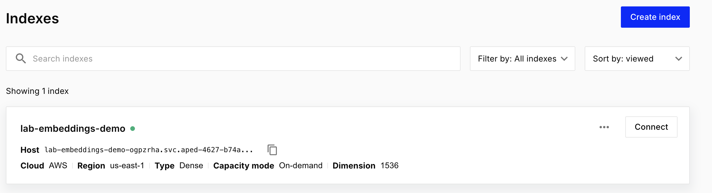

                                            11. lets stores (upserts) our embeddings vector into an index, along with extra information like the original text.

                                            ```py linenums="1"
                                            index.upsert(
                                            vectors=[
                                                {
                                                    "id": "webexone-1",
                                                    "values": embedding,
                                                    "metadata": {
                                                        "text": text
                                                    }
                                                }
                                                    ]
                                                )
                                    
                                            ```

                                            !!! note
                                                Click on the index in Pinecone to see your saved embeddings and their metadata.
                                            
                                            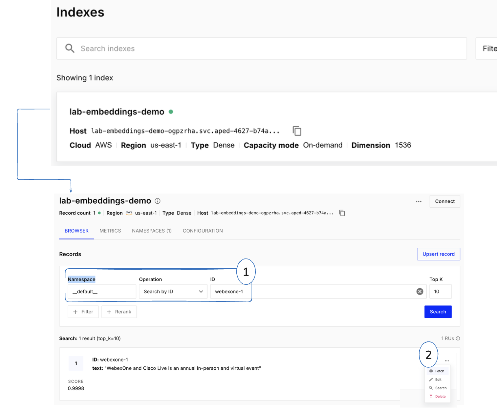
                                            
                                            12. Let's now create an embedding for the query and search the info

                                            ```py linenums="1"
                                            query = "Is WebexOne an annual event?"
                                            query_response = openai_client.embeddings.create(
                                                model="text-embedding-3-small",
                                                input=query
                                            )
                                            query_embedding = query_response.data[0].embedding
                                            # Query Pinecone 
                                            results = index.query(
                                            vector=query_embedding,
                                            top_k=5,
                                            include_metadata=True
                                            )       
                                            results
                                            ```
                                            !!! note
                                                Pinecone will return the nearest vectors to the query embedding. Each result includes a similarity score and, if stored, metadata such as the original text chunk. The highest-scoring matches are the most semantically relevant pieces of information.
                                                                        
                                        **Conclusion**

                                        In summary, vector databases enable LLMs to simulate long-term memory by storing and retrieving information based on semantic meaning. In this section, we generated embeddings using the OpenAI API and explored how to store and query them using two different vector database solutions: SingleStore and Pinecone.

                                        With SingleStore, we demonstrated how embeddings can be stored in a relational database and queried using vector similarity functions. With Pinecone, we followed a more purpose-built vector database approach by creating an index, upserting embeddings, and performing similarity searches.

                                        This comparison highlights how different vector database solutions can be used to efficiently manage and retrieve embeddings, making it easier to build applications such as semantic search, recommendation systems, and retrieval-augmented generation (RAG).

                                        <p align="right"> 👉 This concludes the task. Click the <strong>"Context Windows and Retrieval Augmented Generation (RAG) "</strong> Task on the left. </p>