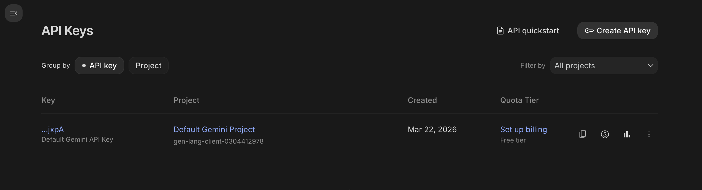
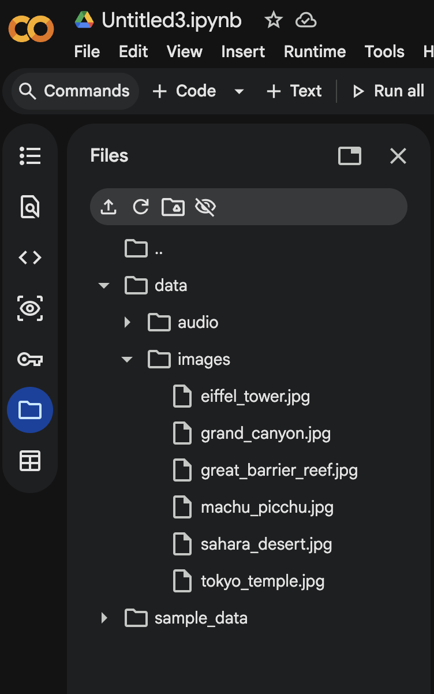
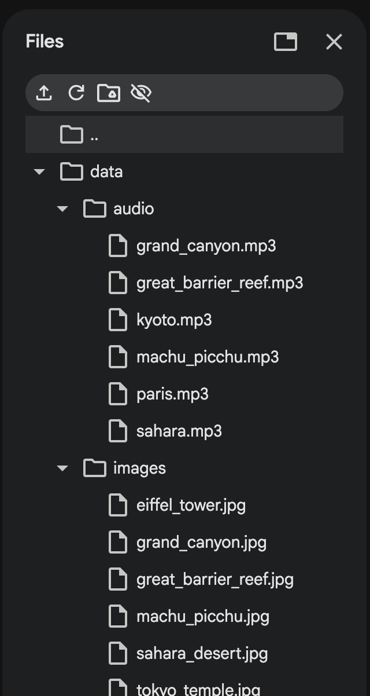

# Gemini Embedding2 Multimodal Retrieval

???+ blank "Gemini Embedding 2"

    ??? info "Introduction"

        === "1. Introduction"

            In the earlier sections of this lab, we explored how embeddings work by converting text into numerical vectors using embedding models. We then stored and queried these embeddings using vector databases such as **SingleStore** and **Pinecone** to perform semantic search and retrieve relevant information based on meaning.

            **The Limitation of Traditional Embeddings**

            Traditionally, embedding models have been **modality-specific** separate models were required for different types of data. For example, one model would handle text embeddings, while a completely different model would handle images. This works well in isolated scenarios but becomes limiting when dealing with real-world data, where text and images often appear together within the same documents or systems.

            **What is Gemini Embedding 2?**

            Recently, Google introduced **Gemini Embedding 2**, a new generation of embedding models designed to be **natively multimodal**. Unlike traditional approaches, Gemini Embedding 2 allows both text and images to be represented within a **single, unified embedding space**.

            !!! info "Learn More"
                Read the full announcement from Google: <a href="https://blog.google/innovation-and-ai/models-and-research/gemini-models/gemini-embedding-2/" target="_blank">Gemini Embedding 2</a>

            This means that different types of data can be compared, searched, and retrieved together without needing separate models or complex pipelines to bridge the gap between modalities.

            **What Does This Enable?**

            * Search for **images using text queries**
            * Find **visually similar images** across datasets
            * Work with documents that contain **both textual and visual information**
            * Build more advanced AI systems that understand **mixed data types**

            **How It Connects to This Lab**

            You have already learned how to generate embeddings, store them in vector databases, and perform similarity searches. Gemini Embedding 2 builds on these same concepts but **extends them beyond text**, allowing you to work with multimodal data and create more flexible and intelligent applications.

            !!! tip "Key Takeaway"
                As AI continues to evolve, multimodal embeddings represent an important step forward. They enable systems to more closely reflect how humans process information by combining text, visuals, and other signals resulting in **richer and more meaningful search and retrieval experiences**.

            <div class="gem2-wrapper">
            <style>
            .gem2-wrapper { background: #0a0e1a; border-radius: 16px; padding: 2rem 1rem; margin: 1.5rem 0; overflow: hidden; border: 1px solid rgba(255,255,255,0.06); box-shadow: 0 8px 30px rgba(0,0,0,0.3); }
            .gem2-title { text-align: center; font-size: 1.1rem; font-weight: 700; color: rgba(255,255,255,0.85); margin-bottom: 1.5rem; letter-spacing: 0.02em; }
            .gem2-svg { display: block; margin: 0 auto; max-width: 100%; }
            .gem2-line { stroke-dasharray: 6 4; animation: dashFlow 1.5s linear infinite; }
            .gem2-line-1 { animation-delay: 0s; }
            .gem2-line-2 { animation-delay: 0.3s; }
            .gem2-line-3 { animation-delay: 0.6s; }
            .gem2-line-4 { animation-delay: 0.9s; }
            .gem2-line-5 { animation-delay: 1.2s; }
            @keyframes dashFlow { to { stroke-dashoffset: -20; } }
            .gem2-arrow { stroke-dasharray: 6 4; animation: dashFlow 1.5s linear infinite; }
            .gem2-model-box { animation: modelGlow2 3s ease-in-out infinite; }
            @keyframes modelGlow2 { 0%, 100% { filter: drop-shadow(0 0 8px rgba(99,102,241,0.2)); } 50% { filter: drop-shadow(0 0 16px rgba(99,102,241,0.4)); } }
            .gem2-space-dot2 { animation: drift2 4s ease-in-out infinite alternate; }
            @keyframes drift2 { 0% { transform: translate(0,0); opacity:0.6; } 50% { opacity:1; } 100% { transform: translate(4px,-3px); opacity:0.7; } }
            .gem2-input-pill { animation: pillPulse 3s ease-in-out infinite; }
            .gem2-input-pill:nth-of-type(1) { animation-delay: 0s; }
            .gem2-input-pill:nth-of-type(2) { animation-delay: 0.4s; }
            .gem2-input-pill:nth-of-type(3) { animation-delay: 0.8s; }
            .gem2-input-pill:nth-of-type(4) { animation-delay: 1.2s; }
            .gem2-input-pill:nth-of-type(5) { animation-delay: 1.6s; }
            @keyframes pillPulse { 0%,100% { opacity:0.8; } 50% { opacity:1; } }
            </style>
            <div class="gem2-title">Multimodal Input</div>
            <svg class="gem2-svg" viewBox="0 0 750 200" xmlns="http://www.w3.org/2000/svg">
              <!-- Input pills -->
              <g class="gem2-input-pill"><rect x="10" y="8" width="90" height="28" rx="14" fill="rgba(255,255,255,0.04)" stroke="rgba(255,255,255,0.1)" stroke-width="1"/><circle cx="30" cy="22" r="5" fill="#818cf8"/><text x="42" y="26" fill="rgba(255,255,255,0.7)" font-size="11" font-weight="600" font-family="monospace">Text</text></g>
              <g class="gem2-input-pill"><rect x="10" y="46" width="90" height="28" rx="14" fill="rgba(255,255,255,0.04)" stroke="rgba(255,255,255,0.1)" stroke-width="1"/><circle cx="30" cy="60" r="5" fill="#34d399"/><text x="42" y="64" fill="rgba(255,255,255,0.7)" font-size="11" font-weight="600" font-family="monospace">Image</text></g>
              <g class="gem2-input-pill"><rect x="10" y="84" width="90" height="28" rx="14" fill="rgba(255,255,255,0.04)" stroke="rgba(255,255,255,0.1)" stroke-width="1"/><circle cx="30" cy="98" r="5" fill="#f472b6"/><text x="42" y="102" fill="rgba(255,255,255,0.7)" font-size="11" font-weight="600" font-family="monospace">Video</text></g>
              <g class="gem2-input-pill"><rect x="10" y="122" width="90" height="28" rx="14" fill="rgba(255,255,255,0.04)" stroke="rgba(255,255,255,0.1)" stroke-width="1"/><circle cx="30" cy="136" r="5" fill="#fbbf24"/><text x="42" y="140" fill="rgba(255,255,255,0.7)" font-size="11" font-weight="600" font-family="monospace">Audio</text></g>
              <g class="gem2-input-pill"><rect x="10" y="160" width="90" height="28" rx="14" fill="rgba(255,255,255,0.04)" stroke="rgba(255,255,255,0.1)" stroke-width="1"/><circle cx="30" cy="174" r="5" fill="#3b9eff"/><text x="42" y="178" fill="rgba(255,255,255,0.7)" font-size="11" font-weight="600" font-family="monospace">Docs</text></g>
              <!-- Lines from inputs to model -->
              <line x1="100" y1="22" x2="270" y2="95" class="gem2-line gem2-line-1" stroke="#818cf8" stroke-width="1.5" opacity="0.5"/>
              <line x1="100" y1="60" x2="270" y2="95" class="gem2-line gem2-line-2" stroke="#34d399" stroke-width="1.5" opacity="0.5"/>
              <line x1="100" y1="98" x2="270" y2="100" class="gem2-line gem2-line-3" stroke="#f472b6" stroke-width="1.5" opacity="0.5"/>
              <line x1="100" y1="136" x2="270" y2="105" class="gem2-line gem2-line-4" stroke="#fbbf24" stroke-width="1.5" opacity="0.5"/>
              <line x1="100" y1="174" x2="270" y2="110" class="gem2-line gem2-line-5" stroke="#3b9eff" stroke-width="1.5" opacity="0.5"/>
              <!-- Embedding Model box -->
              <g class="gem2-model-box">
                <rect x="270" y="65" width="140" height="70" rx="12" fill="rgba(99,102,241,0.12)" stroke="rgba(99,102,241,0.4)" stroke-width="1.5"/>
                <text x="340" y="95" text-anchor="middle" fill="#818cf8" font-size="13" font-weight="700" font-family="monospace">Embedding</text>
                <text x="340" y="112" text-anchor="middle" fill="#818cf8" font-size="13" font-weight="700" font-family="monospace">Model</text>
                <text x="340" y="128" text-anchor="middle" fill="rgba(255,255,255,0.3)" font-size="9" font-family="monospace">Gemini Embedding 2</text>
              </g>
              <!-- Arrow from model to space -->
              <line x1="410" y1="100" x2="510" y2="100" class="gem2-arrow" stroke="rgba(255,255,255,0.25)" stroke-width="1.5"/>
              <polygon points="508,95 518,100 508,105" fill="rgba(255,255,255,0.25)"/>
              <!-- Unified Embedding Space -->
              <rect x="520" y="20" width="210" height="165" rx="12" fill="rgba(255,255,255,0.02)" stroke="rgba(255,255,255,0.08)" stroke-width="1"/>
              <line x1="625" y1="20" x2="625" y2="185" stroke="rgba(255,255,255,0.04)" stroke-width="1"/>
              <line x1="520" y1="102" x2="730" y2="102" stroke="rgba(255,255,255,0.04)" stroke-width="1"/>
              <!-- Dots in space -->
              <circle cx="560" cy="50" r="4" fill="#818cf8" class="gem2-space-dot2" style="animation-delay:0s"/>
              <circle cx="610" cy="75" r="4" fill="#818cf8" class="gem2-space-dot2" style="animation-delay:0.5s"/>
              <circle cx="575" cy="110" r="4" fill="#34d399" class="gem2-space-dot2" style="animation-delay:1s"/>
              <circle cx="660" cy="55" r="4" fill="#34d399" class="gem2-space-dot2" style="animation-delay:1.5s"/>
              <circle cx="640" cy="130" r="4" fill="#f472b6" class="gem2-space-dot2" style="animation-delay:0.3s"/>
              <circle cx="600" cy="90" r="4" fill="#fbbf24" class="gem2-space-dot2" style="animation-delay:0.8s"/>
              <circle cx="680" cy="100" r="4" fill="#3b9eff" class="gem2-space-dot2" style="animation-delay:1.3s"/>
              <circle cx="650" cy="45" r="4" fill="#fbbf24" class="gem2-space-dot2" style="animation-delay:0.6s"/>
              <circle cx="555" cy="140" r="4" fill="#f472b6" class="gem2-space-dot2" style="animation-delay:1.1s"/>
              <circle cx="700" cy="70" r="4" fill="#3b9eff" class="gem2-space-dot2" style="animation-delay:0.4s"/>
              <circle cx="690" cy="150" r="4" fill="#818cf8" class="gem2-space-dot2" style="animation-delay:0.7s"/>
              <circle cx="570" cy="70" r="4" fill="#fbbf24" class="gem2-space-dot2" style="animation-delay:1.4s"/>
              <text x="625" y="178" text-anchor="middle" fill="rgba(255,255,255,0.3)" font-size="9" font-weight="600" font-family="monospace">Unified Embedding Space</text>
            </svg>
            </div>

???+ blank "Gemini Embedding 2 — LAB"

    !!! important
        Please open a new <a href="https://colab.research.google.com/" target="_blank">Google Colab</a> notebook for this section. Click on **"File" > "New notebook"**.

    !!! warning "GPU Required"
        Make sure you are connected to a **GPU runtime**. Go to **Runtime > Change runtime type** and select **GPU** as the hardware accelerator.

    !!! note "Prerequisites"
        You need a **Gemini API key** to complete this lab. You can get one for free at <a href="https://aistudio.google.com" target="_blank">Gemini Ai Studio</a>. Use your **personal Gmail account** to sign up and generate a key.

     

    !!! tip "Save to Key Vault"
        Once you have your Gemini API key, open the **`$ keys`** panel (bottom-left) and save it for easy access across all lab pages.


    **Step 1 — Install Dependencies**

    ```py
    !pip install -q google-genai numpy scikit-learn matplotlib Pillow requests
    ```

    ---

    **Step 2 — Configure API Key**

    Enter your Gemini API key after executing the below task

    ```py linenums="1"
    import getpass
    import os
    if "GEMINI_API_KEY" not in os.environ:
    os.environ["GEMINI_API_KEY"] = getpass.getpass("Enter your Gemini API key: ")
    GEMINI_API_KEY = os.environ["GEMINI_API_KEY"]
    ```

    !!! note
        When prompted, paste the Gemini API key you obtained from <a href="https://aistudio.google.com" target="_blank">AI Studio</a>. If you saved it in the **`$ keys`** panel, click the copy button there to grab it quickly.

    ---

    **Step 3 — Initialize Gemini Client & Imports**

    Now we'll import all the libraries we need and set up the Gemini client. This step connects to Google's **Gemini Embedding 2** model, which we'll use to generate embeddings for text, audio and images throughout this lab. We're also importing tools for **vector similarity** (cosine similarity), **visualization** (matplotlib, t-SNE), and **image handling** (Pillow, requests).

    ```py linenums="1"
    from google import genai
    from google.genai import types
    import numpy as np
    from sklearn.metrics.pairwise import cosine_similarity
    import matplotlib.pyplot as plt
    from PIL import Image
    import requests
    from io import BytesIO
    import IPython.display as display
    from sklearn.manifold import TSNE
    import json
    import urllib.request
    import warnings
    warnings.filterwarnings('ignore')

    client = genai.Client(api_key=GEMINI_API_KEY)
    MODEL = "gemini-embedding-2-preview"

    print("✅ Gemini client initialized")
    print(f"📌 Using model: {MODEL}")
    ```

    !!! note
        The `gemini-embedding-2-preview` model supports **both text, audio and image inputs** in a single unified embedding space this is what makes it multimodal.

    ---

    **Step 4 — Download Sample Multimodal Data**

    Now let's build something practical — a **Travel Destination Search Engine**. Imagine a travel agency with a multimedia knowledge base containing:

    * **Text descriptions** of destinations
    * **Photos** of landmarks and scenery
    * **Audio narrations** describing destinations
    * **Short video clips** of destinations

    Users can query this system with **any modality** (text, image, or audio) to find matching destinations. First, we need to download sample images for our knowledge base.

    !!! info "What This Code Does"
        The code below downloads **6 destination images** (Eiffel Tower, Grand Canyon, Tokyo Temple, Great Barrier Reef, Machu Picchu, Sahara Desert) from public sources. It includes a **fallback mechanism** — if a download fails, it tries an alternative URL, and if all URLs fail, it generates a **synthetic placeholder image** so the lab can continue without interruption.

    ```py linenums="1"
    import os
    import urllib.request
    import time
    from PIL import Image
    import numpy as np

    os.makedirs("data/images", exist_ok=True)
    os.makedirs("data/audio", exist_ok=True)

    # Image sources with fallback URLs for each destination
    image_sources = {
        "eiffel_tower.jpg": [
            "https://cdn.pixabay.com/photo/2018/04/25/09/26/eiffel-tower-3349075_640.jpg",
            "https://images.pexels.com/photos/338515/pexels-photo-338515.jpeg?w=480",
        ],
        "grand_canyon.jpg": [
            "https://cdn.pixabay.com/photo/2015/09/21/14/24/grand-canyon-949517_640.jpg",
            "https://images.pexels.com/photos/2437299/pexels-photo-2437299.jpeg?w=480",
        ],
        "tokyo_temple.jpg": [
            "https://cdn.pixabay.com/photo/2019/07/21/07/12/temple-4352273_640.jpg",
            "https://images.pexels.com/photos/5169056/pexels-photo-5169056.jpeg?w=480",
        ],
        "great_barrier_reef.jpg": [
            "https://cdn.pixabay.com/photo/2016/11/20/08/33/coral-1842158_640.jpg",
            "https://images.pexels.com/photos/3100361/pexels-photo-3100361.jpeg?w=480",
        ],
        "machu_picchu.jpg": [
            "https://cdn.pixabay.com/photo/2012/04/26/22/48/machu-picchu-43387_640.jpg",
            "https://images.pexels.com/photos/2929906/pexels-photo-2929906.jpeg?w=480",
        ],
        "sahara_desert.jpg": [
            "https://cdn.pixabay.com/photo/2016/11/14/04/14/sahara-1822485_640.jpg",
            "https://images.pexels.com/photos/1001435/pexels-photo-1001435.jpeg?w=480",
        ],
    }

    def download_with_fallback(filename, urls, folder="data/images"):
        """Try multiple URLs to download an image, generate synthetic if all fail."""
        path = os.path.join(folder, filename)
        if os.path.exists(path):
            print(f"  ✅ {filename} already exists")
            return True

        headers = {
            "User-Agent": "Mozilla/5.0 (Macintosh; Intel Mac OS X 10_15_7) AppleWebKit/537.36"
        }

        for url in urls:
            try:
                req = urllib.request.Request(url, headers=headers)
                with urllib.request.urlopen(req, timeout=15) as response:
                    with open(path, 'wb') as f:
                        f.write(response.read())
                img = Image.open(path)
                img.verify()
                print(f"  ✅ Downloaded {filename}")
                return True
            except Exception as e:
                print(f"  ⚠️  URL failed for {filename}: {str(e)[:80]}")
                if os.path.exists(path):
                    os.remove(path)
                time.sleep(1)

        # Fallback: generate a synthetic placeholder image
        print(f"  🎨 Generating synthetic image for {filename}...")
        return generate_synthetic_image(filename, path)

    def generate_synthetic_image(filename, path):
        """Generate a recognizable synthetic image as fallback."""
        color_map = {
            "eiffel_tower.jpg": ([30, 50, 100], [200, 180, 120], "Paris"),
            "grand_canyon.jpg": ([200, 100, 50], [220, 150, 80], "Grand Canyon"),
            "tokyo_temple.jpg": ([150, 50, 50], [200, 160, 100], "Kyoto Temple"),
            "great_barrier_reef.jpg": ([20, 100, 180], [50, 200, 200], "Coral Reef"),
            "machu_picchu.jpg": ([80, 120, 50], [180, 200, 160], "Machu Picchu"),
            "sahara_desert.jpg": ([220, 180, 100], [240, 220, 150], "Sahara Desert"),
        }
        colors = color_map.get(filename, ([100, 100, 100], [200, 200, 200], "Unknown"))
        top_color, bottom_color, label = colors

        img_array = np.zeros((480, 640, 3), dtype=np.uint8)
        for y in range(480):
            ratio = y / 480
            for c in range(3):
                img_array[y, :, c] = int(top_color[c] * (1 - ratio) + bottom_color[c] * ratio)

        img = Image.fromarray(img_array)
        img.save(path, "JPEG")
        print(f"  ✅ Created synthetic image for {label}")
        return True

    print("📥 Downloading destination images...\n")
    for filename, urls in image_sources.items():
        download_with_fallback(filename, urls)

    # Verify all images exist
    all_ok = all(os.path.exists(f"data/images/{f}") for f in image_sources)
    if all_ok:
        print("\n🎉 All images ready!")
    else:
        missing = [f for f in image_sources if not os.path.exists(f"data/images/{f}")]
        print(f"\n⚠️ Missing images: {missing}")
    ```

    !!! tip "What Just Happened?"
        We now have a `data/images/` folder with 6 destination photos. These images will be converted into **embeddings** using Gemini Embedding 2, so we can later search for destinations using text queries like *"ancient ruins in the mountains"* and get back matching images. Also you will notice a new folder created.

     
    ---

    **Step 5 — Create the Travel Destination Knowledge Base (Text + Metadata)**

    Now we'll build our **knowledge base** a structured dictionary that pairs each destination with its **text description**, **image path**, and **tags**. Think of this as the data a travel agency would have in their system. Each entry contains:

    * **name** — the destination's display name
    * **description** — a rich text description (this will be embedded as text)
    * **image** — path to the photo we downloaded (this will be embedded as an image)
    * **tags** — categories for filtering

    Later, we'll generate embeddings for both the **text descriptions** and the **images**, and store them together in a unified embedding space — so a user can search using *either* text or images and find matching destinations.

    ```py linenums="1"
    destinations = {
        "paris": {
            "name": "Paris, France",
            "description": "The City of Light enchants visitors with its iconic Eiffel Tower, world-class museums like the Louvre, charming cafes along the Seine River, and exquisite French cuisine. Paris is the ultimate romantic destination with stunning architecture from the Gothic Notre-Dame to the modern Centre Pompidou.",
            "image": "data/images/eiffel_tower.jpg",
            "tags": ["europe", "romance", "culture", "food", "architecture"],
        },
        "grand_canyon": {
            "name": "Grand Canyon, USA",
            "description": "A vast, steep-sided gorge carved by the Colorado River over millions of years. The Grand Canyon reveals layers of colorful red rock exposing geological history spanning nearly two billion years. Hiking, rafting, and helicopter tours offer breathtaking views of this natural wonder.",
            "image": "data/images/grand_canyon.jpg",
            "tags": ["north_america", "nature", "hiking", "geology", "adventure"],
        },
        "kyoto": {
            "name": "Kyoto, Japan",
            "description": "Japan's ancient capital is home to over 2000 temples and shrines, traditional wooden houses, exquisite gardens, and the beauty of geisha culture. Kyoto's bamboo groves, tea ceremonies, and cherry blossom seasons provide an immersive experience in Japanese tradition and Zen philosophy.",
            "image": "data/images/tokyo_temple.jpg",
            "tags": ["asia", "culture", "temples", "tradition", "gardens"],
        },
        "great_barrier_reef": {
            "name": "Great Barrier Reef, Australia",
            "description": "The world's largest coral reef system, visible from outer space, stretches over 2,300 kilometers along the Australian coast. Home to thousands of species of colorful fish, molluscs, sea turtles, and dolphins, it offers spectacular snorkeling and diving in warm tropical waters.",
            "image": "data/images/great_barrier_reef.jpg",
            "tags": ["oceania", "marine", "snorkeling", "nature", "tropical"],
        },
        "machu_picchu": {
            "name": "Machu Picchu, Peru",
            "description": "This 15th-century Incan citadel sits high in the Andes Mountains above the Sacred Valley. The stunning stone ruins, terraced hillsides, and panoramic mountain views make it one of the most iconic archaeological sites. The Inca Trail trek to Machu Picchu is a bucket-list adventure.",
            "image": "data/images/machu_picchu.jpg",
            "tags": ["south_america", "history", "hiking", "archaeology", "mountains"],
        },
        "sahara": {
            "name": "Sahara Desert, Africa",
            "description": "The world's largest hot desert spans across North Africa with endless golden sand dunes, ancient oases, and starlit skies unlike anywhere else on Earth. Camel treks, nomadic Berber culture, and the silence of the vast emptiness offer a transformative desert experience.",
            "image": "data/images/sahara_desert.jpg",
            "tags": ["africa", "desert", "adventure", "culture", "nature"],
        },
    }

    print(f"📚 Knowledge base created with {len(destinations)} destinations:")
    for key, dest in destinations.items():
        print(f"   🌍 {dest['name']} - {len(dest['description'])} chars, tags: {dest['tags']}")
    ```

    !!! tip "What Just Happened?"
        We've created a **structured knowledge base** with 6 travel destinations. Each entry has a text description, an image reference, and tags. In the next steps, we'll use Gemini Embedding 2 to convert both the **text** and **images** into vectors placing them in the same embedding space so we can search across modalities.

    ---

    **Step 6 — Generate Audio Narrations for Each Destination (using gTTS)**

    Gemini Embeddingsv2 also supports **audio** as a modality. To demonstrate this, we'll generate audio narrations for each destination using **gTTS (Google Text-to-Speech)**.

    **What is gTTS?**

    <a href="https://pypi.org/project/gTTS/" target="_blank">gTTS</a> is a Python library that converts text into spoken audio using Google's Text-to-Speech API. It takes a string of text and produces an MP3 audio file no API key required. It's a simple way to programmatically create voice narrations from text descriptions.

    First, install gTTS:

    ```py
    !pip install -q gTTS
    ```

    !!! warning "Dependency Warning — Safe to Ignore"
        You may see an error like:
        ```
        ERROR: pip's dependency resolver does not currently take into account all the packages
        that are installed. This behaviour is the source of the following dependency conflicts.
        typer 0.24.1 requires click>=8.2.1, but you have click 8.1.8 which is incompatible.
        ```
        **This can be safely ignored** — it does not affect gTTS or any of the functionality in this lab.

    Now let's generate a short audio narration for each destination and link it to our knowledge base:

    ```py linenums="1"
    from gtts import gTTS
    import os

    # Generate short audio narrations for each destination
    audio_narrations = {
        "paris": "Visit Paris, the city of light, with the Eiffel Tower, Louvre Museum, and romantic Seine river cruises.",
        "grand_canyon": "Explore the Grand Canyon, a massive gorge carved by the Colorado River, perfect for hiking and rafting adventures.",
        "kyoto": "Discover Kyoto, Japan's cultural heart, with ancient temples, bamboo groves, and traditional tea ceremonies.",
        "great_barrier_reef": "Dive into the Great Barrier Reef, the world's largest coral reef system, with tropical fish and warm waters.",
        "machu_picchu": "Trek to Machu Picchu, the ancient Incan citadel high in the Andes mountains of Peru.",
        "sahara": "Experience the Sahara Desert, endless golden sand dunes, camel treks, and spectacular starlit skies.",
    }

    for key, narration in audio_narrations.items():
        audio_path = f"data/audio/{key}.mp3"
        if not os.path.exists(audio_path):
            tts = gTTS(text=narration, lang='en', slow=False)
            tts.save(audio_path)
            print(f"🔊 Generated audio: {audio_path}")
        else:
            print(f"✅ Audio already exists: {audio_path}")
        destinations[key]["audio"] = audio_path

    print("\n🎉 All audio narrations generated!")
    ```

    !!! note
        In Google Colab, you can verify the audio files were created by expanding the **`data/audio/`** folder in the file browser (left sidebar). You should see 6 `.mp3` files one for each destination.

    

    ---

    **Step 7 — Preview Our Multimodal Data**

    Before we generate any embeddings, let's take a look at what we've built so far. This step displays all 6 destination images in a grid and plays a sample audio narration giving you a visual and auditory preview of the multimodal data that will be embedded in the next steps.

    ```py linenums="1"
    from IPython.display import Audio, HTML
    from PIL import Image
    import matplotlib.pyplot as plt

    fig, axes = plt.subplots(2, 3, figsize=(15, 10))
    axes = axes.flatten()

    for idx, (key, dest) in enumerate(destinations.items()):
        img = Image.open(dest["image"])
        axes[idx].imshow(img)
        axes[idx].set_title(dest["name"], fontsize=12, fontweight='bold')
        axes[idx].axis("off")

    plt.suptitle("🌍 Travel Destination Knowledge Base", fontsize=16, fontweight='bold')
    plt.tight_layout()
    plt.show()

    # Play one audio sample
    print("\n🔊 Sample audio narration (Paris):")
    display.display(Audio("data/audio/paris.mp3"))
    ```

    !!! note
        You should see a **2x3 grid of destination photos** and an **audio player** for the Paris narration. Hit play to listen! This is the raw data that Gemini Embedding 2 will convert into vectors placing text, images, and audio into a single searchable embedding space.

    ---

    **Step 8 — Generate Embeddings for All Modalities**

    Now we'll use Gemini Embedding 2 to embed all our data **text descriptions**, **images**, and **audio** into the same vector space. This is what makes **cross-modal retrieval** possible: a text query and an image of the same concept will have similar embeddings.

    We will start by defining **helper functions** one for each modality. Each function takes an input (text string, image file, or audio file), sends it to the Gemini Embedding 2 model, and returns a **numerical vector** (array of floats). We also define a **cosine similarity** function to compare how close two vectors are, a score of **1.0** means identical, **0.0** means unrelated.

    ```py linenums="1"
    import time

    def embed_text(text, task_type="RETRIEVAL_DOCUMENT"):
        """Embed a text string."""
        result = client.models.embed_content(
            model=MODEL,
            contents=text,
            config=types.EmbedContentConfig(task_type=task_type)
        )
        return np.array(result.embeddings[0].values)

    def embed_image(image_path):
        """Embed an image file."""
        with open(image_path, "rb") as f:
            image_bytes = f.read()
        result = client.models.embed_content(
            model=MODEL,
            contents=types.Part.from_bytes(data=image_bytes, mime_type="image/jpeg"),
        )
        return np.array(result.embeddings[0].values)

    def embed_audio(audio_path):
        """Embed an audio file."""
        with open(audio_path, "rb") as f:
            audio_bytes = f.read()
        result = client.models.embed_content(
            model=MODEL,
            contents=types.Part.from_bytes(data=audio_bytes, mime_type="audio/mpeg"),
        )
        return np.array(result.embeddings[0].values)

    def cosine_sim(a, b):
        """Compute cosine similarity between two vectors."""
        return np.dot(a, b) / (np.linalg.norm(a) * np.linalg.norm(b))

    print("✅ Helper functions defined")
    ```

    !!! info "What Each Function Does"
        | Function | Input | Output |
        |----------|-------|--------|
        | `embed_text()` | A text string | Vector (array of floats) |
        | `embed_image()` | Path to a `.jpg` file | Vector (array of floats) |
        | `embed_audio()` | Path to a `.mp3` file | Vector (array of floats) |
        | `cosine_sim()` | Two vectors | Similarity score (0.0 to 1.0) |

    ??? info "What is `types.Part.from_bytes()`? (click to expand)"
        For **text**, we can pass the string directly to the API. But for **images and audio**, we need to send raw binary data. `types.Part.from_bytes()` wraps the file's bytes along with its **MIME type** (e.g., `image/jpeg` or `audio/mpeg`) into a format the Gemini API understands. Think of it as telling the API: *"Here's a file, it's a JPEG image"* or *"Here's a file, it's an MP3 audio"*, so the model knows how to process it.

    !!! note
        All three embedding functions return vectors in the **same dimensional space** this is the key innovation of Gemini Embedding 2. A text vector and an image vector can be directly compared using cosine similarity because they live in the **same unified embedding space**.

    ---

    **Step 9 — Generate Embeddings for All Destinations (Text, Image, Audio)**

    Now we put our helper functions to work. This step loops through every destination in our knowledge base and generates **three embeddings** for each one from the **text description**, one from the **image**, and one from the **audio narration**. All three are stored together in an `embedding_db` dictionary, which becomes our **searchable vector database**.

    The `time.sleep(1)` between each API call is there to respect **rate limits** on the Gemini API without it, you may get throttled if you send too many requests too fast.

    ```py linenums="1"
    import time

    embedding_db = {}

    for key, dest in destinations.items():
        print(f"\n🔄 Embedding: {dest['name']}...")

        # Embed text description
        print(f"   📝 Embedding text...")
        text_emb = embed_text(dest["description"])
        time.sleep(1)  # Rate limiting

        # Embed image
        print(f"   🖼️ Embedding image...")
        image_emb = embed_image(dest["image"])
        time.sleep(1)

        # Embed audio
        print(f"   🔊 Embedding audio...")
        audio_emb = embed_audio(dest["audio"])
        time.sleep(1)

        embedding_db[key] = {
            "name": dest["name"],
            "description": dest["description"],
            "image_path": dest["image"],
            "audio_path": dest["audio"],
            "tags": dest["tags"],
            "text_embedding": text_emb,
            "image_embedding": image_emb,
            "audio_embedding": audio_emb,
        }
        print(f"   ✅ Done! Embedding dimension: {len(text_emb)}")

    print(f"\n🎉 All {len(embedding_db)} destinations embedded across 3 modalities!")
    print(f"📊 Total embeddings: {len(embedding_db) * 3}")
    ```

    !!! warning "This Step Takes ~30 Seconds"
        The code makes **18 API calls** (6 destinations x 3 modalities each) with 1-second pauses between them. Be patient while it runs you'll see progress printed for each destination.

    !!! tip "What Just Happened?"
        We now have an `embedding_db` with **18 embeddings total** 6 text, 6 image, and 6 audio vectors. Each vector lives in the **same dimensional space**, which means we can now compare a text query against image embeddings, or an audio clip against text embeddings. This is the foundation of our multimodal search engine.

    ??? info "What does Embedding dimension: 3072 mean? (click to expand)"
        Each embedding is an array of **3,072 floating-point numbers**. This is the **dimensionality** of the Gemini Embedding 2 model every piece of content (text, image, or audio) gets converted into a vector with exactly 3,072 values.

        **Why does dimensionality matter?**

        Think of dimensions as the number of "features" the model uses to describe your content. More dimensions = more detail captured:

        | Dimensions | Trade-off |
        |-----------|-----------|
        | **Lower** (e.g., 768, 1,536) | Faster to compute & search, uses less memory, but may miss subtle differences between similar content |
        | **Higher** (e.g., 3,072) | Captures more nuance and fine-grained meaning, better at distinguishing similar items, but requires more storage and slightly slower to search |

        For a small knowledge base like ours (6 destinations), 3,072 dimensions is no problem. For production systems with **millions** of vectors, you might choose a lower-dimensional model to balance accuracy vs. cost and speed.

        For reference: OpenAI's `text-embedding-3-small` uses **1,536** dimensions, while `text-embedding-3-large` uses **3,072** the same as Gemini Embedding 2.

    ---

    **Step 10 — Text-to-Multimodal Search**

    This is where it all comes together. Because all modalities live in the **same embedding space**, a single text query can be compared against **text descriptions**, **images**, AND **audio narrations** simultaneously. The search function computes **cosine similarity** between your query and every embedding in the database, then ranks results by their average score across all modalities.

    We define two functions here:

    * **`search_destinations()`** takes a query embedding, compares it against all destinations across all modalities, and returns the top matches ranked by average similarity score
    * **`display_search_results()`** visualizes the results by showing destination images, scores broken down by modality (text, image, audio), and an overall ranking

    ```py linenums="1"
    def search_destinations(query_embedding, top_k=3, modalities=["text", "image", "audio"]):
        """
        Search across all destinations and modalities.
        Returns ranked results with scores broken down by modality.
        """
        results = []

        for key, data in embedding_db.items():
            scores = {}
            if "text" in modalities:
                scores["text"] = cosine_sim(query_embedding, data["text_embedding"])
            if "image" in modalities:
                scores["image"] = cosine_sim(query_embedding, data["image_embedding"])
            if "audio" in modalities:
                scores["audio"] = cosine_sim(query_embedding, data["audio_embedding"])

            # Combined score (average across modalities)
            avg_score = np.mean(list(scores.values()))

            results.append({
                "key": key,
                "name": data["name"],
                "avg_score": avg_score,
                "modality_scores": scores,
                "description": data["description"],
                "image_path": data["image_path"],
                "audio_path": data["audio_path"],
            })

        # Sort by average score descending
        results.sort(key=lambda x: x["avg_score"], reverse=True)
        return results[:top_k]


    def display_search_results(query_text, results, query_type="text"):
        """Visualize search results with scores."""
        print(f"{'='*70}")
        print(f"🔍 Query ({query_type}): {query_text}")
        print(f"{'='*70}\n")

        fig, axes = plt.subplots(1, len(results), figsize=(6 * len(results), 5))
        if len(results) == 1:
            axes = [axes]

        for idx, result in enumerate(results):
            # Display image
            img = Image.open(result["image_path"])
            axes[idx].imshow(img)
            title = f"#{idx+1} {result['name']}\nScore: {result['avg_score']:.4f}"
            axes[idx].set_title(title, fontsize=11, fontweight='bold')
            axes[idx].axis("off")

            # Print detailed scores
            print(f"  #{idx+1} {result['name']}")
            print(f"     📊 Average Score: {result['avg_score']:.4f}")
            for mod, score in result['modality_scores'].items():
                emoji = {"text": "📝", "image": "🖼️", "audio": "🔊"}[mod]
                print(f"     {emoji} {mod.capitalize()} score: {score:.4f}")
            print()

        plt.tight_layout()
        plt.show()

    print("✅ Search engine ready!")
    ```

    !!! info "How the Scoring Works"
        For each destination, the search computes **3 separate similarity scores** (one per modality) and then averages them into a single **combined score**. This means a destination that matches well across **all** modalities will rank higher than one that only matches on text alone. The breakdown lets you see *which* modality contributed most to the match.

    !!! note
        We haven't run any queries yet this step just defines the search engine. In the next step, we'll fire actual queries and see the results.

    ---

    **Step 11 — Text Search — Try Different Queries!**

    Now let's put our search engine to the test. We'll run **4 natural language queries** each describing a different type of travel experience and see which destinations the system returns.

    Here's what happens for each query:

    1. **`embed_text(query, task_type="RETRIEVAL_QUERY")`** — converts the search query into a 3,072-dimension vector. Notice we use `RETRIEVAL_QUERY` here (not `RETRIEVAL_DOCUMENT`) — this tells the model the text is a *search query* rather than a *document to be stored*, which helps optimize the embedding for retrieval.
    2. **`search_destinations(query_emb, top_k=3)`** — compares the query vector against all 18 embeddings (text + image + audio) in our database and returns the **top 3** matches.
    3. **`display_search_results()`** — shows the matching destination images with similarity scores broken down by modality.

    ```py linenums="1"
    queries = [
        "I want to see ancient ruins in the mountains",
        "Where can I go snorkeling in warm tropical water?",
        "I'm looking for a romantic European city with great food and art",
        "I want an adventure in a vast empty landscape under the stars",
    ]

    for query in queries:
        query_emb = embed_text(query, task_type="RETRIEVAL_QUERY")
        results = search_destinations(query_emb, top_k=3)
        display_search_results(query, results, query_type="text")
        time.sleep(1)
    ```

    !!! tip "What to Look For"
        Check whether the results make sense! For example:

        * *"ancient ruins in the mountains"* should match **Machu Picchu**
        * *"snorkeling in warm tropical water"* should match **Great Barrier Reef**
        * *"romantic European city with great food"* should match **Paris**
        * *"vast empty landscape under the stars"* should match **Sahara Desert**

        The scores show how well each modality (text, image, audio) contributed to the match. You'll notice that **text scores** are typically highest since the query is text-based, but image and audio scores still contribute that's the power of a unified embedding space.

    ---

    **Step 12 — Image-to-Multimodal Search (Cross-Modal Retrieval)**

    In the previous step we searched using **text**. Now let's flip it  we'll use an **image** as the query instead. This is **cross-modal retrieval**: the system takes an image it has never seen before, embeds it, and compares that embedding against all text descriptions, images, and audio in the database to find the best match.

    This step does the following:

    1. **Downloads a new coral reef / ocean photo** (not one from our knowledge base) to use as the query image with fallback to a synthetic image if the download fails
    2. **Displays the query image** so you can see what we're searching with
    3. **`embed_image()`** converts the query image into a 3,072 dimension vector
    4. **`search_destinations()`** compares the image vector against all 18 embeddings in the database
    5. **`display_search_results()`** shows the top 3 matching destinations with scores

    ```py linenums="1"
    import urllib.request

    # Download a query image - a coral/underwater photo (different from our DB)
    query_image_path = "data/images/query_coral.jpg"
    if not os.path.exists(query_image_path):
        query_urls = [
            "https://cdn.pixabay.com/photo/2017/01/11/15/22/turtle-1972331_640.jpg",
            "https://images.pexels.com/photos/932638/pexels-photo-932638.jpeg?w=480",
        ]
        headers = {"User-Agent": "Mozilla/5.0 (Macintosh; Intel Mac OS X 10_15_7) AppleWebKit/537.36"}
        downloaded = False
        for url in query_urls:
            try:
                req = urllib.request.Request(url, headers=headers)
                with urllib.request.urlopen(req, timeout=15) as response:
                    with open(query_image_path, 'wb') as f:
                        f.write(response.read())
                downloaded = True
                print(f"✅ Downloaded query image from: {url[:60]}...")
                break
            except Exception as e:
                print(f"⚠️ Failed: {e}")
        if not downloaded:
            # Fallback: create a synthetic ocean image
            img_array = np.zeros((480, 640, 3), dtype=np.uint8)
            for y in range(480):
                ratio = y / 480
                img_array[y, :, 0] = int(10 * (1 - ratio) + 30 * ratio)
                img_array[y, :, 1] = int(80 * (1 - ratio) + 180 * ratio)
                img_array[y, :, 2] = int(180 * (1 - ratio) + 220 * ratio)
            Image.fromarray(img_array).save(query_image_path, "JPEG")
            print("🎨 Created synthetic ocean query image")

    # Show the query image
    print("\n🖼️ Query Image (coral reef / ocean photo):")
    query_img = Image.open(query_image_path)
    plt.figure(figsize=(6, 4))
    plt.imshow(query_img)
    plt.title("Query Image: Coral Reef / Ocean", fontsize=14, fontweight='bold')
    plt.axis("off")
    plt.show()

    # Embed the query image and search
    print("\n🔄 Embedding query image...")
    query_image_emb = embed_image(query_image_path)

    print("\n🔍 Searching destinations using the image...")
    results = search_destinations(query_image_emb, top_k=3)
    display_search_results("Coral reef / ocean photograph", results, query_type="image")

    print("💡 Notice how the ocean image correctly retrieves the Great Barrier Reef as the top result!")
    ```

    !!! tip "Why This is Powerful"
        The query image is a **completely new photo** the system has never seen it's not in our knowledge base. Yet because both images live in the same embedding space, the model understands that an underwater coral photo is **semantically similar** to the Great Barrier Reef destination. It even matches against the **text description** and **audio narration** of that destination not just image-to-image comparison.

    !!! note
        This is the core idea behind **multimodal RAG** (Retrieval Augmented Generation). In a real application, users could upload a photo from their phone and the system would find matching destinations, products, or documents without any keyword matching.

    **Let's try another image query** this time with a mountain landscape to see if the system can match it to the right destinations:

    ```py linenums="1"
    query_image_path2 = "data/images/query_mountain_trail.jpg"
    if not os.path.exists(query_image_path2):
        query_urls2 = [
            "https://cdn.pixabay.com/photo/2017/10/10/07/48/hills-2836301_640.jpg",
            "https://images.pexels.com/photos/2335126/pexels-photo-2335126.jpeg?w=480",
        ]
        headers = {"User-Agent": "Mozilla/5.0 (Macintosh; Intel Mac OS X 10_15_7) AppleWebKit/537.36"}
        downloaded = False
        for url in query_urls2:
            try:
                req = urllib.request.Request(url, headers=headers)
                with urllib.request.urlopen(req, timeout=15) as response:
                    with open(query_image_path2, 'wb') as f:
                        f.write(response.read())
                downloaded = True
                print(f"✅ Downloaded query image from: {url[:60]}...")
                break
            except Exception as e:
                print(f"⚠️ Failed: {e}")
        if not downloaded:
            # Fallback: green/brown mountain gradient
            img_array = np.zeros((480, 640, 3), dtype=np.uint8)
            for y in range(480):
                ratio = y / 480
                img_array[y, :, 0] = int(100 * (1 - ratio) + 120 * ratio)
                img_array[y, :, 1] = int(140 * (1 - ratio) + 160 * ratio)
                img_array[y, :, 2] = int(180 * (1 - ratio) + 80 * ratio)
            Image.fromarray(img_array).save(query_image_path2, "JPEG")
            print("🎨 Created synthetic mountain query image")

    # Show the query image
    print("\n🖼️ Query Image (mountain landscape):")
    query_img2 = Image.open(query_image_path2)
    plt.figure(figsize=(6, 4))
    plt.imshow(query_img2)
    plt.title("Query Image: Mountain Landscape", fontsize=14, fontweight='bold')
    plt.axis("off")
    plt.show()

    # Embed and search
    print("\n🔄 Embedding query image...")
    query_image_emb2 = embed_image(query_image_path2)
    time.sleep(1)
    results2 = search_destinations(query_image_emb2, top_k=3)
    display_search_results("Mountain landscape photograph", results2, query_type="image")

    print("💡 The mountain image correctly retrieves destinations with similar terrain!")
    ```

    !!! tip "Expected Result"
        A mountain/hills photo should match destinations like **Machu Picchu** (Andes mountains). Notice how the system understands visual similarity it doesn't need text labels or tags to make the connection, just the raw image pixels converted into embeddings.

    ---

    **Step 13 — Audio-to-Multimodal Search**

    We've searched with text (Step 11) and images (Step 12). Now let's complete the trifecta searching with **audio**. Imagine a user describing their dream destination verbally. Gemini Embedding 2 can embed audio **natively** no transcription or speech-to-text step needed. The raw audio waveform goes directly into the model and comes out as a vector in the same unified space.

    Here's what this step does:

    1. **Generates a spoken query** using gTTS *"I want to visit a place with beautiful coral reefs and tropical fish for snorkeling"*
    2. **Plays the audio** in the notebook so you can hear it
    3. **`embed_audio()`** sends the raw MP3 directly to Gemini Embedding 2 (no transcription!)
    4. **`search_destinations()`** compares the audio vector against all text, image, and audio embeddings
    5. **`display_search_results()`** shows the top matches

    ```py linenums="1"
    query_audio_text = "I want to visit a place with beautiful coral reefs and tropical fish for snorkeling"
    query_audio_path = "data/audio/query_snorkeling.mp3"
    tts = gTTS(text=query_audio_text, lang='en', slow=False)
    tts.save(query_audio_path)

    print("🔊 Query Audio:")
    print(f'   "{query_audio_text}"')
    display.display(Audio(query_audio_path))

    # Embed the query audio and search
    print("\n🔄 Embedding query audio...")
    query_audio_emb = embed_audio(query_audio_path)
    time.sleep(1)

    print("\n🔍 Searching destinations using audio query...")
    results = search_destinations(query_audio_emb, top_k=3)
    display_search_results(query_audio_text, results, query_type="audio")

    print("💡 The spoken query about snorkeling and coral reefs correctly retrieves the Great Barrier Reef!")
    ```

    !!! info "No Transcription Needed"
        Unlike traditional speech-based search systems that first convert audio to text (ASR/speech-to-text) and then search on the text, Gemini Embedding 2 processes the **raw audio signal directly**. The model understands the spoken content and maps it into the same embedding space as text and images, all in one step.

    !!! tip "Expected Result"
        The spoken query about *snorkeling and coral reefs* should return **Great Barrier Reef** as the top result even though the query is audio and the database contains text descriptions and images. All three modalities are being compared simultaneously.

    ---

    **Summary & Key Takeaways**

    In this lab, we built a **Multimodal Travel Destination Search Engine** using **Gemini Embedding 2** demonstrating how a single embedding model can understand and connect text, images, and audio in one unified space.

    **What We Built**

    * A knowledge base with **6 travel destinations**, each containing text descriptions, photos, and audio narrations
    * A unified embedding index spanning **3 modalities** (18 total embeddings)
    * A search engine that accepts queries in **any modality** (text, image, or audio) and retrieves results across **all modalities**

    **Key Capabilities Demonstrated**

    | Capability | What It Does |
    |-----------|-------------|
    | **Text Embeddings** | Semantic search over destination descriptions |
    | **Image Embeddings** | Reverse image search find destinations from photos |
    | **Audio Embeddings** | Native audio understanding without transcription |
    | **Cross-Modal Retrieval** | Use one modality to search across all others |

    !!! tip "The Big Takeaway"
        Traditional embedding models require **separate models** for text, images, and audio. Gemini Embedding 2 unifies all modalities into a **single embedding space** with **3,072 dimensions**  meaning a photo of a coral reef, a text description of snorkeling, and a spoken narration about tropical waters all end up as **nearby vectors**. This is what makes true multimodal search possible.

    **Where Do You Go From Here?**

    We kept this lab small on purpose 6 destinations, a handful of queries so you could see the mechanics clearly. But think about what happens when you plug this into something real. You could connect it to a vector database like Pinecone or ChromaDB and load in thousands of destinations. You could throw in video clips, PDF brochures, even user reviews, Gemini Embedding 2 handles them all in the same space. Pair it with a RAG pipeline and now your search engine doesn't just find results, it explains *why* it picked them. Or wrap the whole thing in a simple web app and you've got a working product. And here's where it gets interesting for us tie this into your **Webex workflows** and you could build intelligent assistants that search across meeting recordings, shared documents, and chat messages all at once, or create bots that understand voice queries, images, and text in the same conversation. The building blocks are exactly what you just built the only difference is scale and what you choose to connect it to.

    <p align="right"> 👉 This concludes the task. Click the next **Task** on the left to continue. </p>