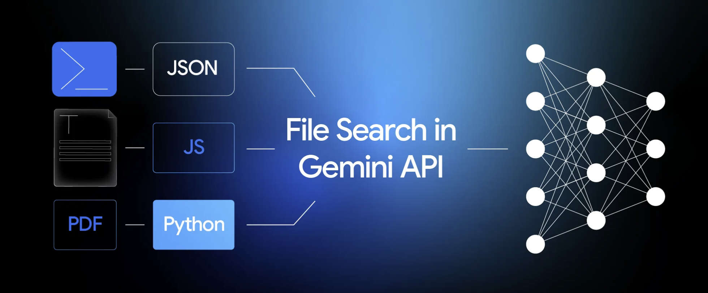
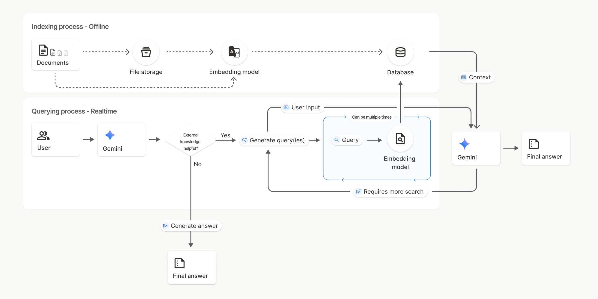
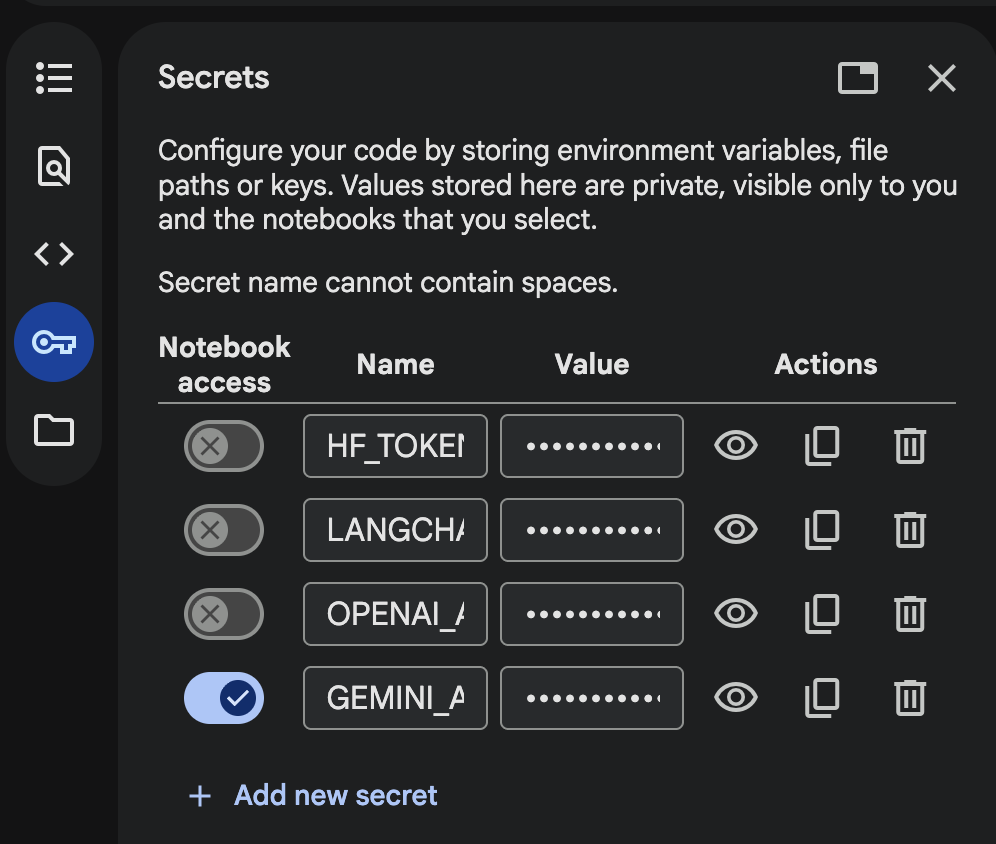
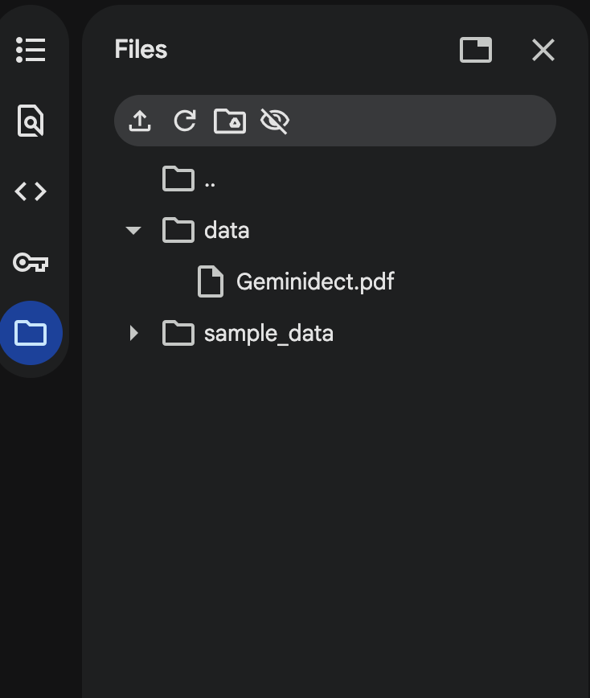

# RAG through File Search Tool

???+ blank "What is Gemini File Search?"

    ??? info "Introduction"

        === "1. Introduction"

            

            **What is Gemini File Search?**

            Google's <a href="https://ai.google.dev/gemini-api/docs/file-search" target="_blank">File Search Tool</a> is a **fully managed RAG service** built directly into the Gemini API. Instead of building and maintaining your own retrieval pipeline chunking documents, generating embeddings, managing a vector database, writing retrieval logic you simply upload your files and let Gemini handle everything.

            

            In the earlier tasks, we learned how to build our own RAG pipeline using LangChain and vector stores, which gives us a lot of flexibility and control. With Gemini File Search, we now have another option: a managed RAG service where Google handles chunking, indexing, embeddings, and retrieval for us. Instead of replacing the old approach, this simply gives us a choice. For some use cases, building RAG yourself will still make sense for others, using Gemini File Search can reduce complexity so you can focus more on your application and AI-by-design decisions rather than the plumbing.

            **How Does This Compare to What We Built in Module 6?**

            In the previous module, we built a RAG pipeline from scratch using LangChain, ChromaDB, and OpenAI. That gave us full control over every step. Gemini File Search takes a different approach, it's a managed service where Google handles the plumbing so you can focus on your application.

            | | Module 6 (DIY RAG) | Module 7 (File Search) |
            |---|---|---|
            | **Chunking** | You configure `RecursiveCharacterTextSplitter` | Gemini handles it automatically |
            | **Embeddings** | You choose and call the embedding model | Gemini generates them for you |
            | **Vector Store** | You set up and manage ChromaDB | Gemini stores and indexes internally |
            | **Retrieval** | You write retriever logic | Gemini retrieves automatically when queried |
            | **LLM Call** | You chain retriever + prompt + LLM | Single API call with `tools=[file_search]` |
            | **Control** | Full control over every step | Less control, much simpler |
            | **Cost** | Embedding API costs + your infrastructure | $0.15/M tokens for indexing, storage free |

            **Why Use File Search?**

            * **Simplicity** — upload files, create a store, ask questions. That's it.
            * **No vector DB to manage** — Gemini handles storage, indexing, and retrieval
            * **Cost-effective** — file storage and query-time embeddings are free. You only pay $0.15 per 1M tokens for initial indexing
            * **Grounded answers** — responses are based on your actual documents, reducing hallucination

            !!! info "Pricing & Models"
                At the time of writing, File Search is supported by **gemini-2.5-pro** and **gemini-2.5-flash**. For pricing details see: <a href="https://ai.google.dev/gemini-api/docs/pricing#gemini-embedding" target="_blank">Embeddings pricing</a> | <a href="https://ai.google.dev/gemini-api/docs/tokens" target="_blank">Token info</a>

            ??? info "Supported File Types (click to expand)"
                **Application types:** `application/pdf`, `application/msword`, `application/json`, `application/sql`, `application/xml`, `application/zip`, `application/vnd.ms-excel`, `application/vnd.jupyter`, `application/vnd.openxmlformats-officedocument.wordprocessingml.document`, `application/vnd.openxmlformats-officedocument.spreadsheetml.sheet`, `application/vnd.openxmlformats-officedocument.presentationml.presentation`, `application/typescript`, `application/dart`, `application/ecmascript`, `application/x-php`, `application/x-powershell`, `application/x-sh`, `application/x-latex`, and more.

                **Text types:** `text/plain`, `text/html`, `text/css`, `text/csv`, `text/javascript`, `text/markdown`, `text/xml`, `text/yaml`, `text/x-python`, `text/x-java`, `text/x-go`, `text/x-rust`, `text/x-c`, `text/x-swift`, `text/x-kotlin`, `text/x-ruby-script`, `text/x-sql`, and many more.

                For the complete list, see the <a href="https://ai.google.dev/gemini-api/docs/file-search" target="_blank">official documentation</a>.
            
            === "LAB"

                === "Let's build a quick Gemini Retrieval Augmented Generation ("RAG") through the File Search tool application"


                    In this lab, we’ll go through the end-to-end workflow of using File Search with a Python script. You’ll learn how to:

                    1. Create a File Search store
                    2. Look up an existing store by its display name
                    3. Upload files into the store
                    4. Use advanced upload options such as custom chunking and metadata
                    5. Run a standard RAG-style generation query
                    6. Clean up by deleting the File Search store when you’re done

                    !!! important
                        In this section, we will be using a version of <a href="https://www.cisco.com/c/dam/en/us/td/docs/voice_ip_comm/cuipph/MPP/6800-DECT/deployment/CiscoDECT6800DeploymentGuide.pdf" target="_blank">Cisco DECT 6800 Deployment Guide</a>. For the purposes of this lab, I’ve modified the original PDF by removing a few pages and saving it as a new file.

                    !!! note
                        The PDF we are using in this lab can be downloaded from [here](./assets/static/Geminidect.pdf){:target="_blank" download="Geminidect.pdf"}

                    !!! warning "Session Timeout"
                        When using Google Colab, if your notebook is **idle for too long**, the session will **time out**, requiring you to **re-run all the cells from the start**.

                    * Open Google Colab and create a new notebook. Click on "File" > "New notebook". Please refer to the [following section](Task1.md) to create Google Colab account.

                    

                    * Make sure you are connected to a runtime. For this task, you can use the CPU as the runtime environment.

                    

                    !!! note "Gemini API Key"
                        If you already obtained your Gemini API key in **Module 5 (Gemini Embedding 2)**, you can reuse the same key here. If you saved it in the **`$ keys`** panel, click the copy button there to grab it quickly.

                    ??? info "Don't have a Gemini API key yet? (click to expand)"
                        You can get one for free at <a href="https://aistudio.google.com/api-keys" target="_blank">Google AI Studio</a>. Use your **personal Gmail account** to sign up and generate a key. For step-by-step instructions, refer to the **Lab Setup** section in <a href="../Task4a/" target="_blank">Module 5 — Gemini Embedding 2</a>.

                    * Within your existing Google Colab notebook navigate to the new "Secrets" section in the sidebar.

                    

                    !!! important
                        - Click on "Add a new secret." Enter the name **GEMINI_API_KEY** and paste your key as the value. Note: The name is permanent once set.
                        - The list of secrets is global across all your notebooks.
                        - Use the "Notebook access" toggle to grant or revoke access to a secret for each notebook.

                    

                    * Let’s load our PDF files into Google Colab. For this example, we can use the [modified DECT guide](./assets/static/Geminidect.pdf){:target="_blank" download="Geminidect.pdf"}

                    * Within Google Colab, click on Folder and create a new folder called "data"

                    

                    * Click on [...], select Upload. Make sure you choose your Geminidect.pdf file

                    

                    

                    ---

                    **Step 1 — Install Dependencies**

                    ```py linenums="1"
                    !pip install -U google-genai
                    ```

                    ---

                    **Step 2 — Import Libraries & Configure API Key**

                    ```py linenums="1"
                    from google.colab import userdata
                    import os
                    from google import genai
                    import time
                    from google.genai import types
                    ```

                    ```py linenums="1"
                    # Grab the key from the Secrets tab and put it into an env var
                    os.environ["GEMINI_API_KEY"] = userdata.get("GEMINI_API_KEY")
                    client = genai.Client(api_key=os.environ["GEMINI_API_KEY"])
                    ```

                    ---

                    **Step 3 — Create a File Search Store**

                    A File Search Store is a persistent container for your document chunks and embeddings. It’s distinct from raw file storage and can hold gigabytes of data.

                    ```py linenums="1"
                    # Create the File Search store with an optional display name
                    file_search_store = client.file_search_stores.create(
                        config={"display_name": "Omers"})
                    ```

                    ```py linenums="1"
                    print("Created a file search store:")
                    print(f"  {file_search_store.name} - {file_search_store.display_name}")
                    ```

                    ---

                    **Step 4 — Verify Your Store**

                    List all File Search stores to confirm yours was created:

                    ```py linenums="1"
                    print("List of file search stores:")
                    for file_search_store in client.file_search_stores.list():
                        print(f"  {file_search_store.name} - {file_search_store.display_name}")
                    ```

                    Now pick your store and set its resource name:

                    ```py linenums="1"
                    # Pick one of your stores
                    file_search_store_name = "fileSearchStores/omers-j6gikclff6tr"
                    ```

                    !!! note
                        Change this to your own File Search store name, the one you created in the previous step.

                    ---

                    **Step 5 — Upload & Index the PDF**

                    Set the path to the PDF and upload it. By default, Gemini handles chunking intelligently but you can optionally configure custom chunking if needed (see the commented-out section).

                    ```py linenums="1"
                    pdf_path = "/content/data/Geminidect.pdf"
                    display_name = "dect.pdf"
                    ```

                    ```py linenums="1"
                    operation = client.file_search_stores.upload_to_file_search_store(
                        file=pdf_path,
                        file_search_store_name=file_search_store_name,
                        config={
                            "display_name": display_name,
                            # optional:
                            # "chunking_config": {
                            #     "white_space_config": {
                            #         "max_tokens_per_chunk": 200,
                            #         "max_overlap_tokens": 20,
                            #     }
                            # },
                        },
                    )
                    # Wait for the upload + indexing to finish
                    while not operation.done:
                        time.sleep(5)
                        operation = client.operations.get(operation)

                    print("Upload complete")
                    print(operation)
                    ```

                    !!! note
                        The upload sends the file to Gemini, which then chunks it, generates embeddings, and indexes everything. The `while` loop polls until indexing is complete.

                    ---

                    **Step 6 — Configure the File Search Tool**

                    We create a Tool object pointing to our store. When the model needs more information, it will automatically search the store, pull the most relevant chunks, and ground its response on that content.

                    ```py linenums="1"
                    file_search = types.Tool(
                        file_search=types.FileSearch(
                            file_search_store_names=[file_search_store_name]
                        )
                    )

                    print(file_search)
                    ```

                    ---

                    **Step 7 — Query Gemini with File Search**

                    Now the magic one API call that retrieves from your documents and generates an answer:

                    ```py linenums="1"
                    response = client.models.generate_content(
                        model="gemini-2.5-flash",
                        contents="What kind of cells does the Cisco IP DECT 6800 Phone products support?",
                        config=types.GenerateContentConfig(
                            tools=[file_search],
                        ),
                    )

                    print("Model response:\n")
                    print(response.text)
                    ```

                    ---

                    **Step 8 — Cleanup**

                    !!! important
                        You can have at most **10 File Search stores per project**, so delete any stores you no longer need.

                    ```py linenums="1"
                    print("Deleting File Search store...")

                    client.file_search_stores.delete(
                        name=file_search_store_name, config={'force': True}
                        )

                    print("File Search store deleted.")
                    ```

                    ---

                    **What We Did in This Module**

                    In Module 6, we built a RAG pipeline from scratch we manually loaded a PDF, chunked it with `RecursiveCharacterTextSplitter`, generated embeddings with OpenAI, stored them in ChromaDB, wrote retriever logic, crafted a prompt template, and chained it all together with LangChain. That gave us full visibility into every step of the pipeline.

                    In this module, we achieved the same outcome asking questions about the same Cisco DECT guide and getting grounded answers but with a completely different approach. We created a File Search store, uploaded the PDF, and Gemini took care of everything else: chunking, embedding, indexing, retrieval, and answer generation. The entire pipeline collapsed into a single `generate_content` call with `tools=[file_search]`.

                    **The key takeaway:** both approaches are valid. The DIY route gives you control you choose the embedding model, the chunk size, the vector database, the prompt. The managed route gives you speed and simplicity you upload a file and ask questions. Knowing both means you can pick the right tool for the job. For a quick prototype or internal tool, File Search gets you there fast. For production systems where you need fine-grained control over retrieval quality, the LangChain approach gives you that flexibility.

                    Either way, the core idea is the same: **ground LLM responses in your own data so the answers are accurate, verifiable, and relevant.**

                    <p align="right"> 👉 This concludes the task. Click the next **Module** on the left to continue.</p>

