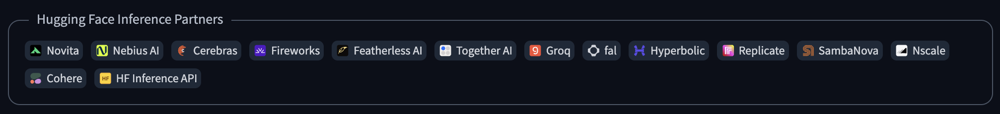
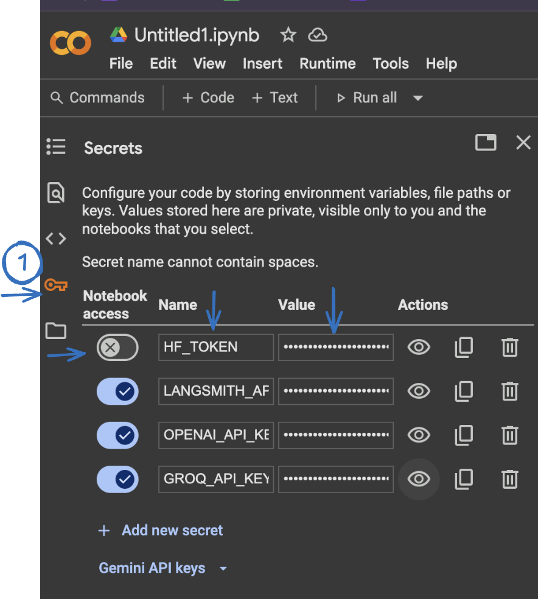
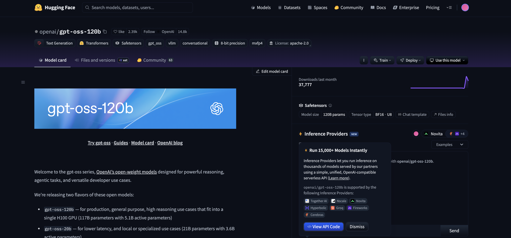
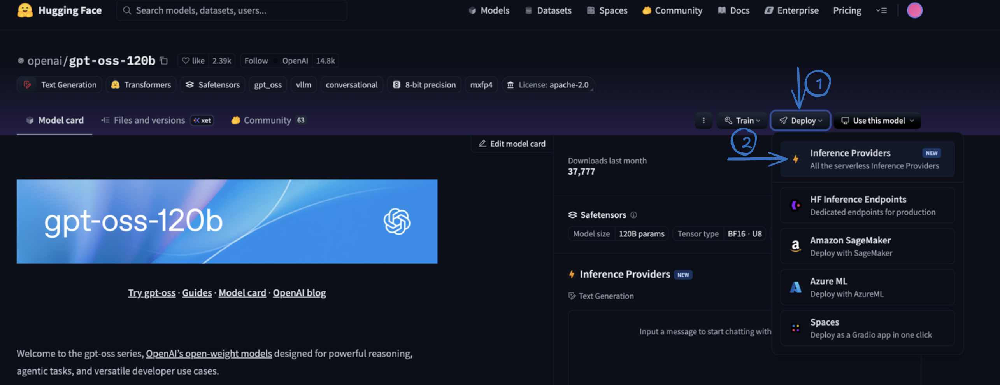
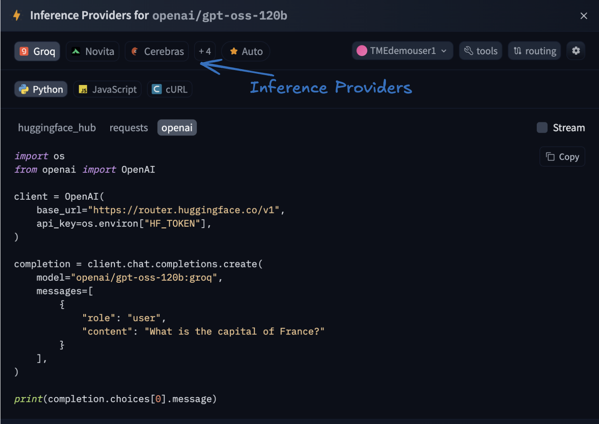

# Hugging Face with OpenAI-Compatible APIs?

???+ blank "HuggingFace Inference Providers"
    In the previous module, we used Groq directly as our inference provider we signed up for an account, grabbed an API key, and pointed LangChain at Groq’s endpoint. That works great when you know exactly which provider you want.

    But what if you want to try the same model across different providers or switch between models without changing your code? This is where **Hugging Face’s Inference Providers** come in. Instead of integrating with each provider separately (Groq, AWS, Replicate, Together AI, etc.), Hugging Face gives you a **single, unified API** that routes your request to the right backend. You use one endpoint, one API key, and the same familiar OpenAI-compatible syntax Hugging Face handles the rest.

    💡 You can also try out models interactively using the Hugging Face Playground at <a href="https://huggingface.co/playground" target="_blank">here</a>. It’s a great way to explore model behavior and capabilities before integrating them into code.


    ??? info "OpenAI"

        === "🤖 OpenAI Compatibility"

            To make integration even easier, Hugging Face now supports <a href="https://platform.openai.com/docs/api-reference/chat/create" target="_blank">OpenAI compatible APIs.</a>. That means you can use familiar methods like:

            ```py linenums="1"

            client.chat.completions.create(...)
            client.embeddings.create(...)
            ```
            
            It uses the same syntax as the OpenAI Python client, but the request is sent through Hugging Face’s API (👉 https://router.huggingface.co/v1) instead. Hugging Face then routes the call to the selected provider like LLaMA, Mixtral, or DeepSeek e.t.c allowing you to run different models with minimal changes to your existing code.

        === "Lab - Inference Providers on Hugging Face"
            
            <a href="https://huggingface.co/inference/get-started" target="_blank">Hugging Face Inference Providers</a> unify 15+ model backends under a single, OpenAI‑compatible endpoint. You can go from prototype to production using the same consistent API without the need to manage any infrastructure.
            
            

            === "🧠 Understanding Hugging Face Router"

                When you use the Hugging Face Router (https://router.huggingface.co/v1), think of it as a proxy like endpoint, where  you're accessing an OpenAI-compatible API gateway that routes your request to a backend that actually performs the inference.

                !!! note
                    You don’t control or see directly which backend (or inference provider) is used by HuggingFace, HF decides based on the model and your usage plan.
                
                === "LAB - Set Up OpenAI Compatible APIs on Hugging Face"

                    * Open Google Colab and create a new notebook. Click on "File" > "New notebook".

                    * Let’s enable the Hugging Face API key — it’s required for inferencing. If you saved it in the **`$ keys`** panel earlier, click the copy button there to grab it quickly. Otherwise, you’ll find it in the `.txt` file you downloaded at the start of the lab. In Google Colab, open the “Secrets” tab on the left. Click “Add new secret”, enter **HF_TOKEN** as the name, and paste your API key into the Value field. Once added, make sure to toggle it on.

                    

                    !!! note
                        You can also browse <a href="https://huggingface.co/" target="_blank"> to </a> and log in using the tmedemouserX account you selected at the start of this lab. That means logging in as tmedemouserX@gmail.com.  
                        If you choose to log in using your own Gmail account, do not use the API key from the .txt file provided. Instead, generate and use the API key from your own Hugging Face account.
                    
                    * Install the required package

                    ```py linenums="1"
                    !pip install openai
                    ```

                    * Let's pull the API keys for HuggingFace

                    ```py linenums="1"
                    import os
                    from google.colab import userdata
                    os.environ['OPENAI_API_KEY']   = userdata.get('OPENAI_API_KEY')
                    os.environ['LANGSMITH_API_KEY'] = userdata.get('LANGSMITH_API_KEY')
                    os.environ['HF_TOKEN'] = userdata.get('HF_TOKEN')

                    # ✅ Set LangSmith tracing config as environment variables (so LangChain can read them)
                    os.environ['LANGSMITH_TRACING'] = "true"
                    os.environ['LANGSMITH_ENDPOINT'] = "https://api.smith.langchain.com"
                    os.environ['LANGSMITH_PROJECT']  = "AibyDesign"
                    ```

                    * As per instructions lets initialize the API client

                    ```py linenums="1"
                    import os
                    from openai import OpenAI

                    client = OpenAI(
                        base_url="https://router.huggingface.co/v1",
                        api_key=os.environ["HF_TOKEN"],
                      )  # make sure you have this set
                    ```

                    * Lets run the model now. 
                    
                    !!! note 
                        You must include the provider in the model name using the :provider format for example: model-id:provider

                    * You can explore available models <a href="https://huggingface.co/models" target="_blank"> here</a>

                    * To check which inference providers support a model, search for example openai/gpt-oss-120b and open the model page on Hugging Face.

                    

                    * In the top-right corner, click Deploy and select Inference API Providers.

                    

                    * You'll see a list of supported providers for that model select Groq

                    

                    * Let's make a chat completion request using a specific model we selected

                    ```py linenums="1"
                    completion = client.chat.completions.create(
                    model="openai/gpt-oss-120b:groq",
                    messages=[
                        {
                            "role": "user",
                            "content": "What is the capital of United kingdom?"
                        }
                            ],
                        )

                    print(completion.choices[0].message)

                    ```

                     <b>Summary</b>

                    In this task, we explored how Hugging Face provides OpenAI compatible APIs, allowing you to interact with a wide range of models like OpenAI, LLaMA, Mixtral, DeepSeek, and others using the same familiar interface as OpenAI’s Python client. In this section you have learned how to:

                    1. Set up your Hugging Face API key securely in Colab

                    2. Initialize the OpenAI-compatible client with Hugging Face’s router endpoint
                    
                    3. Discover and select inference providers for different models
                    
                    4. Perform a basic chat completion using a model hosted by a selected provider (like Groq)
                    
                    This flexibility allows you to test and run various models seamlessly, without needing to change your codebase when switching providers. Let’s now move on to the next task where we put this into practice in a real world use case.

                    === "LAB2 - Multilingual Customer Support Bot"

                    Now that we’ve seen how Hugging Face’s OpenAI compatible API works, let’s put it into action by building a real world application: a multilingual customer support bot 🤖. In today’s global environment, support teams often receive messages in various languages. Our bot will automatically detect the language of a customer’s message, translate it to English for internal processing, generate a helpful response, and then translate the reply back to the original language all powered by a high performance model like openai/gpt-oss-120b:groq. This hands-on example shows how you can combine Hugging Face, Groq, and LangChain to build scalable, language aware applications using a consistent API interface without needing to manage complex infrastructure.

                    !!! note
                        Feel free to continue using the Google Colab notebook from the above task.

                    * Since we'll be detecting the language automatically, let's start by installing langdetect.

                    !!! note
                        langdetect is a lightweight Python library that automatically detects the language of a given text. It supports over 50 languages and is based on Google's language-detection library. It's useful for multilingual applications where the input language isn't known in advance.

                    ```py linenums="1"
                    !pip install langdetect
                    ```

                    * In this step, we define a MultilingualSupportBot class that automates the customer support workflow. It uses langdetect to automatically identify the language of an incoming message, translates it into English, generates a helpful response using the Hugging Face OpenAI compatible API (via Groq), and then translates the reply back to the original language. This allows us to handle multilingual support seamlessly using a single model and consistent interface.

                    ```py linenums="1"
                    from langdetect import detect
                    from openai import OpenAI
                    class MultilingualSupportBot:
                        def __init__(self, api_key: str, model: str = "openai/gpt-oss-120b:groq"):
                            self.client = OpenAI(
                                base_url="https://router.huggingface.co/v1",
                                api_key=api_key
                            )
                            self.model = model

                        def detect_language(self, text: str) -> str:
                            # Auto-detect language using langdetect
                            lang_code = detect(text)
                            # Optional: map code to full name
                            lang_map = {
                                "fr": "French",
                                "es": "Spanish",
                                "de": "German",
                                "it": "Italian",
                                "en": "English",
                                "pt": "Portuguese",
                                "ar": "Arabic"
                            }
                            return lang_map.get(lang_code, "English")

                        def translate(self, text: str, source_lang: str, target_lang: str) -> str:
                            response = self.client.chat.completions.create(
                                model=self.model,
                                messages=[
                                    {"role": "system", "content": "You are a translation assistant."},
                                    {"role": "user", "content": f"Translate this from {source_lang} to {target_lang}:\n\n{text}"}
                                ]
                            )
                            return response.choices[0].message.content.strip()

                        def generate_reply(self, english_text: str) -> str:
                            response = self.client.chat.completions.create(
                                model=self.model,
                                messages=[
                                    {"role": "system", "content": "You are a helpful customer support assistant."},
                                    {"role": "user", "content": f"A customer said: '{english_text}'. How would you respond?"}
                                ]
                            )
                            return response.choices[0].message.content.strip()

                        def handle_customer_message(self, customer_msg: str) -> str:
                            # 1. Detect language
                            source_lang = self.detect_language(customer_msg)
                            print(f"🌐 Detected language: {source_lang}")

                            # 2. Translate to English
                            english_text = self.translate(customer_msg, source_lang, "English")
                            print(f"🔁 Translated to English: {english_text}")

                            # 3. Generate support reply in English
                            support_reply_english = self.generate_reply(english_text)
                            print(f"💬 Support reply (EN): {support_reply_english}")

                            # 4. Translate back to original language
                            final_reply = self.translate(support_reply_english, "English", source_lang)
                            print(f"🌍 Final reply in {source_lang}: {final_reply}")

                            return final_reply
                    ```
                  
                    * Now that the bot class is defined, we can initialize it using our Hugging Face API key and pass in a customer message. The bot will automatically detect the language, handle translation and response generation, and return a final reply in the customer's original language all in one call.

                    !!! note
                        Please feel free to change the message below to a language of your choice.

                    ```py linenums="1"
                    import os
                    api_key = os.getenv("HF_TOKEN")  # or paste your key directly

                    bot = MultilingualSupportBot(api_key=api_key)

                    customer_message = "Hola, mi pedido no ha llegado todavía."  # Spanish
                    reply = bot.handle_customer_message(customer_message)

                    print("🧾 Reply to Customer:", reply)
                    ```

                    === "LAB3 - Multilingual Customer Support Bot - USING LCEL"

                    Now that we’ve seen how to build a multilingual support bot using Hugging Face’s OpenAI compatible API, we can combine everything we’ve learned in the previous tasks using LangChain Expression Language (LCEL) to streamline the logic. In this version, we refactor the bot to use modular LCEL chains by linking together prompt templates, the model, and an output parser using the | operator. This not only makes the code cleaner and easier to manage, but also enhances reusability, composability, and debugging. By chaining components like prompt | model | parser, we define a clear flow of data making it simple to plug in new prompts or swap out models without rewriting logic. This structure is ideal for production ready applications where consistency and maintainability are key.

                    !!! note
                        Feel free to continue using the Google Colab notebook from the above task.
                    
                    * ✅ Install dependencies first (if not already installed or working with a new notebook)
                    ```py linenums="1"
                    !pip install langchain langchain_openai langchain_core langdetect
                    ```

                    * Let's now bring everything together into a clean, modular design. This class uses Hugging Face’s OpenAI-compatible router to interact with open-source models like openai/gpt-oss-120b, and leverages LangChain’s Expression Language (LCEL) to connect prompts, models, and parsers into streamlined pipelines.

                    ```py linenums="1"
                    from langdetect import detect
                    from langchain_openai import ChatOpenAI
                    from langchain_core.prompts import ChatPromptTemplate
                    from langchain_core.output_parsers import StrOutputParser

                    class MultilingualSupportBot:
                        def __init__(self, api_key: str, model: str = "openai/gpt-oss-120b:groq"):
                            # Set up model using Hugging Face Router (OpenAI-compatible API)
                            self.model = ChatOpenAI(
                                base_url="https://router.huggingface.co/v1",
                                api_key=api_key,
                                model=model
                            )

                            # Output parser
                            self.parser = StrOutputParser()

                            # Prompt for translation
                            self.translation_prompt = ChatPromptTemplate.from_messages([
                                ("system", "Translate the following from {source_lang} to {target_lang}:"),
                                ("user", "{text}")
                            ])

                            # Prompt for generating customer support reply
                            self.support_prompt = ChatPromptTemplate.from_messages([
                                ("system", "You are a helpful customer support assistant."),
                                ("user", "A customer said: '{english_text}'. How would you respond?")
                            ])

                            # LCEL chains
                            self.translation_chain = self.translation_prompt | self.model | self.parser
                            self.support_chain     = self.support_prompt     | self.model | self.parser

                        def detect_language(self, text: str) -> str:
                            lang_code = detect(text)
                            lang_map = {
                                "fr": "French",
                                "es": "Spanish",
                                "de": "German",
                                "it": "Italian",
                                "en": "English",
                                "pt": "Portuguese",
                                "ar": "Arabic"
                            }
                            return lang_map.get(lang_code, "English")

                        def translate(self, text: str, source: str, target: str) -> str:
                            return self.translation_chain.invoke({
                                "source_lang": source,
                                "target_lang": target,
                                "text": text
                            })

                        def generate_reply(self, english_text: str) -> str:
                            return self.support_chain.invoke({"english_text": english_text})

                        def handle_customer_message(self, customer_msg: str) -> str:
                            source_lang = self.detect_language(customer_msg)
                            print(f"🌐 Detected language: {source_lang}")

                            english_text = self.translate(customer_msg, source_lang, "English")
                            print(f"🔁 Translated to English: {english_text}")

                            support_reply = self.generate_reply(english_text)
                            print(f"💬 Support reply (EN): {support_reply}")

                            final_reply = self.translate(support_reply, "English", source_lang)
                            print(f"🌍 Final reply in {source_lang}: {final_reply}")

                            return final_reply

                    ```

                    * Let's  initialize it using our Hugging Face API

                    ```py linenums="1"
                    import os

                    # Set your Hugging Face token
                    api_key = os.getenv("HF_TOKEN")  # Or paste it directly as: "hf_..."

                    bot = MultilingualSupportBot(api_key=api_key)

                    # Try a Spanish input
                    customer_message = "Hola, mi pedido no ha llegado todavía."
                    reply = bot.handle_customer_message(customer_message)

                    print("🧾 Final Reply to Customer:", reply)

                    ```


                    **What We Did in This Module — and How It Connects**

                    In the previous module, we went directly to Groq — signed up, got an API key, and pointed LangChain at their endpoint. That’s a perfectly valid approach when you know which provider you want.

                    In this module, we added a layer on top: **Hugging Face’s Inference Providers**. Instead of talking to Groq (or any provider) directly, we used Hugging Face’s router as a single gateway. Same models, same results — but now we can switch providers by changing a model string (`openai/gpt-oss-120b:groq`) instead of swapping out SDKs and endpoints.

                    We then put this to work by building a **multilingual customer support bot** that auto-detects language, translates to English, generates a response, and translates back — all through one consistent API. We built it twice: once with raw API calls, and once with LCEL chains to show how the same logic becomes cleaner and more composable.

                    The progression across the last few modules tells a story: **OpenAI (paid, proprietary) → Groq (free, open-source, direct) → Hugging Face (unified router, any provider)**. You now have three different ways to run inference, and the LangChain patterns stay the same across all of them.

                    This bot is just a starting point. You could integrate it into Webex to handle live multilingual chat, plug it into a contact center workflow, or use it for real-time translation in meetings. The building blocks are here — the use case is yours to decide.

                    <p align="right"> 👉 This concludes the task. Click **Conclusion** on the left. </p>

                                    


                                        


